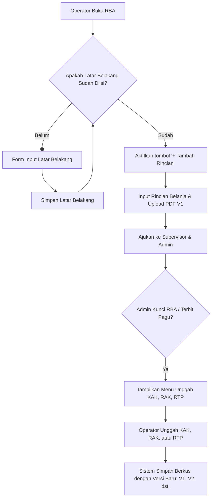

# Implementation Plan - RBA Background Text & Document Versioning

Rencana implementasi ini bertujuan untuk menambahkan dua fitur baru pada alur kerja aplikasi RBA:
1. **Data Latar Belakang Wajib**: Operator harus mengisi data latar belakang (teks bebas) untuk sub-unitnya sebelum dapat menginput rincian belanja pada nomor rekening manapun.
2. **Dokumen Pendukung Hasil Pagu (KAK, RAK, RTP)**: Setelah RBA dikunci oleh Administrator atau pagu sudah ditetapkan (seluruh usulan rincian belanja telah terkunci), operator wajib mengunggah 1 KAK, 1 RAK, dan 1 RTP. Proses unggah dokumen ini harus mendukung pencatatan versi (versioning) agar riwayat berkas sebelumnya tetap terjaga.

---

## Alur Bisnis Baru



---

## Usulan Perubahan Database

### 1. Modifikasi Tabel Submissions (`rba_submissions`)
Menambahkan kolom `background` berupa `TEXT` (nullable) untuk menampung data latar belakang dari masing-masing unit per periode.

### 2. Tabel Baru: Dokumen RBA (`rba_submission_documents`)
Tabel kontainer untuk mendefinisikan tipe dokumen yang diunggah per submission.
* `id` (bigint, primary key)
* `rba_submission_id` (foreign key ke `rba_submissions`, cascade)
* `type` (string, nilai: `KAK`, `RAK`, `RTP`)
* `timestamps`
* *Constraint:* `UNIQUE(rba_submission_id, type)`

### 3. Tabel Baru: Riwayat Versi Dokumen RBA (`rba_submission_document_versions`)
Tabel transaksi untuk menyimpan berkas fisik PDF dan nomor versinya.
* `id` (bigint, primary key)
* `rba_submission_document_id` (foreign key ke `rba_submission_documents`, cascade)
* `file_path` (string)
* `version_number` (integer)
* `uploaded_by` (foreign key ke `users`)
* `timestamps`

---

## Usulan Perubahan Program

### 1. Backend Layer (Models & Database)

#### [NEW] [Migration: Add background to rba submissions](file:///c:/Users/PC12/Project/rbakardinah/database/migrations/2026_07_12_073100_add_background_to_rba_submissions.php)
* Menambahkan kolom `background` tipe `text` atau `longtext` di tabel `rba_submissions`.

#### [NEW] [Migration: Create RBA Submission Documents Tables](file:///c:/Users/PC12/Project/rbakardinah/database/migrations/2026_07_12_073110_create_rba_submission_documents_tables.php)
* Membuat tabel `rba_submission_documents` dan `rba_submission_document_versions`.

#### [MODIFY] [RbaSubmission.php](file:///c:/Users/PC12/Project/rbakardinah/app/Models/RbaSubmission.php)
* Menambahkan `background` ke properti `$fillable`.
* Menambahkan relasi `documents(): HasMany` ke model `RbaSubmissionDocument`.

#### [NEW] [RbaSubmissionDocument.php](file:///c:/Users/PC12/Project/rbakardinah/app/Models/RbaSubmissionDocument.php)
* Mendefinisikan properti tabel dan relasi `submission(): BelongsTo` serta `versions(): HasMany` (diurutkan dari versi terbaru).

#### [NEW] [RbaSubmissionDocumentVersion.php](file:///c:/Users/PC12/Project/rbakardinah/app/Models/RbaSubmissionDocumentVersion.php)
* Mendefinisikan properti berkas fisik, nomor versi, dan relasi `document(): BelongsTo` serta `uploader(): BelongsTo`.

---

### 2. Controller & Routing Layer

#### [MODIFY] [web.php](file:///c:/Users/PC12/Project/rbakardinah/routes/web.php)
* Menambahkan route di bawah middleware `Operator` untuk menyimpan/memperbarui latar belakang:
  `Route::put('submissions/{submission}/background', [SubmissionController::class, 'updateBackground'])->name('submissions.update-background');`
* Menambahkan route untuk manajemen dokumen KAK, RAK, RTP:
  `Route::post('submissions/{submission}/documents/upload', [DocumentController::class, 'uploadDocument'])->name('submissions.documents.upload');`
  `Route::get('submissions/{submission}/documents/{type}/history', [DocumentController::class, 'history'])->name('submissions.documents.history');`

#### [MODIFY] [SubmissionController.php](file:///c:/Users/PC12/Project/rbakardinah/app/Http/Controllers/Operator/SubmissionController.php)
* Muat relasi `documents.versions` di method `show()`.
* Implementasikan method `updateBackground(Request $request, RbaSubmission $submission)` untuk menyimpan teks latar belakang.

#### [MODIFY] [DetailController.php](file:///c:/Users/PC12/Project/rbakardinah/app/Http/Controllers/Operator/DetailController.php)
* Di dalam method `create()` dan `store()`, tambahkan validasi:
  ```php
  if (empty($submission->background)) {
      return redirect()->route('operator.submissions.show', $submission->id)
          ->with('error', 'Anda harus mengisi Latar Belakang terlebih dahulu sebelum menambahkan rincian belanja.');
  }
  ```

#### [NEW] [DocumentController.php](file:///c:/Users/PC12/Project/rbakardinah/app/Http/Controllers/Operator/DocumentController.php)
* Implementasi logika unggah dokumen KAK, RAK, RTP:
  * Pastikan sub-unit milik user pembuat.
  * Pastikan RBA sudah dalam status terkunci oleh Admin (`status_global === 'Locked'` atau seluruh detail belanja sudah terkunci pagu).
  * Lakukan *auto-increment* untuk `version_number` setiap kali dokumen dengan tipe yang sama diunggah ulang.
  * Simpan berkas di storage `documents/`.

---

### 3. Frontend Layer (Views)

#### [MODIFY] [show.blade.php (Operator)](file:///c:/Users/PC12/Project/rbakardinah/resources/views/operator/submissions/show.blade.php)
* **Latar Belakang (Bagian Atas)**:
  * Tampilkan panel teks latar belakang. Jika kosong, tampilkan form input teks penuh dengan tombol "Simpan Latar Belakang".
  * Jika sudah ada, tampilkan teks dan tombol "Edit Latar Belakang" (hanya bisa diedit jika status sub-unit belum terkunci/proses revisi).
* **Tombol Tambah Rincian**:
  * Berikan *conditional statement*: Jika latar belakang kosong, sembunyikan tombol "+ Tambah Rincian" dan tampilkan pesan peringatan di dekatnya.
* **Bagian Unggah Dokumen (KAK, RAK, RTP)**:
  * Jika RBA terkunci, tampilkan tabel khusus berisi 3 baris (KAK, RAK, RTP).
  * Tampilkan status unggahan masing-masing (contoh: *Belum Diunggah* atau *Terunggah (V2)*).
  * Sediakan tombol "Unggah Versi Baru" dan link untuk mengunduh versi terbaru.
  * Sediakan link "Riwayat Versi" yang membuka modal/tampilan berisi daftar unggahan sebelumnya lengkap dengan nama pengunggah dan tanggalnya.

#### [MODIFY] [show.blade.php (Supervisor)](file:///c:/Users/PC12/Project/rbakardinah/resources/views/supervisor/submissions/show.blade.php)
* Tampilkan teks Latar Belakang di bagian atas halaman review agar dapat dibaca oleh Supervisor.
* Tampilkan daftar KAK, RAK, RTP yang diunggah oleh Operator beserta riwayat versinya agar bisa ditinjau.

---

## Rencana Verifikasi

### Pengujian Manual
1. **Uji Validasi Latar Belakang**:
   * Buka halaman RBA yang baru dibuat (Latar Belakang kosong).
   * Pastikan tombol "+ Tambah Rincian" tidak muncul atau dinonaktifkan dengan banner instruksi pengisian latar belakang.
   * Coba akses langsung URL `/operator/details/create?submission_id=X` dan pastikan sistem mengalihkan kembali ke halaman utama dengan pesan error.
   * Isi latar belakang, lalu simpan. Pastikan tombol "+ Tambah Rincian" kini muncul dan bisa diakses.
2. **Uji Penguncian & Unggah KAK, RAK, RTP**:
   * Kunci RBA dari dashboard Admin (atau berikan pagu sehingga terkunci).
   * Buka akun Operator, lihat halaman RBA terkait. Pastikan kolom unggah KAK, RAK, dan RTP muncul.
   * Unggah dokumen KAK (V1). Pastikan status berubah menjadi "V1".
   * Unggah ulang berkas KAK baru. Pastikan versi otomatis naik menjadi "V2" dan versi "V1" tetap tercatat di menu riwayat dokumen.
3. **Review Supervisor**:
   * Buka akun Supervisor, lihat RBA terkait.
   * Pastikan teks latar belakang dan dokumen KAK/RAK/RTP yang diunggah Operator muncul dengan benar dan dapat diunduh.
