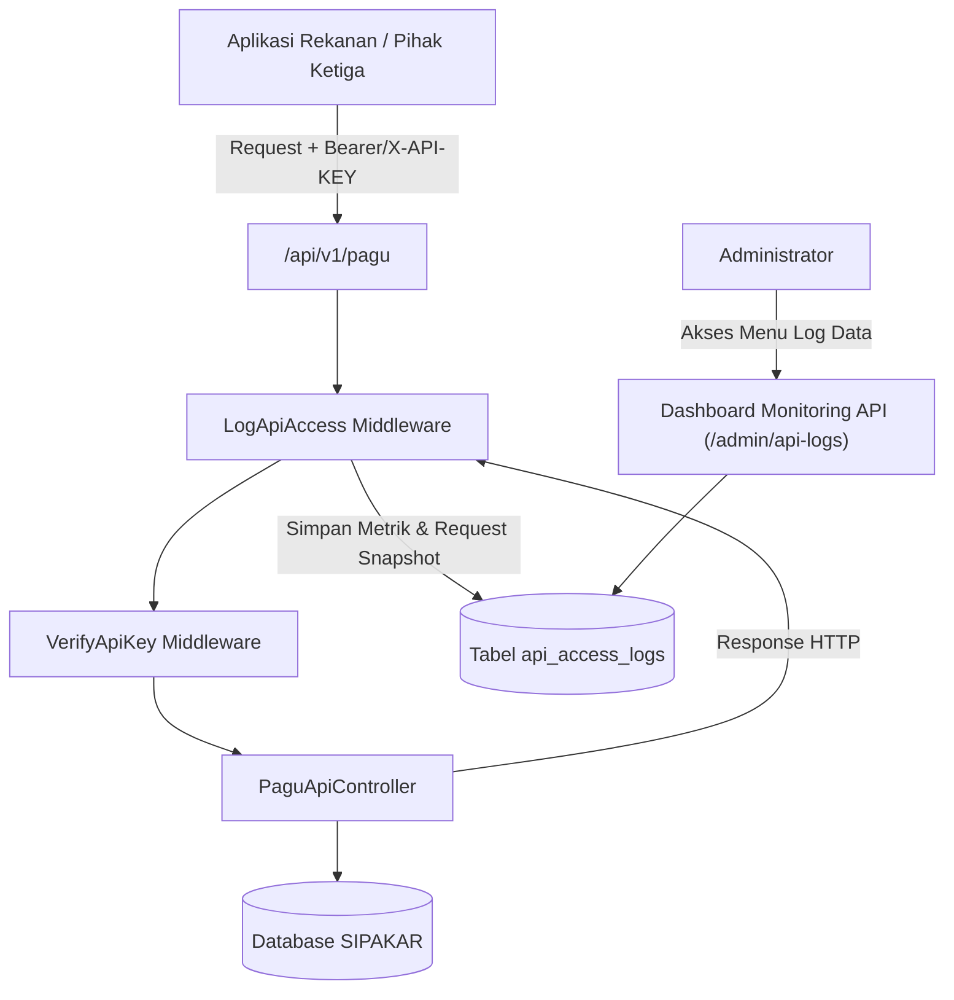

# Walkthrough: Sistem Logging & Monitoring Akses REST API

Sistem pencatatan log (*audit trail*) dan pemantauan (*monitoring dashboard*) untuk seluruh akses eksternal ke REST API SIPAKAR (khususnya endpoint `/api/v1/pagu`) telah berhasil diimplementasikan secara komprehensif, terpisah dari log transaksi internal database, serta terintegrasi mulus pada panel Administrator.

---

## 1. Arsitektur & Komponen yang Dibangun



### Rekapitulasi Komponen:
1. **Tabel Database `api_access_logs`**:
   - `api_client_id` (foreign key nullable ke `api_clients`).
   - `client_name` (nama snapshot klien atau status unauthenticated).
   - `endpoint` (URL path request).
   - `method` (`GET`, `POST`, dll).
   - `status_code` (kode respon HTTP, e.g. 200, 401, 403, 429, 500).
   - `query_params` (snapshot JSON dari parameter filter yang dikirimkan klien).
   - `response_time_ms` (durasi eksekusi request dalam milidetik).
   - `ip_address` (alamat IP klien).
   - `user_agent` (klien browser/HTTP client library seperti Guzzle, Postman, cURL).
   - `error_message` (keterangan pesan error jika request gagal).

2. **Middleware `LogApiAccess` (`app/Http/Middleware/LogApiAccess.php`)**:
   - Menghitung durasi latensi eksekusi secara presisi (`microtime`).
   - Merekam metadata dan status HTTP tanpa memblokir atau memperlambat respon API klien.
   - Terdaftar di alias middleware `api.log` pada `bootstrap/app.php` dan terpasang di rute `routes/api.php`.

3. **Perbaikan Presisi Identifikasi Klien pada `VerifyApiKey`**:
   - Data `api_client` dipasangkan ke `$request->attributes` sedini mungkin saat token dikenali, sehingga pemanggilan yang ditolak karena non-aktif atau kedaluwarsa (HTTP 403) tetap mencatat nama klien aslinya secara akurat.

4. **Dashboard Monitoring Administrator (`/admin/api-logs`)**:
   - **Tab Terpadu di Navigasi Log Data**:
     - `[ 📝 Log Transaksi Database (Internal) ]` -> audit trail mutasi database internal oleh user.
     - `[ 🌐 Log Akses REST API (Eksternal) ]` -> monitoring performa dan log pemanggilan API eksternal.
   - **4 Kartu Metrik Statistik Real-time**:
     1. Total Request API.
     2. Panggilan Hari Ini (dengan tanggal aktif).
     3. Tingkat Keberhasilan (Success Rate %) dengan indikator total sukses vs total error.
     4. Rata-rata Latensi (ms) dengan indikator kecepatan responsivitas server.
   - **Filter Interaktif**:
     - Pencarian kata kunci (nama klien, endpoint, IP, pesan kesalahan).
     - Filter status HTTP (Semua Status, 2xx Sukses, 4xx Klien Error, 401 Unauthorized, 403 Forbidden, 429 Rate Limited, 5xx Server Error).
     - Filter klien API spesifik.
     - Filter rentang tanggal.
   - **Tabel Responsif**:
     - Badge method HTTP berwarna (`GET`, `POST`).
     - Badge status code dengan warna dinamis (hijau untuk 2xx, amber/merah untuk 4xx/5xx).
     - Badge durasi latensi responsivitas (<100ms hijau, <300ms biru, <600ms amber, >600ms merah).
     - Tombol interaktif **Detail Request**.
   - **Modal Rincian Request (Alpine.js)**:
     - Menampilkan detail informasi jaringan, IP, User-Agent, status badge.
     - Format viewer JSON dan card rincian filter/query parameter yang dikirim rekanan.
     - Kotak peringatan merah yang menampilkan rincian pesan error jika status code >= 400.
   - **Fitur Pembersihan Log Lama (Prune)**:
     - Modal dialog konfirmasi pembersihan log lama (pilihan: 7, 14, 30, 60, 90 hari) via Web.
     - Artisan command CLI untuk scheduler / crontab: `php artisan api:logs-prune --days=30`.

---

## 2. Hasil Verifikasi & Pengujian

### A. Pengujian Fitur Khusus (`ApiAccessLogTest`)
Perintah pengujian yang dijalankan:
```bash
php artisan test --filter=ApiAccessLogTest
```
**Hasil**:
```text
   PASS  Tests\Feature\Admin\ApiAccessLogTest
  ✓ api request is automatically logged on success
  ✓ unauthorized api request is logged with 401
  ✓ forbidden api request with revoked token is logged
  ✓ admin can view api logs dashboard and metrics
  ✓ admin can filter api logs by search and status
  ✓ admin can view single api log json for modal
  ✓ non admin cannot access api logs
  ✓ admin can prune old api logs via web
  ✓ prune api logs artisan command

  Tests:    9 passed (36 assertions)
  Duration: 1.97s
```

### B. Pengujian Endpoint REST API Pagu (`PaguApiTest`)
```bash
php artisan test --filter=PaguApiTest
```
**Hasil**:
```text
   PASS  Tests\Feature\Api\PaguApiTest
  ✓ public ping endpoint returns ok
  ✓ protected endpoint without key returns 401
  ✓ protected endpoint with invalid key returns 401
  ✓ protected endpoint with inactive key returns 403
  ✓ protected endpoint with expired key returns 403
  ✓ protected endpoint with valid bearer token returns all 8 attributes
  ✓ protected endpoint with x api key header succeeds
  ✓ can filter pagus by year period and status
  ✓ can filter pagus by account code and kelompok belanja
  ✓ can filter pagus by amount range and search
  ✓ pagination and all flag works
  ✓ artisan commands for api client management

  Tests:    12 passed (104 assertions)
```

### C. Pengujian Seluruh Sistem Aplikasi (Full Suite)
```bash
php artisan test
```
**Hasil**:
```text
  Tests:    191 passed (952 assertions)
  Duration: 42.12s
```
Semua 191 pengujian pada seluruh modul (Admin, Supervisor, Operator, SSO OIDC, PDF Print, Pagu, Master Data, dsb.) **lulus 100% tanpa ada kegagalan maupun regresi**.

---

## 3. Cara Penggunaan untuk Administrator

### Mengakses Halaman Monitoring:
1. Login sebagai **Administrator**.
2. Buka menu **📋 Log Data** di bilah navigasi atas.
3. Klik tab navigasi **🌐 Log Akses REST API (Eksternal)**.
4. Anda akan melihat ringkasan metrik pemanggilan API, latensi rata-rata, kartu filter, dan daftar riwayat panggilan.
5. Klik tombol **Detail** pada baris log mana pun untuk melihat query parameter dan rincian user agent/error.

### Menghapus / Mengarsipkan Log Kadaluwarsa:
- **Melalui Dashboard Web**: Klik tombol merah **"Bersihkan Log Lama"** di pojok kanan atas tab, tentukan batas hari (contoh: 30 hari yang lalu), lalu konfirmasi.
- **Melalui Terminal / Cron Job**:
  ```bash
  php artisan api:logs-prune --days=30
  ```
