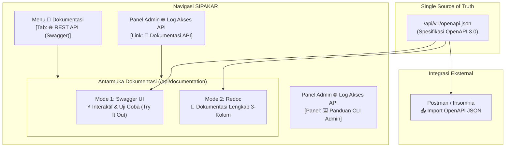

# Walkthrough: Fitur Dokumentasi REST API (Swagger UI & Redoc)

Fitur dokumentasi interaktif untuk REST API SIPAKAR RSUD Kardinah telah selesai dibangun secara menyeluruh. Fitur ini menggabungkan kemampuan **Uji Coba Langsung di Browser (Try It Out via Swagger UI)** dan **Tampilan Dokumentasi Lengkap 3-Kolom (Redoc)** berbasis standar industri **OpenAPI 3.0**, serta memuat seluruh materi panduan dari `documentation/API_PAGU_INTEGRATION_GUIDE.md`.

---

## 1. Arsitektur & Fitur Utama yang Diterapkan



### Rekapitulasi Komponen yang Dibangun:
1. **Spesifikasi OpenAPI 3.0 (`/api/v1/openapi.json`)**:
   - Menjadi *Single Source of Truth* bagi Swagger UI, Redoc, maupun tools pihak ketiga seperti Postman & Insomnia.
   - Menyediakan spesifikasi untuk endpoint:
     - `GET /api/v1/ping`: Uji konektivitas publik tanpa token.
     - `GET /api/v1/pagu`: Data pagu belanja anggaran RBA dengan **seluruh 17 parameter filter query** (lengkap dengan tipe data, deskripsi, contoh nilai, dan alias).
   - Skema sekuriti ganda:
     - `BearerAuth` (`Authorization: Bearer <token>`).
     - `ApiKeyAuth` (`X-API-KEY: <token>`).
   - Model respon JSON lengkap untuk HTTP 200 OK, 401 Unauthorized, 403 Forbidden, 429 Too Many Requests, dan 500 Server Error.
   - Contoh kode siap pakai dalam 4 bahasa: **cURL (Bash)**, **JavaScript (Fetch API)**, **PHP (GuzzleHttp)**, dan **Python (Requests)**.

2. **Portal Dokumentasi Interaktif Dual-View (`/api/documentation`)**:
   - **Mode 1: ⚡ Swagger UI (Uji Coba Langsung / Try It Out)**:
     - Tombol **"Authorize"** untuk memasukkan API Key (format Bearer atau X-API-KEY).
     - Tombol **"Try it out"** pada endpoint `GET /api/v1/pagu` yang membuka formulir parameter interaktif.
     - Tombol **"Execute"** untuk langsung mengirimkan HTTP request nyata ke server SIPAKAR dan melihat respon JSON live secara instan di browser.
   - **Mode 2: 📖 Redoc (Dokumentasi 3-Kolom)**:
     - Tampilan bersih dan elegan khas GitHub Redocly.
     - Kolom kiri: Navigasi cepat dan daftar isi.
     - Kolom tengah: Penjelasan skema, atribut, deskripsi parameter, dan petunjuk integrasi.
     - Kolom kanan: Contoh kode pemanggilan dan preview respons payload JSON.
   - **Tombol Unduh OpenAPI JSON (`openapi.json`)**:
     - Memungkinkan pengembang rekanan mengimpor langsung spesifikasi API ke Postman atau Insomnia mereka.

3. **Penyelesaian Dilema Bagian 7 (Perintah CLI Administrator)**:
   - **Pada Dokumentasi Pengembang / Rekanan Publik**: Bagian 7 diubah menjadi panduan **"📋 Prosedur Memperoleh API Key"** (instruksi resmi untuk menghubungi Tim IT / Bagian Perencanaan RSUD Kardinah).
   - **Pada Panel Administrator (`/admin/api-logs`)**: Disediakan kartu *collapsible* **"⌨️ Panduan Perintah CLI Artisan Administrator"** yang memuat perintah:
     - `php artisan api:client-create "Nama Aplikasi" [--expires-in-days=365]`
     - `php artisan api:client-list`
     - `php artisan api:client-revoke {id_klien}`
     - `php artisan api:logs-prune --days=30`

4. **Integrasi Navigasi SIPAKAR**:
   - Di halaman utama **📖 Dokumentasi** (`/documentation`), ditambahkan tab ke-3:
     `[ 📘 Panduan Web ]` • `[ 📄 Manual Book PDF ]` • `[ 🌐 REST API (Swagger) ]`.
   - Di panel **Log Data & Monitoring API** (`/admin/api-logs`), ditambahkan tombol langsung **"📖 Dokumentasi API"**.

---

## 2. Hasil Verifikasi & Automated Tests

Semua pengujian pada seluruh test suite SIPAKAR berjalan dengan hasil **100% lulus**:
```text
   PASS  Tests\Feature\Api\ApiDocumentationTest
  ✓ openapi json specification is accessible and valid
  ✓ api documentation page renders swagger by default
  ✓ api documentation page renders redoc when requested
  ✓ documentation api alias redirects to api documentation
  ✓ main documentation page contains link to api docs

   PASS  Tests\Feature\Admin\ApiAccessLogTest (9 passed)
   PASS  Tests\Feature\Api\PaguApiTest (12 passed)
   PASS  Tests\Feature\General\DocumentationTest (5 passed)

Total Keseluruhan Test Suite Aplikasi:
Tests:    196 passed (1000 assertions)
Duration: 42.10s
Status:   100% PASS
```

---

## 3. URL dan Cara Penggunaan

1. **Mengakses Swagger UI (Uji Coba API)**:
   - Buka browser ke: `http://<domain_atau_ip_server>/api/documentation?view=swagger` atau cukup `http://<domain_atau_ip_server>/api/documentation`
   - Klik tombol hijau **Authorize** di kanan atas, masukkan API Key (misal: `rba_live_...`).
   - Klik baris **GET /pagu**, klik tombol **Try it out**, masukkan filter yang diinginkan (contoh: `year: 2026`, `period: Murni`), lalu klik **Execute**.
   - Respon server dan data pagu akan tampil langsung.

2. **Mengakses Redoc (Dokumentasi 3-Kolom)**:
   - Buka browser ke: `http://<domain_atau_ip_server>/api/documentation?view=redoc` atau klik tombol switcher **📖 Redoc** pada bilah atas portal.

3. **Mengunduh Spesifikasi OpenAPI 3.0**:
   - Buka URL: `http://<domain_atau_ip_server>/api/v1/openapi.json` atau klik tombol **OpenAPI Spec .json** di pojok kanan atas portal untuk diimpor ke Postman.
