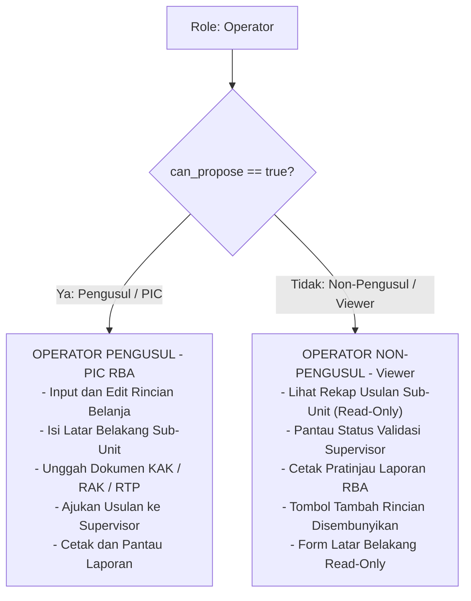

# Implementation Plan: Mekanisme Pembedaan Hak Pengusulan RBA pada User Operator (Pengusul vs Non-Pengusul / Viewer)

Dokumen ini menyajikan analisis kondisi sistem saat ini, opsi arsitektur, dan rekomendasi teknis untuk membedakan antara **Operator yang berwenang langsung melakukan pengusulan anggaran RBA (*Pengusul / PIC Anggaran*)** dan **Operator yang tidak berwenang mengusulkan RBA (*Non-Pengusul / Staf Viewer*)** pasca penetapan struktur Sub-Unit dan login SSO SIMRS di RSUD Kardinah.

---

## 1. Kondisi Sistem Saat Ini (Current State)

### 1.1 Bagaimana Mekanisme Pengusulan Berjalan Sekarang?
Saat ini di SIPAKAR, hak akses pengusulan anggaran sepenuhnya didasarkan pada **Peran Global tunggal (`role == 'Operator'`)** dan kesamaan unit kerja induk (`users.unit_id == rba_submissions.unit_id`):
1. **Akses Dashboard & Pengajuan**:
   - Seluruh pengguna ber-role `Operator` yang login dapat membuka menu pengajuan unitnya (`/operator/submissions/{id}`).
2. **Pengisian Latar Belakang & Dokumen**:
   - Setiap Operator memiliki formulir pengisian latar belakang mandiri (`operatorBackgrounds`) dan dapat mengunggah dokumen KAK/RAK/RTP.
3. **Penginputan Rincian Usulan Belanja**:
   - Tombol **"+ Tambah Rincian"** (`operator.details.create`) aktif bagi siapa saja yang memiliki role `Operator` di unit tersebut (asalkan latar belakang sudah terisi dan status RBA belum terkunci pagu).
   - Setiap Operator dapat mengedit, menghapus usulan draf miliknya, dan menekan tombol **"Ajukan ke Supervisor"** (`details.submit-item`).

### 1.2 Masalah yang Timbul Pasca Adanya Sub-Unit & SSO
Dengan diterapkannya Single Sign-On (SSO) SIMRS:
- Akun bukan lagi "akun milik bersama per instalasi" (akun generik), melainkan **Akun Personal Pegawai ber-NIP**.
- Dalam satu Sub-Bagian atau Instalasi (misalnya *Instalasi Farmasi* atau *Sub Bagian Perencanaan*), bisa terdapat **5 hingga 20 pegawai** yang sama-sama memiliki akun SSO dan terdaftar di unit tersebut.
- **Risiko & Kebingungan Saat Ini**:
  - Jika semua staf di suatu sub-unit diberi role `Operator`, maka **seluruh staf teknis/administrasi bisa menginput usulan belanja semau mereka**, sehingga rawan tumpang tindih, manipulasi tidak sengaja, atau hilangnya hierarki tanggung jawab.
  - Namun di sisi lain, jika staf tersebut sama sekali tidak diberi akun atau dinonaktifkan, mereka **tidak bisa memantau pagu, tidak bisa melihat usulan yang diajukan oleh PIC sub-unitnya, dan tidak bisa mencetak laporan RBA sub-unitnya**.

---

## 2. Pilihan Pendekatan Solusi (Architectural Options)

Berikut perbandingan 3 opsi solusi arsitektural untuk menjawab kebutuhan ini:

| Kriteria | Opsi 1: Permission Flag di User (`users.can_propose`) ⭐ *(Disarankan)* | Opsi 2: Flag di Level Sub-Unit (`sub_units.can_propose`) | Opsi 3: Penambahan Role Baru (`Role: Viewer`) |
|---|---|---|---|
| **Tingkat Fleksibilitas** | **Sangat Tinggi** (Bisa mengatur perorangan di sub-unit yang sama). | **Rendah** (Berlaku seragam untuk semua staf di sub-unit tersebut). | **Sedang** (Peran kaku di level auth global). |
| **Kesesuaian Realitas RSUD** | **Sangat Sesuai**: 1 Instalasi bisa memiliki 1 PIC Pengusul dan 4 Staf Viewer. | **Kurang Sesuai**: Jika sub-unit dimatikan, PIC-nya pun tidak bisa mengusulkan. | **Cukup Sesuai**, namun mengubah arsitektur role utama. |
| **Dampak Regresi (Zero-Regression)** | **0% Risiko Regresi**: Seluruh 206 automated tests dan query role eksisting tetap 100% aman. | **0% Risiko Regresi**, namun fungsionalitas terbatas. | **Risiko Regresi Tinggi**: Ratusan query `$user->role == 'Operator'` dan middleware rute harus dirombak. |
| **Kemudahan Administrasi** | Admin & Supervisor cukup mencentang toggle switch di form user. | Admin mencentang toggle di master data sub-unit. | Admin harus memilih role yang berbeda saat sinkronisasi SSO. |

---

## 3. Rekomendasi Solusi Terbaik: *User-Level Permission Flag (`can_propose`)*

Kami merekomendasikan **Opsi 1: Penambahan Kolom Otorisasi `can_propose` pada Tabel `users`**:



### Keunggulan Utama Rekomendasi Ini:
1. **Granularitas Personal Sempurna**:
   Di Sub-Bagian Tata Usaha atau Instalasi Radiologi, Kepala Bagian / Supervisor dapat menetapkan:
   - *Pegawai A (Koordinator/Bendahara Pembantu)* $\rightarrow$ `can_propose = true` (Bisa input & edit usulan).
   - *Pegawai B, C, D (Staf Pelaksana)* $\rightarrow$ `can_propose = false` (Hanya bisa melihat/memantau tanpa merusak data).
2. **Kenyamanan Operator Non-Pengusul**:
   Operator non-pengusul tidak merasa "dikesampingkan" atau ditolak masuk sistem. Mereka tetap memiliki akses ke sistem SIPAKAR untuk transparansi data anggaran, namun sistem membatasi aksi manipulasi data.
3. **100% Kompatibel dengan Akun Eksisting (Zero-Regression)**:
   Semua akun Operator yang sudah ada di database saat ini otomatis diberi nilai `can_propose = true` (default), sehingga aktivitas penganggaran yang sedang berjalan tidak ada yang terhenti.

---

## 4. Rencana Spesifikasi Teknis Implementasi

### 4.1 Perubahan Skema Basis Data (Database Migration)
* **File Migrasi Baru**: `database/migrations/2026_09_14_000001_add_can_propose_to_users_table.php`
* **Definisi Kolom**:
  ```php
  Schema::table('users', function (Blueprint $table) {
      $table->boolean('can_propose')->default(true)->after('sub_unit_id');
  });
  ```
* **Nilai Default**: `true` untuk menjamin tidak ada akun lama yang tiba-tiba kehilangan hak akses secara tidak sengaja.

### 4.2 Model Eloquent (`App\Models\User`)
* Menambahkan `'can_propose'` ke dalam properti `$fillable`.
* Menambahkan casting `'can_propose' => 'boolean'`.
* Menambahkan helper accessor / helper method:
  ```php
  public function isProposer(): bool
  {
      return $this->role === 'Operator' && $this->can_propose;
  }
  ```

### 4.3 Otorisasi Backend (Laravel Gates / Policy)
Mencegah manipulasi langsung via URL/API dengan mendefinisikan Gate otorisasi:
* Pada `App\Providers\AppServiceProvider` (atau Policy):
  ```php
  Gate::define('propose-rba', function (User $user) {
      return $user->role === 'Operator' && $user->can_propose;
  });
  ```
* Pada Controller Operator:
  - `DetailController@create`, `DetailController@store`:
    `Gate::authorize('propose-rba');`
  - `DetailController@edit`, `DetailController@update`, `DetailController@destroy`:
    `Gate::authorize('propose-rba');`
  - `DetailController@submitItem`:
    `Gate::authorize('propose-rba');`
  - `SubmissionController@updateBackground`:
    `Gate::authorize('propose-rba');`
  - `DocumentController@uploadDocument`:
    `Gate::authorize('propose-rba');`

### 4.4 Penyesuaian Antarmuka Pengguna (UI/UX)

#### A. Pada Tampilan Operator (`operator/submissions/show.blade.php`):
* **Jika `$user->can_propose == true`**:
  - Tombol **"+ Tambah Rincian"** tampil aktif berwarna biru.
  - Tombol aksi Edit, Hapus, Upload Revisi PDF, dan "Ajukan" tampil normal.
  - Editor Latar Belakang dan tombol Simpan Latar Belakang aktif.
* **Jika `$user->can_propose == false`**:
  - Tombol "+ Tambah Rincian" digantikan dengan badge informasi elegan:
    `<span class="bg-gray-100 text-gray-600 px-3 py-1.5 rounded text-xs font-medium border border-gray-200">👁️ Mode Peninjau (Hanya Lihat)</span>`
  - Kartu Latar Belakang menjadi tampilan *read-only* tanpa tombol edit/simpan.
  - Kolom aksi rincian usulan hanya menampilkan ikon "Lihat Lampiran PDF" dan tombol Cetak, sedangkan tombol Edit/Hapus/Submit disembunyikan.

#### B. Pada Panel Manajemen User Admin & Supervisor (`admin/users` dan `supervisor/users`):
* **Form Tambah & Edit User**:
  Ditambahkan sakelar pilihan (*checkbox / toggle switch*) khusus ketika role yang dipilih adalah **Operator**:
  ```html
  <div class="mt-4" id="can_propose_container">
      <label class="inline-flex items-center cursor-pointer">
          <input type="checkbox" name="can_propose" value="1" {{ old('can_propose', $user->can_propose ?? true) ? 'checked' : '' }} class="rounded border-gray-300 text-indigo-600 shadow-sm">
          <span class="ml-2 text-sm text-gray-700 font-medium">Izinkan Melakukan Pengusulan RBA (Hak Input Rincian Belanja & Latar Belakang)</span>
      </label>
      <p class="text-xs text-gray-500 mt-1">Jika tidak dicentang, pengguna ini berstatus sebagai Viewer (hanya dapat melihat data usulan & mencetak laporan sub-unitnya).</p>
  </div>
  ```
* **Tabel Daftar User**:
  Pada kolom Role/Akses, disematkan badge penjelas:
  - `<span class="badge bg-green-100 text-green-800">Operator (Pengusul)</span>`
  - `<span class="badge bg-gray-100 text-gray-700">Operator (Viewer)</span>`
* Ditambahkan filter cepat pada DataTables: **Semua / Hanya Pengusul / Hanya Viewer**.

---

## 5. Rencana Verifikasi & Automated Testing

1. **Unit & Feature Test Baru (`OperatorPermissionTest.php`)**:
   - Operator dengan `can_propose = true` dapat mengakses form create rincian dan menyimpan usulan belanja.
   - Operator dengan `can_propose = false` diarahkan ke HTTP 403 Forbidden saat mencoba mengakses endpoint create/store rincian belanja.
   - Operator dengan `can_propose = false` tetap dapat melihat index usulan, show usulan, dan mengunduh cetak pratinjau laporan RBA.
   - Administrator dan Supervisor dapat mengubah status `can_propose` user operator.
2. **Regression Testing Penuh**:
   - Memastikan seluruh 206 test case eksisting tetap lulus 100% tanpa ada yang terdampak.

---

## 6. Pertanyaan / Masukan untuk Pengguna (User Approval)

> [!NOTE]
> Apakah Anda menyetujui rekomendasi **Opsi 1 (User-Level Permission Flag `can_propose`)** di atas untuk diterapkan pada sistem SIPAKAR?
> 
> Jika Anda menyetujui, kami akan segera mengeksekusi implementasi ini secara menyeluruh (migrasi database, proteksi Gate controller, penyesuaian form user Admin/Supervisor, penyesuaian antarmuka Operator, dan pembuatan unit test).
