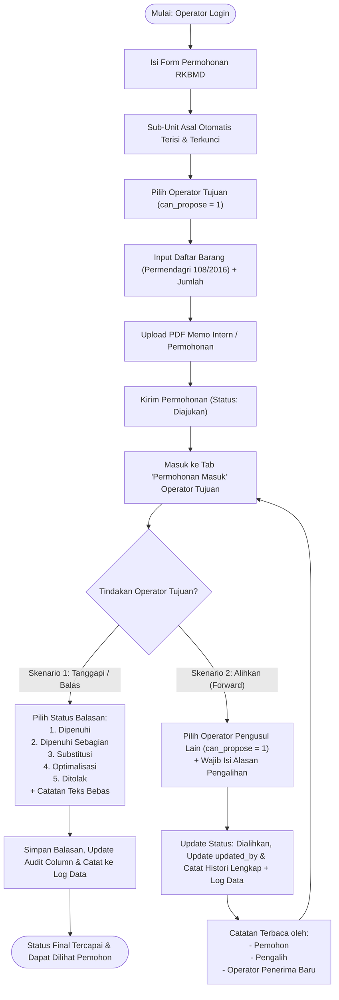

# Implementation Plan: Menu Rencana Kebutuhan Barang Milik Daerah (RKBMD) Permohonan Barang Antar-Operator (Revisi Kolom Audit & Log Data)

Dokumen ini menyajikan revisi rencana arsitektur dan implementasi teknis untuk modul **Rencana Kebutuhan Barang Milik Daerah (RKBMD)** pada aplikasi SIPAKAR RSUD Kardinah Kota Tegal. Modul ini memfasilitasi seluruh user level Operator (baik staf non-pengusul/viewer maupun pengusul) untuk mengajukan permohonan pengadaan/kebutuhan barang kepada Operator Pengusul RBA (`can_propose = 1`), dengan mekanisme tindak lanjut dua skenario (Balasan Keputusan vs Pengalihan Berantai Berita Acara / Riwayat Lengkap), katalog Master Barang berbasis **Permendagri No. 108 Tahun 2016**, **kolom pelengkap audit penuh (`created_at`, `created_by`, `updated_at`, `updated_by`, `deleted_at`, `deleted_by`)**, serta **pencatatan otomatis ke Log Data (`activity_logs`)**.

---

## 1. Latar Belakang & Kebutuhan Sistem

### 1.1 Latar Belakang
Pasca pembedaan hak akses pengusulan RBA (`can_propose = 1` vs `can_propose = 0`), operator staf/peninjau di masing-masing sub-unit memerlukan saluran resmi dalam sistem untuk menyampaikan kebutuhan barang/alat/fasilitas sub-unitnya ke Pejabat Pembuat Usulan (PIC RBA / Operator Pengusul) yang berwenang menyusun RBA belanja.

Selain itu, dalam tata kelola Rumah Sakit Daerah dan pengelolaan aset daerah:
1. Pengusulan belanja modal dan barang habis pakai harus merujuk pada kodefikasi Barang Milik Daerah sesuai **Permendagri No. 108 Tahun 2016**.
2. PIC pengusul yang menerima permohonan belum tentu merupakan penanggung jawab akhir untuk akun rekening belanja terkait (misal: Sub-Unit Rawat Jalan memohon printer ke Pengusul Bagian Umum, namun pengadaan IT seharusnya diusulkan oleh Pengusul Sub Bagian IT/SIMRS). Oleh karena itu, permohonan harus dapat **dialihkan (*forwarded*) secara berantai antar-operator pengusul** dengan jejak riwayat audit yang transparan dan lengkap.
3. **Standar Audit & Akuntabilitas**:
   - Seluruh tabel transaksi dan master barang wajib dilengkapi kolom pelengkap audit:
     - `created_at` & `created_by` (user yang membuat rekaman data)
     - `updated_at` & `updated_by` (user terakhir yang memperbarui data)
     - `deleted_at` & `deleted_by` (user yang melakukan penghapusan/soft delete)
   - Seluruh aktivitas pembuatan, perubahan, pengalihan, balasan, dan penghapusan data wajib **terekam secara otomatis ke Menu Log Data (`activity_logs`)** melalui integrasi trait `LogsActivity`.

### 1.2 Ringkasan Alur & Aturan Bisnis (Business Rules)
1. **Hak Akses Pemohon**: Seluruh akun ber-role `Operator` dapat membuat permohonan RKBMD.
2. **Asal Sub-Unit Pemohon**: Otomatis terisi dari `sub_unit_id` operator yang sedang login dan terkunci (`readonly/disabled`), karena sub-unit melekat pada profil operator.
3. **Operator Tujuan Awal**: Dipilih dari daftar user Operator yang memiliki hak pengusulan (`can_propose = 1`) dan berstatus aktif.
4. **Daftar Barang & Volume**: Multi-item dinamis (tambah/hapus baris) yang merujuk pada Master Data Barang Permendagri 108/2016 (menyimpan `id`, `kode_barang`, `nama_barang`, volume/jumlah, satuan, spesifikasi).
5. **Dokumen Pendukung**: Wajib mengunggah file PDF nota dinas / memo intern permohonan (maks. 10MB).
6. **Skenario Tindak Lanjut Pasca Pengajuan**:
   - **Skenario 1 (Pemberian Tanggapan / Balasan)**: Operator tujuan membalas dengan teks bebas dan menentukan salah satu status:
     - `Dipenuhi`
     - `Dipenuhi Sebagian`
     - `Substitusi`
     - `Optimalisasi`
     - `Ditolak`
   - **Skenario 2 (Pengalihan / Forwarding)**: Operator tujuan tidak membalas, melainkan mengalihkan permohonan ke operator pengusul RBA lain (`can_propose = 1`):
     - Status permohonan menjadi `Dialihkan`.
     - Wajib mengisi keterangan/alasan pengalihan.
     - Riwayat pengalihan dapat dibaca oleh: **Operator Pemohon**, **Operator Pengalih**, dan **Operator Tujuan Baru**.
     - Operator tujuan baru dapat membalas (Skenario 1) atau mengalihkan kembali ke operator pengusul lain (Skenario 2 berulang).
7. **Audit Trail Riwayat Lengkap & Log Data**:
   - Setiap tahapan (pengajuan, pengalihan 1, pengalihan 2, ..., balasan akhir) dicatat secara kronologis di tabel histori `rkbmd_histories` dan disajikan dalam bentuk Timeline interaktif.
   - Seluruh mutasi data tercatat di tabel `activity_logs` dan dapat dipantau di menu *Log Data* administrator.

---

## 2. Diagram Alur Proses (Flowchart)



---

## 3. Desain Basis Data & Skema ERD Lengkap

### 3.1 Skema Tabel dengan Kolom Pelengkap Audit

#### Tabel 1: `master_barangs` (Katalog BMD Permendagri No. 108 Tahun 2016)
| Kolom | Tipe Data | Keterangan |
| :--- | :--- | :--- |
| `id` | `BIGINT UNSIGNED AUTO_INCREMENT` | Primary Key |
| `kode_barang` | `VARCHAR(100)` | Kodefikasi barang Permendagri 108/2016 (cth: `1.3.2.05.01.01.001`), indexed & unique |
| `nama_barang` | `VARCHAR(255)` | Nama resmi barang BMD |
| `satuan` | `VARCHAR(50)` | Nullable (cth: Unit, Buah, Set, Kotak, Box, Botol) |
| `deskripsi` | `TEXT` | Nullable, keterangan spesifikasi umum |
| `is_active` | `BOOLEAN` | Default `true` |
| `created_by` | `BIGINT UNSIGNED` | Nullable, FK ke `users.id` (User pembuat) |
| `updated_by` | `BIGINT UNSIGNED` | Nullable, FK ke `users.id` (User pengubah terakhir) |
| `deleted_by` | `BIGINT UNSIGNED` | Nullable, FK ke `users.id` (User penghapus) |
| `created_at` | `TIMESTAMP` | Waktu dibuat |
| `updated_at` | `TIMESTAMP` | Waktu diperbarui |
| `deleted_at` | `TIMESTAMP` | Nullable (Soft Deletes) |

#### Tabel 2: `rkbmd_submissions` (Header Tiket Permohonan RKBMD)
| Kolom | Tipe Data | Keterangan |
| :--- | :--- | :--- |
| `id` | `BIGINT UNSIGNED AUTO_INCREMENT` | Primary Key |
| `nomor_permohonan` | `VARCHAR(100)` | Unique, contoh: `RKBMD/2026/09/0001` |
| `year` | `YEAR` | Tahun anggaran usulan (cth: 2026) |
| `user_id` | `BIGINT UNSIGNED` | FK ke `users.id` (Pemohon) |
| `unit_id` | `BIGINT UNSIGNED` | FK ke `units.id` (Unit Induk Pemohon) |
| `sub_unit_id` | `BIGINT UNSIGNED` | FK ke `sub_units.id` (Sub-Unit Pemohon, Nullable jika direct unit) |
| `target_operator_id` | `BIGINT UNSIGNED` | FK ke `users.id` (Operator pengusul pemegang berkas aktif saat ini) |
| `original_operator_id` | `BIGINT UNSIGNED` | FK ke `users.id` (Operator pengusul tujuan pertama kali diajukan) |
| `title` | `VARCHAR(255)` | Perihal / Judul Permohonan |
| `notes` | `TEXT` | Latar belakang / Penjelasan kebutuhan dari pemohon |
| `attachment_path` | `VARCHAR(255)` | Path file PDF memo intern di storage public |
| `status` | `ENUM` | `Diajukan`, `Dialihkan`, `Dipenuhi`, `Dipenuhi Sebagian`, `Substitusi`, `Optimalisasi`, `Ditolak` |
| `reply_notes` | `TEXT` | Nullable, teks bebas balasan dari operator tujuan |
| `replied_at` | `TIMESTAMP` | Nullable, waktu permohonan dibalas |
| `replied_by` | `BIGINT UNSIGNED` | Nullable, FK ke `users.id` yang memberikan balasan final |
| `created_by` | `BIGINT UNSIGNED` | Nullable, FK ke `users.id` |
| `updated_by` | `BIGINT UNSIGNED` | Nullable, FK ke `users.id` |
| `deleted_by` | `BIGINT UNSIGNED` | Nullable, FK ke `users.id` |
| `created_at` | `TIMESTAMP` | Waktu dibuat |
| `updated_at` | `TIMESTAMP` | Waktu diperbarui |
| `deleted_at` | `TIMESTAMP` | Nullable (Soft Deletes) |

#### Tabel 3: `rkbmd_items` (Daftar Rincian Barang yang Dimohonkan)
| Kolom | Tipe Data | Keterangan |
| :--- | :--- | :--- |
| `id` | `BIGINT UNSIGNED AUTO_INCREMENT` | Primary Key |
| `rkbmd_submission_id` | `BIGINT UNSIGNED` | FK ke `rkbmd_submissions.id` (Cascade on delete) |
| `master_barang_id` | `BIGINT UNSIGNED` | FK ke `master_barangs.id` |
| `volume` | `DECIMAL(12, 2)` | Jumlah/volume barang yang dimohonkan |
| `satuan` | `VARCHAR(50)` | Satuan barang |
| `spesifikasi` | `TEXT` | Nullable, spesifikasi teknis / merk / tipe yang dibutuhkan |
| `volume_disetujui` | `DECIMAL(12, 2)` | Nullable, jumlah yang dipenuhi (diisi saat balasan) |
| `status_item` | `VARCHAR(50)` | Nullable, status per item: `Dipenuhi`, `Dipenuhi Sebagian`, `Substitusi`, `Optimalisasi`, `Ditolak` |
| `catatan_operator` | `TEXT` | Nullable, catatan tindak lanjut per item dari operator tujuan |
| `created_by` | `BIGINT UNSIGNED` | Nullable, FK ke `users.id` |
| `updated_by` | `BIGINT UNSIGNED` | Nullable, FK ke `users.id` |
| `deleted_by` | `BIGINT UNSIGNED` | Nullable, FK ke `users.id` |
| `created_at` | `TIMESTAMP` | Waktu dibuat |
| `updated_at` | `TIMESTAMP` | Waktu diperbarui |
| `deleted_at` | `TIMESTAMP` | Nullable (Soft Deletes) |

#### Tabel 4: `rkbmd_histories` (Audit Trail & Riwayat Pengalihan Lengkap)
| Kolom | Tipe Data | Keterangan |
| :--- | :--- | :--- |
| `id` | `BIGINT UNSIGNED AUTO_INCREMENT` | Primary Key |
| `rkbmd_submission_id` | `BIGINT UNSIGNED` | FK ke `rkbmd_submissions.id` (Cascade on delete) |
| `user_id` | `BIGINT UNSIGNED` | FK ke `users.id` (Aktor yang mengeksekusi aksi) |
| `action` | `VARCHAR(50)` | `Pengajuan`, `Pengalihan`, `Balasan` |
| `from_operator_id` | `BIGINT UNSIGNED` | Nullable, FK ke `users.id` (Operator asal pengalih) |
| `to_operator_id` | `BIGINT UNSIGNED` | Nullable, FK ke `users.id` (Operator penerima baru) |
| `status_before` | `VARCHAR(50)` | Status sebelum aksi |
| `status_after` | `VARCHAR(50)` | Status setelah aksi |
| `notes` | `TEXT` | Alasan pengalihan atau teks balasan |
| `created_by` | `BIGINT UNSIGNED` | Nullable, FK ke `users.id` |
| `updated_by` | `BIGINT UNSIGNED` | Nullable, FK ke `users.id` |
| `created_at` | `TIMESTAMP` | Waktu dibuat |
| `updated_at` | `TIMESTAMP` | Waktu diperbarui |

---

## 4. Mekanisme Otomatisasi Kolom Pelengkap & Log Data

### 4.1 Trait `App\Traits\TracksUserAudit`
Untuk memastikan pengisian kolom `created_by`, `updated_by`, dan `deleted_by` berjalan otomatis dan konsisten di seluruh model tanpa perlu di-assign secara manual di controller:
```php
namespace App\Traits;

use Illuminate\Support\Facades\Auth;

trait TracksUserAudit
{
    public static function bootTracksUserAudit()
    {
        static::creating(function ($model) {
            if (Auth::check() && !$model->created_by) {
                $model->created_by = Auth::id();
            }
        });

        static::updating(function ($model) {
            if (Auth::check()) {
                $model->updated_by = Auth::id();
            }
        });

        static::deleting(function ($model) {
            if (Auth::check() && in_array('Illuminate\Database\Eloquent\SoftDeletes', class_uses_recursive($model))) {
                $model->deleted_by = Auth::id();
                $model->saveQuietly();
            }
        });
    }

    public function creator()
    {
        return $this->belongsTo(\App\Models\User::class, 'created_by');
    }

    public function updater()
    {
        return $this->belongsTo(\App\Models\User::class, 'updated_by');
    }

    public function deleter()
    {
        return $this->belongsTo(\App\Models\User::class, 'deleted_by');
    }
}
```

### 4.2 Integrasi ke Sistem Log Data (`App\Traits\LogsActivity`)
Seluruh model baru (`MasterBarang`, `RkbmdSubmission`, `RkbmdItem`, `RkbmdHistory`) akan menyertakan `use LogsActivity;`. Pada [`app/Traits/LogsActivity.php`](file:///c:/Users/PDETUF/Project/Rumah%20Sakit/rbakardinah/app/Traits/LogsActivity.php), ditambahkan penanganan khusus pada method `generateActivityDescription`:
- **`RkbmdSubmission`**:
  - Pada event `created`: `"{$actor} membuat Permohonan RKBMD: \"{$model->title}\" ({$model->nomor_permohonan})"`
  - Pada event `updated` saat dialihkan: `"{$actor} mengalihkan Permohonan RKBMD #{$model->nomor_permohonan} ke operator {$model->targetOperator?->name}"`
  - Pada event `updated` saat dibalas: `"{$actor} membalas Permohonan RKBMD #{$model->nomor_permohonan} dengan status {$model->status}"`
- **`MasterBarang`**:
  - Pada event `created`: `"{$actor} menambahkan Master Barang BMD: [{$model->kode_barang}] {$model->nama_barang}"`
  - Pada event `updated`: `"{$actor} memperbarui Master Barang BMD: [{$model->kode_barang}] {$model->nama_barang}"`
  - Pada event `deleted`: `"{$actor} menghapus Master Barang BMD: [{$model->kode_barang}] {$model->nama_barang}"`

---

## 5. Rincian Komponen Teknis & Arsitektur

### 5.1 Backend (Models & Relationships)
1. **Model `MasterBarang` (`app/Models/MasterBarang.php`)**:
   - Uses: `SoftDeletes`, `LogsActivity`, `TracksUserAudit`
   - `$fillable = ['kode_barang', 'nama_barang', 'satuan', 'deskripsi', 'is_active', 'created_by', 'updated_by', 'deleted_by']`
   - Relasi `hasMany(RkbmdItem::class)`
2. **Model `RkbmdSubmission` (`app/Models/RkbmdSubmission.php`)**:
   - Uses: `SoftDeletes`, `LogsActivity`, `TracksUserAudit`
   - `$fillable`: seluruh field header termasuk kolom audit.
   - Relasi:
     - `applicant`: `belongsTo(User::class, 'user_id')`
     - `unit`: `belongsTo(Unit::class, 'unit_id')`
     - `subUnit`: `belongsTo(SubUnit::class, 'sub_unit_id')`
     - `targetOperator`: `belongsTo(User::class, 'target_operator_id')`
     - `originalOperator`: `belongsTo(User::class, 'original_operator_id')`
     - `repliedBy`: `belongsTo(User::class, 'replied_by')`
     - `items`: `hasMany(RkbmdItem::class)`
     - `histories`: `hasMany(RkbmdHistory::class)->latest()`
   - Helper methods:
     - `canBeManagedBy(User $user)`: Memastikan apakah user login adalah `target_operator_id` saat ini dan berstatus belum final.
3. **Model `RkbmdItem` (`app/Models/RkbmdItem.php`)**:
   - Uses: `SoftDeletes`, `LogsActivity`, `TracksUserAudit`
   - Relasi: `belongsTo(RkbmdSubmission::class)`, `belongsTo(MasterBarang::class)`
4. **Model `RkbmdHistory` (`app/Models/RkbmdHistory.php`)**:
   - Uses: `LogsActivity`, `TracksUserAudit`
   - Relasi:
     - `actor`: `belongsTo(User::class, 'user_id')`
     - `fromOperator`: `belongsTo(User::class, 'from_operator_id')`
     - `toOperator`: `belongsTo(User::class, 'to_operator_id')`

### 5.2 Controllers & Logic
1. **`App\Http\Controllers\Operator\RkbmdController`**:
   - `index()`:
     - Menampilkan tab:
       1. *Permohonan Saya* (`user_id = Auth::id()` atau unit/sub-unitnya)
       2. *Permohonan Masuk* (Khusus akun dengan `can_propose = true`, di mana `target_operator_id = Auth::id()`).
   - `create()`:
     - Mengambil data operator login, sub-unit login (otomatis terkunci).
     - Mengambil daftar operator tujuan: `User::where('role', 'Operator')->where('can_propose', true)->where('is_active', true)->where('id', '!=', Auth::id())->with(['unit', 'subUnit'])->get()`.
     - Mengambil master barang aktif untuk pilihan dinamis.
   - `store()`:
     - Validasi `target_operator_id` (wajib operator `can_propose = true`).
     - Validasi file PDF `attachment` (mimes:pdf, max:10240).
     - Validasi array item barang: `items.*.master_barang_id`, `items.*.volume`, `items.*.satuan`.
     - Generate nomor tiket otomatis `RKBMD/{TAHUN}/{BULAN}/{INDEX_4DIGIT}`.
     - Menyimpan record `rkbmd_submissions`, `rkbmd_items`, dan mencatat histori pertama: `action = 'Pengajuan'`.
   - `show(RkbmdSubmission $rkbmd)`:
     - Hak akses: Pemohon, Operator Pengalih terdahulu, Operator Tujuan saat ini, Supervisor unit pemohon, atau Administrator.
     - Menampilkan rincian permohonan, tabel daftar barang, preview PDF memo intern, dan **Timeline Riwayat Pengalihan & Status**.
     - Jika viewer adalah `target_operator_id` dan status masih belum final (`Diajukan` / `Dialihkan`), muncul tombol aksi: **Tanggapi / Balas** dan **Alihkan Permohonan**.
   - `reply(Request $request, RkbmdSubmission $rkbmd)` (Skenario 1):
     - Validasi: `status` (`in:Dipenuhi,Dipenuhi Sebagian,Substitusi,Optimalisasi,Ditolak`), `reply_notes` (required string).
     - Mengupdate status submission, mengisi `reply_notes`, `replied_by = Auth::id()`, `replied_at = now()`.
     - Mencatat ke `rkbmd_histories` (`action = 'Balasan'`).
   - `forward(Request $request, RkbmdSubmission $rkbmd)` (Skenario 2):
     - Validasi: `new_target_operator_id` (`exists:users,id`, role Operator, `can_propose = true`, `!= Auth::id()`), `forward_reason` (required string).
     - Memperbarui `target_operator_id` menjadi target baru.
     - Status berubah menjadi `Dialihkan`.
     - Mencatat record baru ke `rkbmd_histories`:
       - `action = 'Pengalihan'`
       - `from_operator_id = Auth::id()`
       - `to_operator_id = $request->new_target_operator_id`
       - `notes = $request->forward_reason`

2. **`App\Http\Controllers\Admin\MasterBarangController`**:
   - CRUD Master Barang Permendagri 108/2016 (Index DataTables, Create, Edit, Toggle Aktif/Nonaktif).
   - Fitur Seed / Initial Data import untuk kodefikasi umum barang milik daerah RSUD.

---

## 6. Rencana Antarmuka Pengguna (UI / Views)

### 6.1 Navigasi
- Navigasi Operator: Menambahkan link menu **📦 RKBMD** di [`navigation.blade.php`](file:///c:/Users/PDETUF/Project/Rumah%20Sakit/rbakardinah/resources/views/layouts/navigation.blade.php).
- Navigasi Admin: Menambahkan sub-menu **📦 Master Barang (Permendagri 108)** pada dropdown *Master Data*.

### 6.2 Halaman & Komponen View
1. **`resources/views/operator/rkbmd/index.blade.php`**:
   - Header ringkasan metrik: *Total Permohonan Saya*, *Menunggu Balasan*, *Dipenuhi*, *Dialihkan*.
   - Tab switcher:
     - Tab **Permohonan Saya** (menampilkan status badge, nomor surat, tanggal, operator tujuan, jumlah item barang).
     - Tab **Permohonan Masuk** (hanya muncul jika `Auth::user()->can_propose == true`, menampilkan badge *Baru* atau *Dialihkan Dari [Nama]*).
2. **`resources/views/operator/rkbmd/create.blade.php`**:
   - Form pembuatan permohonan baru.
   - Field **Asal Sub-Unit Kerja**: Menggunakan input readonly/disabled dengan ikon pin `📌 {{ Auth::user()->subUnit?->name ?? 'Langsung di bawah Unit Induk' }}`.
   - Field **Operator Pengusul Tujuan**: Dropdown terkelompok dengan keterangan unit & sub-unit.
   - **Tabel Dinamis Tambah Barang (Alpine.js)**:
     - Tombol "+ Tambah Barang"
     - Baris input: Pilihan Master Barang (Dropdown/Datalist searchable), Volume, Satuan, Keterangan Tambahan, Tombol Hapus Baris.
   - Upload PDF Memo Intern.
3. **`resources/views/operator/rkbmd/show.blade.php`**:
   - Kartu Informasi Pengajuan (Pemohon, Sub-Unit Asal, Waktu Pengajuan, Operator Pemegang Saat Ini, Info Created by & Updated by).
   - Kartu Berkas Lampiran (Preview file PDF memo intern).
   - Tabel Rincian Barang Dimohonkan (dengan status item jika sudah dibalas).
   - **Komponen Timeline Riwayat Lengkap**:
     - Visual audit trail yang memperlihatkan alur perjalanan permohonan dari saat diajukan, setiap titik pengalihan beserta nama pengalih, penerima, tanggal jam, dan alasan pengalihan, hingga balasan akhir.
   - Panel Aksi Operator Tujuan (jika `Auth::id() == $rkbmd->target_operator_id`):
     - **Tombol 1: Berikan Balasan (Skenario 1)** -> Membuka modal tanggapan status & teks bebas.
     - **Tombol 2: Alihkan ke Pengusul Lain (Skenario 2)** -> Membuka modal pengalihan (pilih operator pengusul baru + alasan).

---

## 7. Rencana Verifikasi & Pengujian (Zero Regression)

### 7.1 Automated Feature Testing
Membuat test suite khusus: `tests/Feature/Operator/RkbmdTest.php` yang memverifikasi:
1. Operator dapat melihat menu RKBMD dan halaman form pengajuan.
2. Nilai asal sub-unit terkunci otomatis sesuai profil user yang login.
3. Validasi gagal jika operator tujuan bukan akun dengan `can_propose = true`.
4. Berhasil menyimpan permohonan, item barang, file upload PDF, dan riwayat awal `Pengajuan`.
5. Kolom pelengkap `created_by`, `updated_by` terisi otomatis oleh trait `TracksUserAudit`.
6. Seluruh mutasi RKBMD tercatat di `activity_logs` (Menu Log Data).
7. Operator tujuan dapat membalas permohonan (Skenario 1) dengan teks bebas dan salah satu dari 5 status.
8. Operator tujuan dapat mengalihkan permohonan (Skenario 2) ke operator pengusul lain.
9. Verifikasi riwayat pengalihan tercatat lengkap di `rkbmd_histories` dan terbaca oleh pemohon, pengalih, dan penerima baru.
10. Operator penerima baru dapat membalas atau mengalihkan kembali permohonan.
11. Operator non-pengusul (`can_propose = 0`) diblokir jika mencoba mengakses aksi balasan/pengalihan.
12. Admin dapat mengelola Master Barang Permendagri 108/2016 lengkap dengan pencatatan `activity_logs`.

### 7.2 Regression Testing
- Menjalankan seluruh test suite aplikasi (`php artisan test`) untuk memastikan **217+ test cases yang telah ada tetap 100% PASS (Hijau)**.

---

## 8. Rencana Tahapan Eksekusi

| Tahap | Aktivitas |
| :--- | :--- |
| **Tahap 1** | Pembuatan Trait `TracksUserAudit` & Modifikasi `LogsActivity` untuk context RKBMD & Master Barang. |
| **Tahap 2** | Pembuatan Database Migrations dengan kolom pelengkap audit (`master_barangs`, `rkbmd_submissions`, `rkbmd_items`, `rkbmd_histories`) & Seeder Permendagri 108. |
| **Tahap 3** | Pembuatan Models Eloquent & Relasi (`MasterBarang`, `RkbmdSubmission`, `RkbmdItem`, `RkbmdHistory`). |
| **Tahap 4** | Pembuatan Controller `RkbmdController` (aliran permohonan, balasan, dan pengalihan berantai) & `MasterBarangController`. |
| **Tahap 5** | Pembuatan Tampilan Antarmuka (Views: Index Tab, Create Dynamic Items, Show with Timeline History, Modals Balasan & Pengalihan). |
| **Tahap 6** | Integrasi Navigasi di `layouts/navigation.blade.php`. |
| **Tahap 7** | Pembuatan Automated Test Suite & Eksekusi Pengujian Penuh. |
| **Tahap 8** | Pembuatan Dokumen Walkthrough & Penyimpanan ke `documentation/`. |
