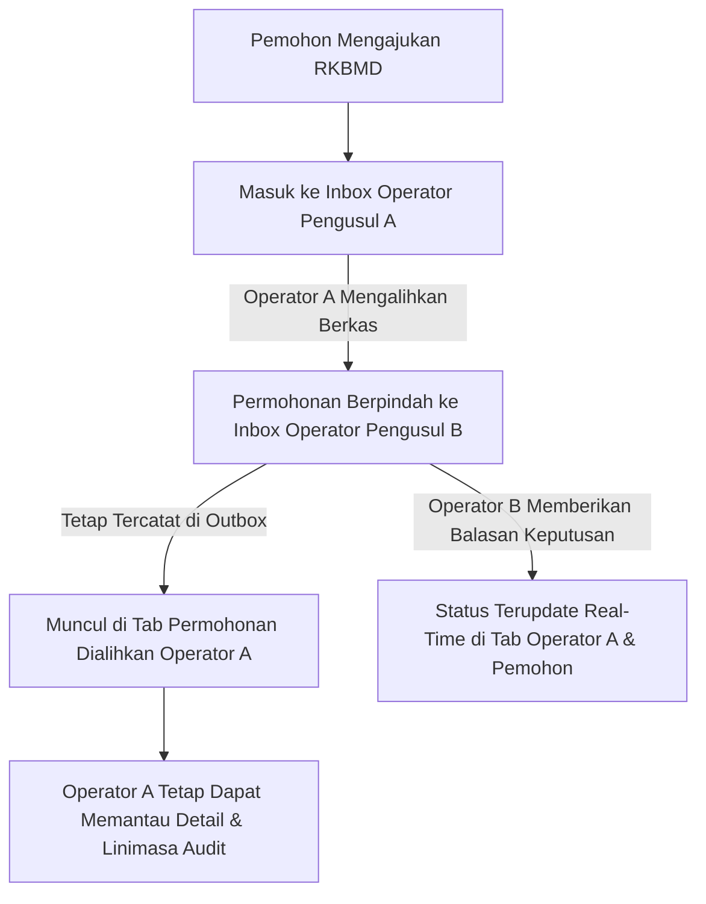

# Walkthrough: Fitur Monitoring Permohonan RKBMD yang Dialihkan oleh Operator Pengusul

## Ringkasan Fitur
Sebelumnya, ketika Operator Pengusul (PIC RBA) mengalihkan (*forward*) permohonan RKBMD ke operator pengusul lain, berkas tersebut langsung berpindah ke kotak masuk operator tujuan dan hilang dari daftar operator pengalih. Hal ini menimbulkan persepsi bahwa data permohonan seolah hilang atau tidak dapat dilacak kembali.

Kini sistem telah dilengkapi dengan tab khusus **"↪️ Permohonan Dialihkan"** pada menu RKBMD. Fitur ini memungkinkan Operator Pengusul untuk tetap memantau seluruh berkas yang pernah dialihkan ke PIC lain, melihat perkembangan status terkininya secara *real-time*, serta meninjau riwayat lengkap dan audit trail tanpa kehilangan jejak berkas.

---

## Perubahan yang Diimplementasikan

### 1. Controller & Query Logika
- **File**: [`app/Http/Controllers/Operator/RkbmdController.php`](file:///c:/Users/PDETUF/Project/Rumah%20Sakit/rbakardinah/app/Http/Controllers/Operator/RkbmdController.php)
  - **Query Berkas Dialihkan (`index()`)**:
    Menambahkan pengambilan koleksi `$forwardedSubmissions` bagi pengguna berstatus pengusul (`$isProposer`):
    ```php
    $forwardedSubmissions = RkbmdSubmission::with(['applicant', 'subUnit', 'unit', 'items', 'targetOperator', 'histories'])
        ->whereHas('histories', function ($q) use ($user) {
            $q->where('action', 'Pengalihan')
                ->where('from_operator_id', $user->id);
        })
        ->where('target_operator_id', '!=', $user->id)
        ->latest('updated_at')
        ->get();
    ```
  - **Perbaikan Scoping Grup Query Partisipan (`show()`)**:
    Merapikan pengelompokan query `where` pada histori berkas agar hak akses partisipan terdahulu (termasuk operator pengalih) terisolasi secara tepat pada `rkbmd_submission_id`.

### 2. Antarmuka Pengguna (Blade Views & Alpine.js)
- **File Indeks Menu RKBMD**: [`resources/views/operator/rkbmd/index.blade.php`](file:///c:/Users/PDETUF/Project/Rumah%20Sakit/rbakardinah/resources/views/operator/rkbmd/index.blade.php)
  - **Tab Switcher Card**:
    Menambahkan tombol tab ke-3 **"↪️ Permohonan Dialihkan"** dengan badge counter dinamis `{{ $forwardedSubmissions->count() }}` khusus bagi operator pengusul.
  - **Tabel Permohonan Dialihkan**:
    Menyediakan tabel terstruktur yang menampilkan:
    1. **No. Tiket & Tanggal Pengajuan**
    2. **Pemohon & Asal Sub-Unit**
    3. **Perihal Permohonan & Catatan**
    4. **Dialihkan Kepada**: Menampilkan nama dan unit PIC penerima alihan berkas saat ini.
    5. **Jumlah Item Barang**
    6. **Status Terkini**: Menampilkan badge status langsung (*Dialihkan*, *Dipenuhi*, *Dipenuhi Sebagian*, *Substitusi*, *Optimalisasi*, atau *Ditolak*).
    7. **Aksi**: Tombol *"Lihat Detail & Pantau →"*.
- **File Halaman Detail Permohonan**: [`resources/views/operator/rkbmd/show.blade.php`](file:///c:/Users/PDETUF/Project/Rumah%20Sakit/rbakardinah/resources/views/operator/rkbmd/show.blade.php)
  - Menampilkan banner status informatif amber bagi operator pengalih:
    *"ℹ️ Berkas Telah Anda Alihkan: Anda telah meneruskan permohonan ini kepada [Nama Operator Penerima]. Anda tetap dapat memantau perkembangan dan tindak lanjut status keputusan melalui linimasa riwayat di bawah ini."*

---

## Verifikasi & Hasil Pengujian

### 1. Pengujian Otomatis Fitur RKBMD (`Tests\Feature\Operator\RkbmdTest`)
Pengujian mencakup:
1. Operator pengalih melihat permohonan yang baru saja dialihkan pada tab `forwarded` (Permohonan Dialihkan) lengkap dengan tujuan alihan.
2. Permohonan yang dialihkan otomatis keluar dari tab `incoming` (Permohonan Masuk) operator pengalih dan berpindah ke tab `incoming` operator penerima alihan.
3. Operator pengalih dapat membuka halaman detail dan melihat banner status pengalihan serta linimasa audit.
4. Ketika operator penerima alihan memberikan balasan keputusan (misal: `Dipenuhi`), status pada tab `forwarded` operator pengalih otomatis ikut terupdate secara konsisten.

Hasil eksekusi:
```text
   PASS  Tests\Feature\Operator\RkbmdTest
  ✓ operator can access rkbmd index and create page
  ✓ operator can submit rkbmd with items and pdf memo
  ✓ audit columns and activity logs are automatically populated
  ✓ target operator can reply with status and free text
  ✓ target operator can forward rkbmd to another proposer and logs history
  ✓ viewer operator cannot reply or forward rkbmd
  ✓ admin can manage master barang permendagri 108
  ✓ admin master barangs index handles empty table without breaking datatables
  ✓ target operator can edit reply and logs history
  ✓ viewer and unauthorized operator cannot edit reply
  ✓ admin can delegate master barangs menu permission to operator
  ✓ operator with delegated permission can manage master barangs
  ✓ operator without delegated permission cannot access master barangs
  ✓ operator with delegated permission cannot access other admin menus
  ✓ applicant operator can access edit page when status diajukan and no forward or reply
  ✓ applicant operator can update submission and items and logs history
  ✓ applicant cannot edit if submission has been replied
  ✓ applicant cannot edit if submission has been forwarded
  ✓ unauthorized operator cannot edit submission
  ✓ forwarding operator sees forwarded submission in dedicated tab
  ✓ forwarding operator can view show page and banner of forwarded submission
  ✓ forwarded submission status updates when resolved by target operator

  Tests:    22 passed (103 assertions)
  Duration: 3.59s
```

### 2. Pengujian Regresi Menyeluruh (Full Test Suite)
```text
Tests:    239 passed (1172 assertions)
Duration: 45.34s
Status:   100% HIJAU (PASSED)
```

---

## Kesimpulan Alur Kerja Pengalihan Berkas



1. **Kotak Masuk Tindak Lanjut Tetap Bersih**: Tab *Permohonan Masuk* hanya berisi berkas yang memerlukan tindakan aktif operator.
2. **Tidak Ada Data yang Hilang**: Seluruh berkas yang pernah diteruskan ke PIC lain tetap tersimpan dan dapat dipantau di tab *Permohonan Dialihkan*.
3. **Akuntabilitas & Transparansi Penuh**: Seluruh riwayat alasan alihan, pengalih, dan penerima alihan dapat ditinjau kapan saja.
