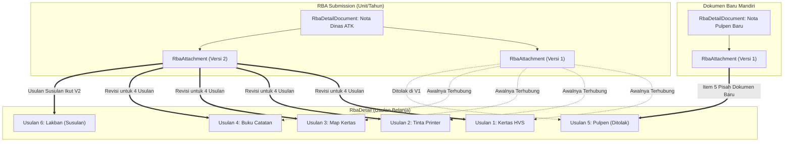

# Implementation Plan: Fitur 1 PDF untuk Beberapa Usulan Belanja RBA (Multi-Item Shared PDF & Versioning)

Dokumen ini merancang solusi komprehensif untuk mengakomodir kebutuhan operator agar **1 berkas PDF (seperti Nota Dinas, KAK/TOR, atau Telaahan Staf) dapat digunakan bersama oleh beberapa usulan belanja (`rba_detail`)**, sekaligus mempertahankan **sistem versioning PDF**, riwayat audit trail per usulan, serta fleksibilitas tinggi saat terjadi revisi, penolakan, usulan susulan, maupun penambahan/pengurangan usulan.

---

## User Review Required

> [!IMPORTANT]
> **Keputusan Arsitektur Inti: Konsep "Dokumen Usulan" & Tabel Pivot `rba_detail_attachments`**
> - Saat ini, tabel `rba_attachments` terikat kaku dengan 1 baris `rba_detail_id`.
> - Untuk mendukung 1 PDF ke banyak usulan secara fleksibel tanpa merusak sistem eksisting, kami mengusulkan penerapan entitas **`RbaDetailDocument`** (wadah dokumen, misal *"Nota Dinas Belanja ATK 2026"*) yang memiliki versi berkas fisik **`RbaAttachment`** (V1, V2, dst.), dan dihubungkan ke **`RbaDetail`** melalui tabel pivot **`rba_detail_attachments`**.
> - Seluruh method pemanggilan eksisting seperti `$detail->attachments` dan `$detail->latestAttachment()` tetap dipertahankan 100% kompatibel sehingga **tidak ada perubahan pemecah (*zero breaking changes*)** pada modul supervisor, admin monitoring, maupun export laporan.

> [!TIP]
> **Fleksibilitas Alur pada Form Input & Modal Revisi:**
> 1. **Saat Tambah Usulan (`create`)**: Operator dapat memilih:
>    - **Opsi A**: *Unggah Berkas PDF Baru* (otomatis tersimpan sebagai dokumen baru unit).
>    - **Opsi B**: *Gunakan Dokumen PDF yang Sudah Ada* (memilih dari daftar PDF yang sudah diunggah pada pengajuan RBA unit tersebut tanpa perlu upload ulang).
> 2. **Saat Unggah Revisi PDF (`uploadVersion`)**: Jika suatu PDF dipakai bersama oleh beberapa usulan (misal 5 usulan), modal revisi memberikan pilihan:
>    - **Pilihan 1 (Pisahkan Dokumen)**: Mengunggah PDF baru khusus untuk usulan ini saja (usulan ini lepas dari dokumen bersama, usulan lain tidak terganggu).
>    - **Pilihan 2 (Revisi Dokumen Bersama V2)**: Mengunggah versi revisi baru, dilengkapi daftar centang (*checkbox*) untuk menentukan usulan mana saja yang ikut menggunakan versi baru (misal 4 usulan dicentang ikut V2, sedangkan 1 usulan ditolak tidak dicentang karena akan menggunakan PDF tersendiri).

---

## Analisis Skenario Pengguna

Berikut pemetaan teknis untuk seluruh skenario yang diutarakan:



### 1. Skenario 1: 1 PDF untuk 5 Usulan, 1 Ditolak, 4 Diperbarui ke PDF Revisi, 1 Pakai PDF Baru
- **Kondisi Awal**: Usulan 1, 2, 3, 4, 5 menggunakan Dokumen *"Nota Dinas ATK"* (Versi 1).
- **Aksi Supervisor**: Supervisor menyetujui Usulan 1-4, namun menolak Usulan 5 (catatan: *"Pulpen dikeluarkan dari nota dinas / gunakan nota tersendiri"*).
- **Penanganan Operator**:
  - **Langkah A (Usulan 5)**: Operator membuka usulan 5, memilih *"Unggah Dokumen PDF Baru Khusus Usulan Ini"*. Usulan 5 kini memiliki dokumen terpisah (*"Nota Dinas Khusus Pulpen"*, V1) dan statusnya kembali menjadi *Draft*. Dokumen Usulan 1-4 sama sekali tidak terganggu.
  - **Langkah B (Usulan 1-4 jika nota dinas diperbarui ke V2)**: Operator mengunggah revisi *"Nota Dinas ATK"* (V2) dan mencentang Usulan 1-4. Usulan 1-4 kini mencatat Versi 2 sebagai versi terbarunya, dan statusnya disesuaikan untuk validasi ulang jika diperlukan.

### 2. Skenario 2: Usulan Susulan / Terlewat Menggunakan PDF yang Sudah Terikat
- **Kondisi Awal**: 5 usulan sudah tersimpan atau bahkan sudah diajukan (`is_submitted = true`).
- **Penanganan Operator**:
  - Operator klik *"Tambah Rincian Belanja"*.
  - Pada bagian lampiran PDF, operator memilih opsi *"Gunakan Dokumen PDF yang Sudah Ada"*.
  - Dropdown menampilkan dokumen-dokumen yang ada di pengajuan unit tersebut (misal: *"Nota Dinas ATK (V1/V2) - Digunakan oleh 5 usulan"*).
  - Operator memilih dokumen tersebut dan menyimpan usulan.
  - Usulan ke-6 langsung terikat ke dokumen tersebut tanpa perlu mengunggah ulang berkas fisik. 5 usulan sebelumnya tidak terpengaruh statusnya.

### 3. Skenario Jumlah Usulan Bertambah atau Berkurang pada 1 PDF
- **Penambahan**: Dilakukan via form tambah rincian dengan memilih dokumen yang ada, atau saat edit usulan.
- **Pengurangan**: Jika salah satu usulan dihapus (`destroy` / soft delete), relasi usulan tersebut dilepas dari dokumen, namun berkas fisik dan data dokumen tetap aman dan tetap terhubung dengan usulan-usulan lainnya.

### 4. Skenario Versioning & Riwayat Audit Trail
- Model `RbaDetail->attachments()` berelasi Many-to-Many dengan `RbaAttachment` melalui tabel pivot `rba_detail_attachments`.
- Halaman riwayat audit trail (`/history/{detail}`) akan menampilkan:
  - Judul dokumen dan nama berkas asli.
  - Urutan versi kronologis yang pernah dilalui oleh usulan tersebut (misal: pernah menggunakan Dokumen A V1, lalu direvisi ke Dokumen A V2, atau berganti ke Dokumen B V1).
  - Keterangan jika dokumen tersebut digunakan bersama oleh usulan lain.

---

## Proposed Changes

### Database & Migrations

#### [NEW] [Migration: create_rba_detail_documents_table](file:///c:/Users/PDETUF/Project/Rumah%20Sakit/rbakardinah/database/migrations/2026_09_18_080000_create_rba_detail_documents_table.php)
- Membuat tabel `rba_detail_documents`:
  - `id` (bigint, pk)
  - `rba_submission_id` (foreignId -> `rba_submissions`, cascade)
  - `document_name` (string)
  - `created_by` (foreignId -> `users`)
  - `timestamps`

#### [NEW] [Migration: create_rba_detail_attachments_table](file:///c:/Users/PDETUF/Project/Rumah%20Sakit/rbakardinah/database/migrations/2026_09_18_080100_create_rba_detail_attachments_table.php)
- Menambahkan kolom pada `rba_attachments`:
  - `rba_detail_document_id` (foreignId -> `rba_detail_documents`, nullable)
  - `original_filename` (string, nullable)
  - Mengubah `rba_detail_id` menjadi `nullable`
- Membuat tabel pivot `rba_detail_attachments`:
  - `id` (bigint, pk)
  - `rba_detail_id` (foreignId -> `rba_details`, cascade)
  - `rba_attachment_id` (foreignId -> `rba_attachments`, cascade)
  - `timestamps`
- **Data Migration Otomatis**:
  - Menyalin relasi dari seluruh baris eksisting di `rba_attachments` ke dalam `rba_detail_attachments` agar tidak ada data usulan lampiran lama yang hilang.
  - Membuatkan entitas `rba_detail_documents` default untuk data eksisting berdasarkan nama berkas.

---

### Models

#### [NEW] [`app/Models/RbaDetailDocument.php`](file:///c:/Users/PDETUF/Project/Rumah%20Sakit/rbakardinah/app/Models/RbaDetailDocument.php)
- Relasi:
  - `submission()`: `belongsTo(RbaSubmission::class)`
  - `versions()`: `hasMany(RbaAttachment::class)`
  - `latestVersion()`: `hasOne(RbaAttachment::class)->latestOfMany('version_number')`
  - `creator()`: `belongsTo(User::class, 'created_by')`

#### [MODIFY] [`app/Models/RbaAttachment.php`](file:///c:/Users/PDETUF/Project/Rumah%20Sakit/rbakardinah/app/Models/RbaAttachment.php)
- Update `$fillable` menambahkan `rba_detail_document_id` dan `original_filename`.
- Menambahkan relasi:
  - `document()`: `belongsTo(RbaDetailDocument::class, 'rba_detail_document_id')`
  - `details()`: `belongsToMany(RbaDetail::class, 'rba_detail_attachments')->withTimestamps()`

#### [MODIFY] [`app/Models/RbaDetail.php`](file:///c:/Users/PDETUF/Project/Rumah%20Sakit/rbakardinah/app/Models/RbaDetail.php)
- Mengubah relasi `attachments()` dari `hasMany` menjadi `belongsToMany(RbaAttachment::class, 'rba_detail_attachments')->withTimestamps()`.
- Menjaga helper `latestAttachment()` tetap bekerja dengan return `$this->attachments()->orderByDesc('rba_attachments.version_number')->first()`.
- Menambahkan helper `document()` untuk mengakses dokumen induk dari `latestAttachment()`.

---

### Backend Controllers & Policies

#### [MODIFY] [`app/Http/Controllers/Operator/DetailController.php`](file:///c:/Users/PDETUF/Project/Rumah%20Sakit/rbakardinah/app/Http/Controllers/Operator/DetailController.php)
- **Method `create()`**: Mengambil daftar dokumen yang sudah ada pada `$submission`:
  ```php
  $existingDocuments = RbaDetailDocument::where('rba_submission_id', $submission->id)
      ->with(['latestVersion', 'versions.details'])
      ->orderByDesc('id')
      ->get();
  ```
- **Method `store()`**:
  - Validasi kondisional: jika memilih dokumen eksisting (`rba_detail_document_id`), file upload baru tidak wajib.
  - Jika unggah dokumen baru: simpan file, buat `RbaDetailDocument`, buat `RbaAttachment` (V1), lalu pasang relasi pivot `$detail->attachments()->attach($attachment->id)`.
  - Jika gunakan dokumen eksisting: ambil versi terbaru dokumen tersebut, lalu pasang relasi pivot `$detail->attachments()->attach($latestAttachment->id)`.
- **Method `uploadVersion()`**:
  - Menerima parameter opsional: `upload_mode` (`standalone` / `shared_update`), `document_name`, dan `target_detail_ids` (array id usulan yang ikut diperbarui).
  - Menangani pemisahan usulan (membuat dokumen baru untuk usulan tersebut) atau pembuatan versi baru (V2) dari dokumen bersama yang ditautkan ke usulan-usulan yang dipilih.
  - Mengatur ulang status usulan yang diperbarui menjadi `Draft` agar disinkronkan ke supervisor.
- **Method `destroy()`**:
  - Melepas tautan pivot usulan tanpa menghapus berkas fisik `RbaAttachment` jika berkas masih digunakan oleh usulan lain.

#### [MODIFY] [`app/Http/Controllers/General/HistoryController.php`](file:///c:/Users/PDETUF/Project/Rumah%20Sakit/rbakardinah/app/Http/Controllers/General/HistoryController.php)
- Memuat informasi dokumen dan usulan lain yang berbagi dokumen tersebut:
  `$detail->load(['attachments.document', 'attachments.user', 'attachments.details.accountCode'])`

---

### Frontend Views & UI/UX

#### [MODIFY] [`resources/views/operator/details/create.blade.php`](file:///c:/Users/PDETUF/Project/Rumah%20Sakit/rbakardinah/resources/views/operator/details/create.blade.php)
- Mengubah bagian upload PDF menjadi tab / selector interaktif (Alpine.js):
  1. **Tab 1: Unggah Dokumen PDF Baru**:
     - Input judul/nama dokumen (opsional).
     - Input berkas file PDF (drag & drop / picker).
  2. **Tab 2: Gunakan Dokumen PDF yang Sudah Ada**:
     - Ditampilkan jika `$existingDocuments->isNotEmpty()`.
     - Tampilan kartu/dropdown pilihan rapi berisi: Judul Dokumen, Nama Berkas Asli, Versi, Jumlah usulan yang terikat, serta tombol cepat *Preview PDF*.

#### [MODIFY] [`resources/views/operator/details/edit.blade.php`](file:///c:/Users/PDETUF/Project/Rumah%20Sakit/rbakardinah/resources/views/operator/details/edit.blade.php)
- Menampilkan dokumen PDF yang saat ini terpasang pada usulan.
- Menyediakan opsi jika operator ingin beralih ke dokumen yang sudah ada lainnya atau mengunggah dokumen baru.

#### [MODIFY] [`resources/views/operator/submissions/show.blade.php`](file:///c:/Users/PDETUF/Project/Rumah%20Sakit/rbakardinah/resources/views/operator/submissions/show.blade.php)
- **Modal Unggah Revisi PDF**:
  - Menampilkan informasi apakah usulan ini menggunakan dokumen bersama.
  - Menyediakan 2 opsi:
    - *Unggah PDF Baru Khusus Usulan Ini (Pisahkan Dokumen)*
    - *Unggah Versi Revisi Baru untuk Dokumen Bersama* (dengan checklist usulan mana saja yang ikut menggunakan versi revisi).
- **Tabel Rincian**:
  - Kolom PDF menampilkan badge/tooltip jika dokumen digunakan bersama oleh beberapa rincian belanja.

#### [MODIFY] [`resources/views/supervisor/submissions/show.blade.php`](file:///c:/Users/PDETUF/Project/Rumah%20Sakit/rbakardinah/resources/views/supervisor/submissions/show.blade.php)
- Menampilkan indikator pada kolom dokumen jika beberapa rincian mengacu pada satu dokumen yang sama, sehingga supervisor tahu bahwa rincian-rincian tersebut bersumber dari satu nota dinas/memo yang sama.

#### [MODIFY] [`resources/views/general/history.blade.php`](file:///c:/Users/PDETUF/Project/Rumah%20Sakit/rbakardinah/resources/views/general/history.blade.php)
- Menyempurnakan tampilan riwayat audit: menampilkan nama dokumen induk, versi file, dan rincian belanja lain yang berbagi dokumen tersebut pada versi yang bersangkutan.

---

## Verification Plan

### Automated Tests (`tests/Feature/Operator/RbaDetailTest.php`)
Menjalankan dan menambahkan pengujian fitur:
1. `test_operator_can_create_detail_with_new_pdf_document`: Memastikan usulan baru dengan dokumen PDF baru berhasil disimpan.
2. `test_operator_can_create_detail_using_existing_shared_pdf_document`: Memastikan usulan kedua (dan susulan) dapat menggunakan PDF yang sudah ada tanpa unggah ulang berkas.
3. `test_shared_pdf_revising_updates_selected_items_and_leaves_unselected`: Memastikan saat revisi V2 diunggah untuk 4 usulan, usulan ke-5 tetap pada dokumen sebelumnya atau terpisah sesuai pilihan.
4. `test_detaching_item_to_new_document_creates_standalone_history`: Memastikan usulan yang ditolak dapat mengunggah PDF baru secara mandiri tanpa mengubah usulan lain yang satu dokumen.
5. `test_deleting_one_item_preserves_shared_attachment_for_other_items`: Memastikan jika 1 usulan dihapus, berkas PDF pada usulan lainnya tetap utuh.
6. `test_supervisor_and_history_views_render_shared_document_details`: Memastikan tampilan supervisor dan riwayat audit trail merender status dokumen bersama dengan benar.

### Command Verifikasi Pengujian
```powershell
php artisan test tests/Feature/Operator/RbaDetailTest.php
php artisan test
```
Seluruh 243+ unit dan feature test aplikasi harus berstatus **100% PASS** tanpa kegagalan.

---

## Pertanyaan / Konfirmasi Tambahan untuk Pengguna

Apakah rancangan alur ini telah sesuai dengan ekspektasi Anda:
1. Pilihan antara **"Unggah Dokumen Baru"** vs **"Gunakan Dokumen yang Sudah Ada"** pada form tambah usulan.
2. Fleksibilitas pada modal revisi untuk **"Memisahkan Dokumen Khusus Usulan Ini"** vs **"Revisi Dokumen Bersama (dengan checklist usulan terkait)"**.
3. Penjagaan riwayat audit trail yang terinci per usulan.

Jika sudah disetujui, silakan konfirmasi dengan membalas **"lanjutkan"** untuk memulai implementasi tahap demi tahap.
