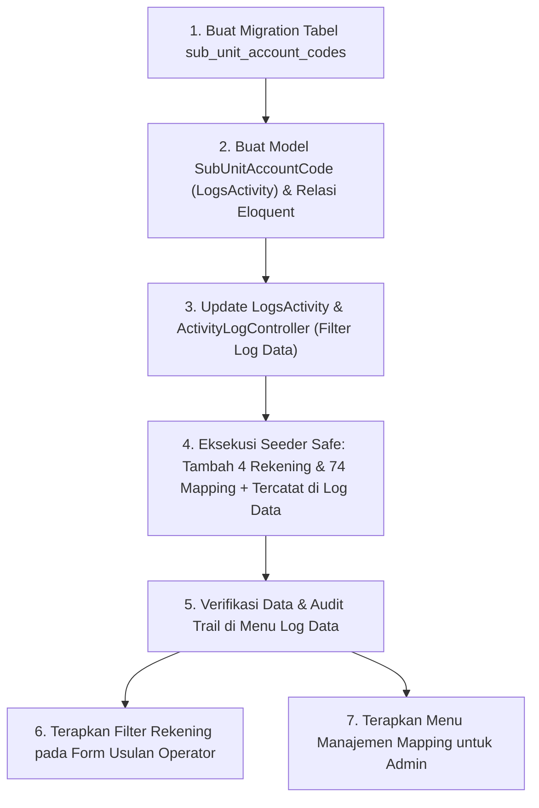

# Implementation Plan: Pemaparan & Rencana Eksekusi Mapping Rekening ke Sub Unit (SIPAKAR)

> [!IMPORTANT]
> **Status Dokumen**: Telah direvisi sesuai dengan seluruh arahan pengguna:
> 1. **Sheet Acuan**: **Sheet 2 (`Mapping Operator 2027`)** disepakati sebagai sumber kebenaran tunggal (*Single Source of Truth*).
> 2. **Unit PPM**: Seluruh rekening `Subag PPM` disamakan dan diarahkan ke **Unit PPM (ID 38)**.
> 3. **4 Rekening Belanja Pegawai**: Dialokasikan menjadi tanggung jawab **Sub Bag. Anggaran (ID 49)**.
> 4. **Prinsip Seeder Aman (Anti-Overwrite)**: Seeder **WAJIB mengecek** apakah nomor rekening / data sudah ada di database. Jika sudah ada, **DILARANG me-replace / meng-update**. Pengguna yang akan mengedit manual jika ada perbedaan deskripsi pada nomor rekening yang sama.
> 5. **Wajib Masuk ke Log Data (Audit Trail)**: Seluruh penambahan rekening baru dan relasi mapping sub-unit wajib tercatat ke sistem **Log Data (`activity_logs`)**, model dilengkapi trait `LogsActivity`, didaftarkan ke filter menu Log Data Admin, dan memiliki format deskripsi aktivitas yang jelas.

---

## 1. Ringkasan Eksekutif & Struktur Dokumen Excel

Berdasarkan pemeriksaan dokumen [raw/Mapping Operator.xlsx](file:///c:/Users/PDETUF/Project/Rumah%20Sakit/rbakardinah/raw/Mapping%20Operator.xlsx):
* **Sheet 1 (`OPERATOR`)**: Memiliki 202 baris fisik karena menggunakan format visual bertingkat 2 baris per usulan (*double-row layout*). Total rekening transaksi unik riil adalah **72 kode rekening**.
* **Sheet 2 (`Mapping Operator 2027`)**: Memiliki 146 baris fisik dengan format datar (*flat 4 columns*). Total rekening transaksi unik riil adalah **74 kode rekening**.

Perbedaan baris (202 vs 146) bukan karena data hilang, melainkan format Sheet 2 sudah diratakan (*flattened*). Sheet 2 merupakan **versi revisi pemutakhiran untuk perencanaan 2027**, memuat 2 rekening belanja IT baru pada Unit PDE, dan telah ditetapkan sebagai **acuan tunggal implementasi**.

---

## 2. Hasil Keputusan Komparasi & Mapping Final

### A. Alokasi 4 Rekening Belanja Pegawai ke Sub Bag. Anggaran
Sesuai arahan pengguna, 4 rekening belanja pegawai yang di Sheet 2 kolom operatornya kosong, dialokasikan ke **Sub Bag. Anggaran (ID 49)**:
1. `5.1.01.01.01.0001` - Belanja Gaji dan Tunjangan ASN $\rightarrow$ **Sub Bag. Anggaran**
2. `5.1.01.03.06.0001` - Belanja Insentif Jasa Pelayanan Kesehatan bagi ASN $\rightarrow$ **Sub Bag. Anggaran**
3. `5.1.01.03.07.0001` - Belanja Insentif Penyelenggaraan Pelayanan dan Non Pelayanan Kesehatan Bagi ASN Pengelola Keuangan $\rightarrow$ **Sub Bag. Anggaran**
4. `5.1.01.03.07.0002` - Belanja Insentif Pegawai ASN yang Melaksanakan Pengadaan Barang/Jasa $\rightarrow$ **Sub Bag. Anggaran**

### B. Penyatuan Subag PPM ke Unit PPM (ID 38)
Sesuai arahan pengguna, 1 rekening pemeliharaan alkes pada `Subag PPM` digabungkan bersama 5 rekening sewa/modal alkes pada `Unit PPM`, sehingga total 6 rekening diampu oleh **Unit PPM (ID 38)**:
* `5.1.02.03.02.0204`: Belanja Pemeliharaan Alat Kedokteran dan Kesehatan $\rightarrow$ **Unit PPM**
* `5.1.02.02.04.0204`: Belanja Sewa Alat Kedokteran Umum - CTScan $\rightarrow$ **Unit PPM**
* `5.1.02.02.04.0207`: Belanja Sewa Alat Kedokteran Bedah - MOT $\rightarrow$ **Unit PPM**
* `5.1.02.02.04.0218`: Belanja Sewa Alat Kedokteran Radiodiagnostic - MRI $\rightarrow$ **Unit PPM**
* `5.2.02.07.01.0001`: Belanja Modal Alat Kedokteran Umum $\rightarrow$ **Unit PPM**
* `5.2.02.07.02.0005`: Belanja Modal Alat Kedokteran Umum Lainnya $\rightarrow$ **Unit PPM**

---

## 3. Matriks Distribusi Final 74 Rekening per Sub-Unit Database

Berikut adalah distribusi lengkap 74 kode rekening dari Sheet 2 ke master data `sub_units` SIPAKAR:

| No | Sub Unit di Database SIPAKAR | ID DB | Variasi Teks di Excel | Jumlah Rekening | Uraian Belanja Utama |
|:---:|:---|:---:|:---|:---:|:---|
| 1 | **Sub Bag. Anggaran** | 49 | `Anggaran`, `Subag Anggaran`, `Subag. Anggaran`, *(4 Rek Belanja Pegawai)* | **17** | Gaji/Tunjangan ASN, Jaspel ASN, Insentif Keuangan & PBJ, Iuran BPJS Non-ASN, Jasa Keuangan, Telepon, SPPD Luar Daerah, Jaspel Non-ASN |
| 2 | **Sub Bag. Tata Usaha** | 46 | `Subag TU` | **12** | BBM/Gas/Pelumas, Benda Pos/Materai, Jamuan Tamu/Rapat, CS, Audit ISO, Tagihan Air & Listrik, Paket/Ekspedisi, Pajak/STNK/Perizinan, Servis Kendaraan |
| 3 | **Unit PDE** | 42 | `Unit PDE` | **10** | Belanja Modal PC/Server/Jaringan/Peralatan PC, Sewa Jaringan, Jasa Konversi SI, Internet, Pemeliharaan Komputer/Laptop/Jaringan |
| 4 | **Sub Bag. Perlengkapan dan RT** | 45 | `Subag RT` | **9** | ATK, Cetak/Penggandaan, Alat Rumah Tangga, Sewa Angkutan Barang, Desain Arsitektural, Servis Peralatan RT, Belanja Modal Mebel/Pendingin/Alat RT |
| 5 | **Unit PPM** | 38 | `Subag PPM`, `Unit PPM` | **6** | Pemeliharaan Alkes Kedokteran, Sewa CT-Scan/MOT/MRI, Belanja Modal Alat Kedokteran Umum |
| 6 | **IPSRS** | 43 | `IPSRS` | **5** | Bahan Bangunan, Alat Listrik/Elektronik, Pemeliharaan Bangunan Gedung, Pemeliharaan Taman, Jaringan Listrik & Genset |
| 7 | **Sub Bag. Pemasaran dan Humas** | 41 | `Subag Humas` | **3** | Belanja Advertensi/Iklan, Langganan Koran/Majalah, Modal Peralatan Studio Video & Film |
| 8 | **IPLRS** | 37 | `IPLRS` | **3** | Isi Tabung APAR, Jasa Tenaga Ahli IPL, Pengolahan Air Limbah / B3 |
| 9 | **Instalasi Gizi** | 36 | `Instalasi Gizi` | **3** | Tabung Gas LPG, Makanan & Minuman Pegawai (Natura), Makanan & Minuman Pasien |
| 10 | **Sub Bag. Kepegawaian** | 47 | `Subag Kepegawaian`, `Subag. Kepegawaian` | **2** | Souvenir/Cinderamata, Kursus Singkat / Pelatihan Pegawai |
| 11 | **Instalasi Farmasi** | 30 | `Instalasi Farmasi` | **2** | Belanja Obat-Obatan, Bahan Alkes Habis Pakai (BMHP), BDRS, Kimia/Reagen |
| 12 | **Instalasi Loundry** | 32 | `Instalasi Laundry` | **1** | Bahan Linen dan Laundry |
| 13 | **Komkordik** | 15 | `Komkordik` | **1** | Insentif Pengajar/Pendidik Klinis Dokter Kordik |
| **TOTAL** | | | | **74** | **100% Rekening Terpetakan** |

---

## 4. Analisis Master Data `account_codes` & Penambahan 4 Rekening

Dari 74 rekening yang di-mapping:
* **70 Rekening**: Sudah ada dan aktif di tabel `account_codes`.
* **4 Rekening**: Belum terdaftar di tabel `account_codes` dan harus didaftarkan:

| Kode Rekening | Uraian / Keterangan | Kelompok Belanja | Target Sub-Unit |
|:---|:---|:---:|:---:|
| `5.1.01.01.01.0001` | Belanja Gaji dan Tunjangan ASN | Belanja Pegawai (ID 1) | Sub Bag. Anggaran (ID 49) |
| `5.1.01.03.07.0002` | Belanja Insentif Pegawai ASN yang Melaksanakan PBJ | Belanja Pegawai (ID 1) | Sub Bag. Anggaran (ID 49) |
| `5.1.02.02.13.0001` | Belanja Jasa Pelayanan Kesehatan bagi ASN | Belanja Barang dan Jasa (ID 2) | Sub Bag. Anggaran (ID 49) |
| `5.2.02.06.01.0001` | Belanja Modal Peralatan Studio Video dan Film | Belanja Modal (ID 3) | Sub Bag. Pemasaran dan Humas (ID 41) |

---

## 5. Integrasi Penuh ke Sistem Log Data (`activity_logs`)

Sesuai instruksi: *"jangan lupa masuk ke log data"*, seluruh lifecycle data mapping dan penambahan rekening baru wajib memiliki jejak audit yang dapat dipantau di menu **Log Data** (`/admin/logs`):

### A. Penggunaan Trait `LogsActivity` pada Model `SubUnitAccountCode`
Model baru `SubUnitAccountCode` akan menyertakan `use LogsActivity;`:
```php
namespace App\Models;

use Illuminate\Database\Eloquent\Model;
use App\Traits\LogsActivity;

class SubUnitAccountCode extends Model
{
    use LogsActivity;

    protected $fillable = [
        'sub_unit_id',
        'account_code_id',
        'fiscal_year',
        'keterangan_khusus',
    ];
    ...
}
```

### B. Kustomisasi Deskripsi Aktivitas pada `LogsActivity::generateActivityDescription`
Menambahkan handler spesifik di `app/Traits/LogsActivity.php` agar pesan di Log Data informatif dan mudah dibaca:
```php
if ($modelName === 'SubUnitAccountCode') {
    $subUnitName = $model->subUnit?->name ?? 'Sub Unit';
    $accountCode = $model->accountCode?->code ?? '';
    $accountName = $model->accountCode?->name ?? '';
    $tahun = $model->fiscal_year ? " (Tahun {$model->fiscal_year})" : '';
    
    return "{$actor} {$actionVerb} mapping rekening [{$accountCode}] {$accountName} ke {$subUnitName}{$tahun}";
}
```

### C. Pendaftaran Model ke Filter Menu Log Data Admin (`ActivityLogController`)
Di `app/Http/Controllers/Admin/ActivityLogController.php`, daftarkan `SubUnitAccountCode` ke dalam `$availableModels`:
```php
$availableModels = [
    'SubUnitAccountCode' => 'Mapping Rekening ke Sub Unit',
    'AccountCode' => 'Nomor Rekening',
    'SubUnit' => 'Sub Unit Kerja',
    'Unit' => 'Unit Kerja',
    'RbaDetail' => 'Usulan RBA Detail',
    ...
];
```
Dengan penambahan ini, Admin dapat menyaring (*filter*) riwayat penambahan, modifikasi, atau penghapusan mapping rekening langsung dari dropdown menu Log Data.

### D. Pencatatan Audit Log saat Eksekusi Seeder
Saat seeder dijalankan (baik via CLI atau web):
* Setiap penambahan kode rekening baru (4 rekening) akan mencatat log dengan `model_type = 'App\Models\AccountCode'` dan deskripsi:
  * *"Sistem menambahkan Nomor Rekening: 5.1.01.01.01.0001 - Belanja Gaji dan Tunjangan ASN"*.
* Setiap mapping relasi yang dibuat akan mencatat log dengan `model_type = 'App\Models\SubUnitAccountCode'` dan deskripsi:
  * *"Sistem menambahkan mapping rekening [5.1.02.01.01.0024] Belanja Alat Tulis Kantor ke Sub Bag. Perlengkapan dan RT (Tahun 2027)"*.

---

## 6. Arsitektur Teknis Seeder (Anti-Overwrite Policy)

Sesuai instruksi mutlak dari pengguna:
> *"Seeder harus mengecek dulu apakah datanya sudah ada atau belum, kalau sudah ada maka jangan di-replace (khususnya pada nomor rekening), biar saya saja yang edit manual kalau ada data seeder yang sudah ada di database tapi beda bagian deskripsi (nomor rekening sama)"*

### A. Kebijakan Seeder `AccountCode` (Hanya Insert Yang Belum Ada)
```php
// CONTOH LOGIKA SEEDER ACCOUNT CODE (SAFE & STRICT CHECK)
$accountCode = AccountCode::where('code', $item['code'])->first();

if (!$accountCode) {
    // Rekening BENAR-BENAR BARU, lakukan insert
    $accountCode = AccountCode::create([
        'code' => $item['code'],
        'name' => $item['name'],
        'kelompok_belanja_id' => $item['kelompok_belanja_id'],
        'is_active' => true,
    ]);
    $this->command->info("Ditambahkan rekening baru: {$item['code']} - {$item['name']}");
} else {
    // Rekening SUDAH ADA di database:
    // DILARANG UPDATE / DILARANG REPLACE DESKRIPSI!
    // Biarkan data lama tetap utuh sesuai preferensi pengguna.
    $this->command->line("Rekening {$item['code']} sudah ada. Dilewati (skip) tanpa mengubah deskripsi.");
}
```

### B. Desain Skema Tabel Relasi Mapping `sub_unit_account_codes`
Tabel `sub_unit_account_codes`:
* `id` (bigint, PK)
* `sub_unit_id` (foreignId -> `sub_units.id`, onDelete cascade)
* `account_code_id` (foreignId -> `account_codes.id`, onDelete cascade)
* `fiscal_year` (string/int, default '2027')
* `keterangan_khusus` (text, nullable, catatan peruntukan seperti di kolom Excel)
* `created_at`, `updated_at`
* **Unique Index**: `['sub_unit_id', 'account_code_id', 'fiscal_year']` (mencegah relasi ganda).

### C. Kebijakan Seeder Relasi Mapping (Anti-Duplikasi)
```php
SubUnitAccountCode::firstOrCreate(
    [
        'sub_unit_id' => $subUnitId,
        'account_code_id' => $accountCode->id,
        'fiscal_year' => '2027',
    ],
    [
        'keterangan_khusus' => $item['keterangan'] ?? null,
    ]
);
```

---

## 7. Rencana Implementasi Bertahap



### Langkah 1: Migrasi Database
* Buat file migration untuk tabel `sub_unit_account_codes`.
* Jalankan `php artisan migrate`.

### Langkah 2: Pembuatan Model & Relasi Eloquent
* Buat model `app/Models/SubUnitAccountCode.php` dengan trait `LogsActivity`.
* Tambahkan relasi `belongsToMany` pada `SubUnit` dan `AccountCode`.

### Langkah 3: Integrasi Menu Log Data
* Tambahkan deskripsi aktivitas `SubUnitAccountCode` di `app/Traits/LogsActivity.php`.
* Daftarkan `'SubUnitAccountCode'` pada dropdown model filter di `app/Http/Controllers/Admin/ActivityLogController.php`.

### Langkah 4: Eksekusi Seeder yang Aman
* Buat seeder `SubUnitAccountCodeSeeder.php` yang memuat dataset 74 rekening dari Sheet 2.
* Jalankan seeder via `php artisan db:seed --class=SubUnitAccountCodeSeeder`.

### Langkah 5: Penerapan di Sisi Aplikasi (UI/UX)
1. **Form Usulan Operator (`Operator/RbaSubmissionController`)**:
   - Menyesuaikan form usulan belanja agar memprioritaskan/membatasi kode rekening sesuai mapping sub-unit operator yang sedang login.
2. **Panel Admin (Master Data Mapping)**:
   - Menu kelola mapping rekening per sub-unit agar Admin sewaktu-waktu dapat memodifikasi hak rekening antar unit jika ada rotasi anggaran, dan setiap perubahan tercatat di Log Data.

---

## 8. Rencana Pengujian & Validasi

1. **Uji Anti-Overwrite**:
   - Menjalankan seeder dan memverifikasi tabel `account_codes` tidak berubah deskripsinya untuk 70 rekening eksisting.
   - Memastikan hanya 4 rekening baru yang ditambahkan.
2. **Uji Pencatatan Log Data**:
   - Membuka halaman `/admin/logs`.
   - Memfilter dropdown **Model: Mapping Rekening ke Sub Unit**.
   - Memverifikasi entri aktivitas muncul dengan format: *"Sistem menambahkan mapping rekening [Kode] Nama ke Sub Unit"*.
3. **Uji Distribusi Mapping**:
   - Memverifikasi total 74 relasi terbentuk dengan tepat sesuai tabel matriks di Bagian 3.
