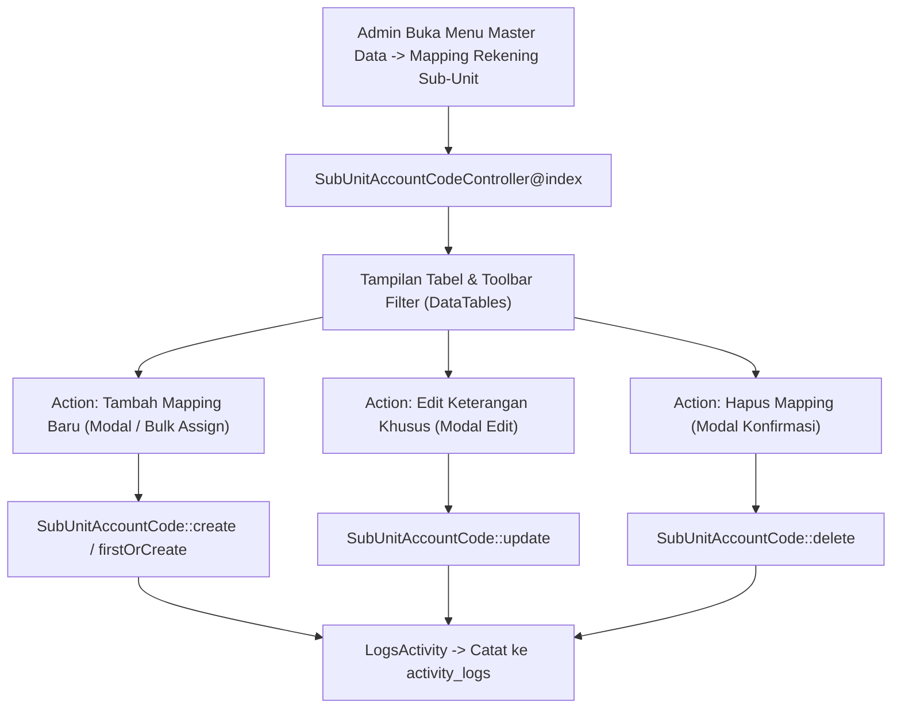

# Implementation Plan: Halaman Manajemen Mapping Sub Unit dengan Nomor Rekening (Admin SIPAKAR)

## 1. Status Saat Ini & Kebutuhan Fitur

### A. Kondisi Saat Ini
* Tabel database `sub_unit_account_codes` telah dibuat dan berisi **74 relasi mapping** untuk Tahun Anggaran 2027.
* Model [SubUnitAccountCode.php](file:///c:/Users/PDETUF/Project/Rumah%20Sakit/rbakardinah/app/Models/SubUnitAccountCode.php) telah memiliki relasi Eloquent serta dilengkapi trait `LogsActivity`.
* Namun, **belum ada halaman antarmuka (UI/Web Interface)** di panel Administrator untuk mengelola, menambah, mengedit, ataupun menghapus mapping rekening tersebut secara visual.

### B. Tujuan Pengembangan
Membangun modul **Manajemen Mapping Rekening Sub-Unit** pada menu **Master Data** Admin SIPAKAR agar Administrator dapat:
1. Melihat daftar seluruh mapping rekening per sub-unit secara terstruktur dan informatif.
2. Memfilter data berdasarkan **Sub-Unit**, **Kelompok Belanja**, dan **Tahun Anggaran**.
3. Menambahkan mapping baru (baik per rekening maupun fitur **Bulk/Batch Assign** beberapa rekening sekaligus ke satu sub-unit).
4. Mengubah catatan peruntukan khusus (*keterangan khusus*) atau memindahkan kewenangan rekening.
5. Menghapus relasi mapping jika terjadi perubahan kebijakan anggaran rumah sakit.
6. Memastikan seluruh aktivitas CRUD mapping tercatat otomatis di menu **Log Data (`/admin/logs`)**.

---

## 2. Arsitektur Komponen & Alur Data



---

## 3. Rencana Komponen Teknis

### A. Routing (`routes/web.php`)
Menambahkan rute resource di dalam grup `Route::middleware(['auth', 'role:Administrator'])->prefix('admin')->name('admin.')`:
```php
// Mapping Rekening ke Sub Unit
Route::post('sub-unit-account-codes/bulk-store', [\App\Http\Controllers\Admin\SubUnitAccountCodeController::class, 'bulkStore'])
    ->name('sub-unit-account-codes.bulk-store');
Route::resource('sub-unit-account-codes', \App\Http\Controllers\Admin\SubUnitAccountCodeController::class)
    ->except(['show', 'create', 'edit']); // Menggunakan Modal interaktif untuk Tambah & Edit
```

### B. Controller (`app/Http/Controllers/Admin/SubUnitAccountCodeController.php`)
Controller baru yang menangani operasi data:
* `index(Request $request)`:
  - Mengambil data mapping dengan eager load `['subUnit.unit', 'accountCode.kelompokBelanja']`.
  - Filter berdasarkan `sub_unit_id`, `kelompok_belanja_id`, `fiscal_year`, dan pencarian teks.
  - Menghitung statistik ringkasan (*total mapping, sub-unit terpetakan, rekening unik terpetakan*).
  - Mengirimkan master sub-unit aktif dan master kode rekening aktif untuk keperluan form modal.
* `store(Request $request)`:
  - Validasi: `sub_unit_id`, `account_code_id`, `fiscal_year`, `keterangan_khusus`.
  - Mencegah duplikasi dengan `firstOrCreate` / rule unique validation.
* `bulkStore(Request $request)`:
  - Fitur unggulan: Admin dapat memilih 1 sub-unit dan mencentang banyak nomor rekening sekaligus dalam satu kali klik.
* `update(Request $request, SubUnitAccountCode $subUnitAccountCode)`:
  - Memperbarui `keterangan_khusus` atau memindahkan ke sub-unit lain.
* `destroy(SubUnitAccountCode $subUnitAccountCode)`:
  - Menghapus relasi mapping (otomatis memicu audit log pada `activity_logs`).

### C. Antarmuka Pengguna / Views (`resources/views/admin/sub_unit_account_codes/index.blade.php`)
Halaman modern menggunakan Tailwind CSS dan DataTables sesuai standar SIPAKAR:
1. **Summary Cards (Statistik Cepat)**:
   - 📊 Total Relasi Mapping Aktif (misal: 74)
   - 🏛️ Sub-Unit yang Memiliki Rekening (misal: 13 Unit)
   - 💳 Nomor Rekening Unik Terpetakan (misal: 74 Rekening)
   - 📅 Tahun Anggaran Acuan (misal: 2027)
2. **Filter Toolbar Interaktif**:
   - Filter Dropdown: **Sub-Unit Kerja** (dengan info unit induknya)
   - Filter Dropdown: **Kelompok Belanja** (Pegawai, Barang & Jasa, Modal)
   - Filter Dropdown: **Tahun Anggaran**
   - Tombol **Reset Semua Filter**
3. **Data Table**:
   - Kolom:
     1. No
     2. Sub-Unit Kerja & Unit Induk
     3. Kode Rekening
     4. Nama Rekening Belanja
     5. Kelompok Belanja (Badge)
     6. Keterangan Khusus RSUD
     7. Tahun Anggaran
     8. Aksi (Tombol Edit Modal & Tombol Hapus)
4. **Modal Tambah Mapping / Bulk Assign**:
   - Pilihan Sub-Unit Kerja target.
   - Pilihan multi-select rekening dengan pencarian kode/nama akun.
   - Catatan keterangan khusus opsional.
5. **Modal Edit Mapping**:
   - Form ringkas untuk memperbarui catatan atau memindahkan sub-unit.

### D. Navigasi Menu (`resources/views/layouts/navigation.blade.php`)
Menambahkan link menu di dropdown **Master Data**:
```html
<x-dropdown-link :href="route('admin.sub-unit-account-codes.index')" 
    class="{{ request()->routeIs('admin.sub-unit-account-codes.*') ? 'bg-indigo-50 text-indigo-700 font-semibold' : '' }}">
    🔗 {{ __('Mapping Rekening Sub-Unit') }}
</x-dropdown-link>
```

---

## 4. Langkah-Langkah Eksekusi (Implementation Steps)

1. **Pembuatan Controller**:
   - Buat `app/Http/Controllers/Admin/SubUnitAccountCodeController.php`.
   - Implementasikan method `index`, `store`, `bulkStore`, `update`, dan `destroy`.
2. **Registrasi Rute**:
   - Daftarkan rute `sub-unit-account-codes` pada `routes/web.php`.
3. **Pembuatan Tampilan Blade**:
   - Buat direktori `resources/views/admin/sub_unit_account_codes/`.
   - Buat `resources/views/admin/sub_unit_account_codes/index.blade.php` lengkap dengan DataTables, filter, dan modal interaktif.
4. **Pembaruan Navigasi**:
   - Tambahkan menu link di dropdown **Master Data** pada `resources/views/layouts/navigation.blade.php`.
5. **Pengujian & Verifikasi**:
   - Uji akses halaman index, uji filter per sub-unit dan per kelompok belanja.
   - Uji penambahan mapping baru & fitur bulk assign.
   - Uji edit keterangan khusus.
   - Uji hapus mapping.
   - Verifikasi bahwa seluruh aksi tercatat di menu **Log Data (`/admin/logs`)**.

---

## 5. Rencana Pengujian & Validasi

1. **Uji Validasi Form**:
   - Mencoba menambahkan relasi yang sudah ada -> memastikan sistem memunculkan notifikasi bahwa relasi sudah terdaftar.
2. **Uji Bulk Assign**:
   - Memilih 1 sub-unit dan memilih 3 rekening sekaligus -> memastikan ke-3 relasi terbentuk dengan benar.
3. **Uji Filter DataTables**:
   - Filter Sub-Unit "Unit PDE" -> tabel hanya menampilkan 10 rekening IT.
   - Filter Kelompok Belanja "Belanja Modal" -> tabel menampilkan rekening aset/modal.
4. **Uji Audit Log (Log Data)**:
   - Buka `/admin/logs` -> filter model "Mapping Rekening ke Sub Unit" -> verifikasi seluruh aktivitas penambahan, pengubahan, dan penghapusan tercatat dengan benar.
