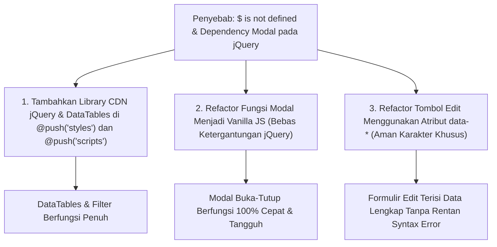

# Implementation Plan: Perbaikan Tombol Modal (Tambah, Bulk Assign, & Edit) pada Manajemen Mapping Rekening Sub-Unit

## 1. Analisis Akar Penyebab Masalah (*Root Cause Analysis*)

Berdasarkan pemeriksaan mendalam terhadap kode [resources/views/admin/sub_unit_account_codes/index.blade.php](file:///c:/Users/PDETUF/Project/Rumah%20Sakit/rbakardinah/resources/views/admin/sub_unit_account_codes/index.blade.php) dan layout utama [resources/views/layouts/app.blade.php](file:///c:/Users/PDETUF/Project/Rumah%20Sakit/rbakardinah/resources/views/layouts/app.blade.php), ditemukan **3 akar penyebab utama** mengapa tombol Tambah Mapping, Bulk Assign, dan Edit tidak berefek apa-apa saat diklik:

### A. Penyebab 1: Library jQuery & DataTables Tidak Dimuat (`$ is not defined`)
* Pada layout utama [app.blade.php](file:///c:/Users/PDETUF/Project/Rumah%20Sakit/rbakardinah/resources/views/layouts/app.blade.php), bundel skrip `@vite` hanya memuat Alpine.js dan Axios, **tidak menyertakan jQuery secara global**.
* Pada halaman Master Data lainnya (seperti `admin/account-codes/index.blade.php` atau `admin/units/index.blade.php`), jQuery dan DataTables selalu dimuat secara eksplisit via CDN di `@push('scripts')`:
  ```html
  <script src="https://code.jquery.com/jquery-3.7.1.min.js"></script>
  <script src="https://cdn.datatables.net/2.0.3/js/dataTables.js"></script>
  <script src="https://cdn.datatables.net/2.0.3/js/dataTables.tailwindcss.js"></script>
  ```
* Pada `admin/sub_unit_account_codes/index.blade.php`, baris pemuatan skrip CDN tersebut **terlewat/tidak ada**. Akibatnya, browser langsung mengalami crash JavaScript:
  `Uncaught ReferenceError: $ is not defined at (index):480`
* Karena crash terjadi tepat saat inisialisasi script, seluruh fungsi JavaScript di bawahnya gagal dieksekusi atau tidak terdaftar di window browser.

### B. Penyebab 2: Fungsi Modal Bergantung Penuh pada jQuery
* Fungsi pembuka dan penutup modal ditulis menggunakan sintaks jQuery:
  ```javascript
  function openCreateModal() { $('#modal-create').removeClass('hidden'); }
  function openBulkModal() { $('#modal-bulk').removeClass('hidden'); }
  function openEditModal(...) { $('#modal-edit').removeClass('hidden'); }
  ```
* Karena `$` tidak terdefinisi, saat tombol diklik:
  - Tombol **Tambah Mapping** memanggil `openCreateModal()` $\rightarrow$ Error `$ is not defined` $\rightarrow$ Modal tidak muncul.
  - Tombol **Bulk Assign** memanggil `openBulkModal()` $\rightarrow$ Error `$ is not defined` $\rightarrow$ Modal tidak muncul.
  - Tombol **Edit** memanggil `openEditModal(...)` $\rightarrow$ Error `$ is not defined` $\rightarrow$ Modal tidak muncul.

### C. Penyebab 3: Penanganan Data Parameter pada Tombol Edit Rentan Karakter Khusus
* Tombol edit pada tabel mem-passing data parameter secara langsung di atribut HTML:
  ```html
  onclick="openEditModal({{ $item->id }}, {{ $item->sub_unit_id }}, {{ $item->account_code_id }}, '{{ addslashes($item->fiscal_year) }}', '{{ addslashes($item->keterangan_khusus ?? '') }}')"
  ```
* Jika `keterangan_khusus` mengandung karakter khusus seperti kutip, kurung, atau karakter tak terduga, ini dapat memicu error sintaks inline JavaScript (`Uncaught SyntaxError`). Solusi terbaik adalah menggunakan atribut HTML5 `data-*` (misal: `data-id`, `data-keterangan`) dan membaca elemen via `openEditModal(this)`.

---

## 2. Rencana Perbaikan (*Proposed Fixes*)



### Langkah 1: Memuat Library jQuery & DataTables CDN
Menambahkan blok `@push('styles')` dan melengkapi `@push('scripts')` di [index.blade.php](file:///c:/Users/PDETUF/Project/Rumah%20Sakit/rbakardinah/resources/views/admin/sub_unit_account_codes/index.blade.php):
```html
@push('styles')
    <link rel="stylesheet" href="https://cdn.datatables.net/2.0.3/css/dataTables.tailwindcss.css">
    <style>
        div.dt-container div.dt-layout-row {
            margin-bottom: 0.75rem;
        }
    </style>
@endpush

@push('scripts')
    <script src="https://code.jquery.com/jquery-3.7.1.min.js"></script>
    <script src="https://cdn.datatables.net/2.0.3/js/dataTables.js"></script>
    <script src="https://cdn.datatables.net/2.0.3/js/dataTables.tailwindcss.js"></script>
    ...
@endpush
```

### Langkah 2: Mengubah Logika Modal Menjadi Vanilla JavaScript
Dengan menggunakan JavaScript murni (`document.getElementById`), modal dijamin **dapat dibuka dan ditutup 100% instan** bahkan sebelum library eksternal selesai diunduh:
```javascript
function openCreateModal() {
    document.getElementById('modal-create').classList.remove('hidden');
}

function closeCreateModal() {
    document.getElementById('modal-create').classList.add('hidden');
}

function openBulkModal() {
    document.getElementById('modal-bulk').classList.remove('hidden');
}

function closeBulkModal() {
    document.getElementById('modal-bulk').classList.add('hidden');
}

function closeEditModal() {
    document.getElementById('modal-edit').classList.add('hidden');
}
```

### Langkah 3: Menggunakan Atribut `data-*` untuk Tombol Edit
Mengubah tombol edit di dalam baris tabel:
```html
<button type="button" 
    onclick="openEditModal(this)"
    data-id="{{ $item->id }}"
    data-sub-unit-id="{{ $item->sub_unit_id }}"
    data-account-code-id="{{ $item->account_code_id }}"
    data-year="{{ $item->fiscal_year }}"
    data-keterangan="{{ $item->keterangan_khusus ?? '' }}"
    class="inline-flex items-center p-1.5 bg-slate-100 hover:bg-indigo-50 text-slate-600 hover:text-indigo-600 rounded-lg transition-colors cursor-pointer"
    title="Edit Mapping">
    ...
</button>
```

Dan fungsi pembacaan data di JavaScript:
```javascript
function openEditModal(button) {
    var id = button.getAttribute('data-id');
    var subUnitId = button.getAttribute('data-sub-unit-id');
    var accountCodeId = button.getAttribute('data-account-code-id');
    var year = button.getAttribute('data-year');
    var ket = button.getAttribute('data-keterangan');

    var form = document.getElementById('form-edit-mapping');
    form.action = "{{ url('admin/sub-unit-account-codes') }}/" + id;
    document.getElementById('edit-sub-unit-id').value = subUnitId;
    document.getElementById('edit-account-code-id').value = accountCodeId;
    document.getElementById('edit-fiscal-year').value = year;
    document.getElementById('edit-keterangan-khusus').value = ket || '';
    document.getElementById('modal-edit').classList.remove('hidden');
}
```

### Langkah 4: Optimasi Fitur Pencarian Cepat pada Modal Bulk Assign
Memastikan checklist dan filter pencarian rekening pada modal bulk assign menggunakan Vanilla JS agar pencarian rekening sangat responsif tanpa lag.

---

## 3. Rencana Pengujian & Verifikasi

1. **Uji Klik Tombol Tambah Mapping**:
   - Klik tombol `➕ Tambah Mapping` di header.
   - Verifikasi bahwa modal terbuka mulus dan form siap diisi.
   - Uji tombol Batal dan tombol silang (&times;) untuk menutup modal.
2. **Uji Klik Tombol Bulk Assign Rekening**:
   - Klik tombol `⚡ Bulk Assign Rekening` di header.
   - Verifikasi modal bulk assign muncul dengan daftar seluruh rekening.
   - Uji pengetikan pada kotak pencarian cepat (misal ketik "komputer" atau "gizi") -> verifikasi daftar rekening tersaring secara instan.
   - Uji tombol *Pilih Semua Tampil* dan *Batal Pilih*.
3. **Uji Klik Tombol Edit pada Baris Data**:
   - Klik ikon pensil ✏️ pada salah satu baris rekening (misal: Unit PDE atau IPSRS).
   - Verifikasi modal edit terbuka dengan nilai Sub-Unit, Nomor Rekening, Tahun Anggaran, dan Keterangan Khusus yang terisi persis sesuai baris yang diklik.
   - Verifikasi atribut `action` pada form edit mengarah ke `/admin/sub-unit-account-codes/{id}` yang tepat.
4. **Uji Browser Console**:
   - Memastikan tidak ada lagi error `Uncaught ReferenceError: $ is not defined` di browser console.
   - Memastikan DataTables, filter dropdown Sub-Unit, Kelompok Belanja, dan Tahun Anggaran berjalan sempurna.
