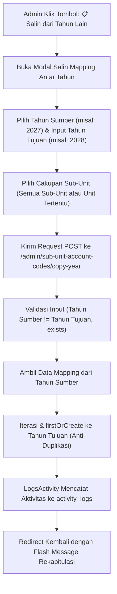

# Implementation Plan: Fitur Salin (Copy) Mapping Rekening Sub-Unit Antar Tahun Anggaran

## 1. Deskripsi Kebutuhan & Latar Belakang

Pada modul **Manajemen Mapping Rekening Sub-Unit**, pemetaan rekening kewenangan unit kerja (seperti 74 rekening yang saat ini dipetakan untuk Tahun Anggaran 2027) umumnya bersifat berkelanjutan dari tahun ke tahun dengan sedikit penyesuaian. 

Jika Administrator harus menginput ulang atau mencentang puluhan rekening satu per satu saat berganti tahun anggaran (misal memasuki Tahun 2028), proses tersebut membutuhkan waktu dan rentan kekeliruan manusia (*human error*).

Oleh karena itu, diperlukan **Fitur Salin (Copy) Mapping Rekening Antar Tahun**, di mana Administrator dapat:
1. Memilih **Tahun Sumber / Asal** (misal: `2027`).
2. Menentukan **Tahun Tujuan / Baru** (misal: `2028`).
3. Memilih cakupan: **Semua Sub-Unit** sekaligus atau **Sub-Unit Tertentu**.
4. Melakukan penyalinan secara aman (*anti-duplicate*): rekening yang sudah ada di tahun tujuan tidak akan digandakan atau ditimpa.
5. Mendapatkan laporan rekap jumlah data yang berhasil disalin dan data yang dilewati.
6. Memastikan seluruh aktivitas penyalinan terekam di sistem **Log Data (`activity_logs`)**.

---

## 2. Arsitektur Alur Fitur (Workflow)



---

## 3. Rencana Komponen Teknis

### A. Rute Baru (`routes/web.php`)
Menambahkan endpoint POST di grup admin:
```php
Route::post('sub-unit-account-codes/copy-year', [\App\Http\Controllers\Admin\SubUnitAccountCodeController::class, 'copyYear'])
    ->name('sub-unit-account-codes.copy-year');
```

### B. Controller Method (`app/Http/Controllers/Admin/SubUnitAccountCodeController.php`)
Menambahkan method `copyYear(Request $request)`:
* **Validasi Input**:
  - `source_year`: required, string, max 10.
  - `target_year`: required, string, max 10, different:source_year.
  - `sub_unit_id`: nullable, exists:sub_units,id (jika dipilih, hanya salin unit tersebut).
* **Pengambilan Data Sumber**:
  ```php
  $query = SubUnitAccountCode::where('fiscal_year', $request->source_year);
  if ($request->filled('sub_unit_id')) {
      $query->where('sub_unit_id', $request->sub_unit_id);
  }
  $sourceMappings = $query->get();
  ```
  - Jika data sumber kosong $\rightarrow$ kembalikan `with('error', 'Tidak ditemukan data mapping pada tahun sumber yang dipilih.')`.
* **Eksekusi Penyalinan (Safe Copy)**:
  ```php
  $copiedCount = 0;
  $skippedCount = 0;

  foreach ($sourceMappings as $src) {
      $mapping = SubUnitAccountCode::firstOrCreate(
          [
              'sub_unit_id' => $src->sub_unit_id,
              'account_code_id' => $src->account_code_id,
              'fiscal_year' => $request->target_year,
          ],
          [
              'keterangan_khusus' => $src->keterangan_khusus,
          ]
      );

      if ($mapping->wasRecentlyCreated) {
          $copiedCount++;
      } else {
          $skippedCount++;
      }
  }
  ```
* **Notifikasi Hasil**:
  ```php
  $unitText = $request->filled('sub_unit_id') ? " untuk sub-unit terpilih" : "";
  $msg = "Berhasil menyalin {$copiedCount} mapping rekening{$unitText} dari tahun {$request->source_year} ke tahun {$request->target_year}.";
  if ($skippedCount > 0) {
      $msg .= " ({$skippedCount} rekening dilewati karena sudah terdaftar di tahun tujuan).";
  }
  return back()->with('success', $msg);
  ```

### C. Antarmuka Pengguna (`resources/views/admin/sub_unit_account_codes/index.blade.php`)
1. **Tombol Baru di Header Toolbar**:
   - Ditempatkan berdampingan dengan tombol *Tambah Mapping* dan *Bulk Assign*:
     ```html
     <button type="button" onclick="openCopyYearModal()"
         class="inline-flex items-center px-3.5 py-2 bg-amber-600 border border-transparent rounded-lg font-semibold text-xs text-white uppercase tracking-wider hover:bg-amber-700 active:bg-amber-900 focus:outline-none focus:ring-2 focus:ring-amber-500 focus:ring-offset-2 transition shadow-sm cursor-pointer">
         <span>📋</span> <span class="ml-1.5">Salin Antar Tahun</span>
     </button>
     ```
2. **Modal Interaktif: `modal-copy-year`**:
   - **Tahun Sumber (Asal)**: Dropdown pilihan tahun yang tersedia di sistem (misal: `2027`, diambil dari `$years`).
   - **Tahun Tujuan (Baru)**: Input teks font mono dengan *default value* (misal: tahun berjalan + 1 atau `2028`).
   - **Cakupan Sub-Unit**:
     - Dropdown: Opsi pertama `Semua Sub-Unit Kerja (Rekomendasi)` atau pilih salah satu sub-unit.
   - **Info Box / Alert**:
     - *"Fitur ini akan menyalin seluruh relasi mapping nomor rekening beserta keterangan khususnya ke tahun anggaran tujuan. Data yang sudah ada di tahun tujuan tidak akan digandakan."*
   - **Tombol Eksekusi**: `Mulai Salin Mapping` dengan indikator aksi.
3. **Fungsi JavaScript**:
   - `openCopyYearModal()` dan `closeCopyYearModal()` berbasis Vanilla JS murni.

---

## 4. Langkah-Langkah Eksekusi (Implementation Steps)

1. **Pembaruan Controller**:
   - Buka [SubUnitAccountCodeController.php](file:///c:/Users/PDETUF/Project/Rumah%20Sakit/rbakardinah/app/Http/Controllers/Admin/SubUnitAccountCodeController.php).
   - Tambahkan method `copyYear(Request $request)`.
2. **Pendaftaran Rute**:
   - Buka [routes/web.php](file:///c:/Users/PDETUF/Project/Rumah%20Sakit/rbakardinah/routes/web.php).
   - Tambahkan rute `POST sub-unit-account-codes/copy-year`.
3. **Pembaruan Tampilan Blade**:
   - Buka [index.blade.php](file:///c:/Users/PDETUF/Project/Rumah%20Sakit/rbakardinah/resources/views/admin/sub_unit_account_codes/index.blade.php).
   - Tambahkan tombol `📋 Salin Antar Tahun` pada header.
   - Tambahkan markup `MODAL: Salin Mapping Antar Tahun`.
   - Tambahkan fungsi `openCopyYearModal()` dan `closeCopyYearModal()`.
4. **Pengujian & Verifikasi**:
   - Uji coba klik tombol modal salin.
   - Uji coba validasi jika tahun tujuan sama dengan tahun sumber.
   - Uji coba menyalin seluruh data dari tahun `2027` ke tahun percobaan (misal `2028`).
   - Verifikasi total 74 relasi terbentuk di tahun `2028` dengan jumlah akun yang identik.
   - Verifikasi bahwa seluruh aktivitas tercatat di menu **Log Data (`/admin/logs`)**.
   - Uji coba salin ulang untuk memastikan mekanisme *anti-duplicate* berjalan (0 dibuat, 74 dilewati).

---

## 5. Rencana Pengujian & Validasi

1. **Uji Validasi Form**:
   - Input Tahun Sumber: `2027`, Tahun Tujuan: `2027` $\rightarrow$ Sistem harus menolak dengan pesan error bahwa tahun tujuan harus berbeda dari tahun sumber.
2. **Uji Eksekusi Salin Seluruh Sub-Unit (2027 $\rightarrow$ 2028)**:
   - Pilih Sumber: `2027`, Tujuan: `2028`, Sub-Unit: *Semua Sub-Unit*.
   - Verifikasi data `sub_unit_account_codes` untuk tahun `2028` bertambah persis 74 data.
3. **Uji Eksekusi Salin Spesifik 1 Sub-Unit**:
   - Pilih Sumber: `2027`, Tujuan: `2029`, Sub-Unit: *Unit PDE (10 Rekening)*.
   - Verifikasi hanya 10 rekening Unit PDE yang tersalin ke tahun `2029`.
4. **Uji Audit Trail Log Data**:
   - Buka `/admin/logs`, filter model `Mapping Rekening ke Sub Unit`.
   - Verifikasi entri tercatat dengan teks: *"Admin (Administrator) menambahkan mapping rekening [Kode] Nama ke Sub Unit (Tahun 2028)"*.
