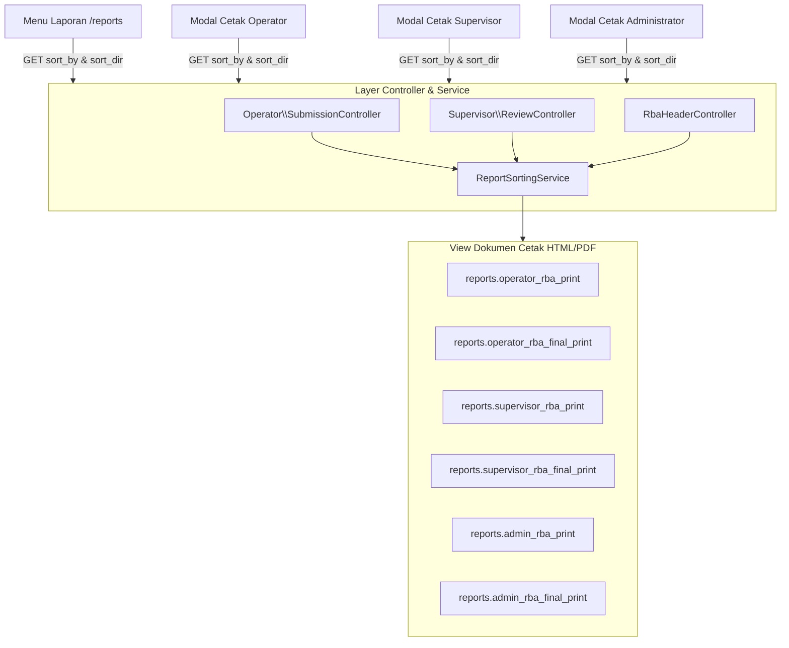

# Implementation Plan: Opsi Pengurutan Berdasarkan Kolom pada Cetak Rincian Belanja & Pagu (RBA Final)

Rencana ini merinci implementasi penambahan **opsi pengurutan berdasarkan kolom (sort by column)** pada seluruh fitur pencetakan **Usulan Rincian Belanja** dan **Rincian Belanja & Pagu (RBA Final)**. Pengurutan secara bawaan (*default*) adalah berdasarkan kolom **Nomor Rekening Belanja** (`account_code`, Ascending/Menaik), dan diterapkan secara menyeluruh baik pada tombol cetak di tiap halaman level user (Operator, Supervisor, Administrator) maupun pada Menu Laporan utama.

---

## 🎯 Sasaran & Kebutuhan Pengguna

1. **Fleksibilitas Pengurutan Kolom**:
   - Pengguna dapat memilih kolom acuan pengurutan tabel cetak:
     - 🔢 **Nomor Rekening Belanja** (*Default*, 5.1.xx / 5.2.xx)
     - 🔤 **Nama Rekening Belanja** (Alfabetis A - Z)
     - 📝 **Uraian & Spesifikasi Belanja** (Alfabetis A - Z)
     - 💰 **Total Usulan Belanja (Rp)** (Nominal terbesar ke terkecil atau sebaliknya)
     - 🏷️ **Nominal Pagu Final (Rp)** (*khusus dokumen RBA Final*)
     - 💵 **Harga Satuan (Rp)**
     - 📦 **Volume Belanja**
     - 👤 **Operator Penyusun** (*pada level Supervisor & Administrator*)
     - 🏢 **Unit Kerja** (*pada level Administrator*)
   - Pengguna dapat memilih arah pengurutan: **Menaik (Ascending / 0-9 / A-Z)** atau **Menurun (Descending / 9-0 / Z-A)**.
2. **Penerapan Komprehensif di Semua Level**:
   - **Menu Laporan** (`/reports` - `reports.index`): Pilihan terintegrasi dalam formulir konfigurasi cetak.
   - **Halaman Operator** (`operator/submissions/show.blade.php`): Modal/tombol konfigurasi cetak dengan opsi urutan kolom.
   - **Halaman Supervisor** (`supervisor/submissions/show.blade.php`): Modal konfigurasi cetak supervisor dengan opsi urutan kolom.
   - **Halaman Administrator** (`admin/headers/show.blade.php`): Modal konfigurasi cetak admin dengan opsi urutan kolom.
3. **Mendukung Kedua Format Tata Letak (Flat & Terkelompok Rekening)**:
   - **Format Flat (Per Baris Usulan)**: Seluruh baris usulan belanja diurutkan langsung berdasarkan kolom yang dipilih.
   - **Format Terkelompok Rekening (Grouped by Account)**:
     - Grup rekening diurutkan berdasarkan kriteria yang dipilih (misal: urut kode akun, urut nama akun, urut total usulan per akun, urut pagu final per akun).
     - Baris-baris rincian di dalam grup rekening juga diurutkan berdasarkan kriteria kolom yang dipilih.

---

## 🏗️ Arsitektur & Rencana Perubahan

---

## 📋 Langkah-Langkah Pengerjaan

### 1. Backend Service: `App\Services\ReportSortingService.php`
Membuat class service tersentralisasi untuk menangani logika pengurutan koleksi data usulan belanja dan grup rekening secara konsisten:
- Method `sortDetails($details, $sortBy = 'account_code', $sortDir = 'asc', $pagus = null)`:
  - Mengurutkan koleksi `$details` berdasarkan kolom target.
  - Memiliki fallback perbandingan stabil (`$a->id <=> $b->id`).
- Method `sortGroupedDetails($groupedDetails, $sortBy = 'account_code', $sortDir = 'asc', $pagus = null)`:
  - Mengurutkan grup akun dan rincian belanja di dalam setiap grup.
- Method `sortAccountCodes($accountCodes, $detailsByAccount, $sortBy = 'account_code', $sortDir = 'asc', $pagus = null)`:
  - Mengurutkan daftar `$reportAccountCodes` pada dokumen cetak Administrator RBA Final.
- Method `getSortLabel($sortBy, $sortDir)`:
  - Mengembalikan teks keterangan ramah pengguna (misalnya: *"Nomor Rekening (Menaik)"*, *"Total Usulan (Menurun)"*) untuk ditampilkan pada dokumen cetak.

### 2. Integrasi ke Backend Controllers
Memperbarui method `printPreview` dan `printPreviewFinal` pada ketiga controller:

#### A. [Operator\SubmissionController.php](file:///c:/Users/PDETUF/Project/Rumah%20Sakit/rbakardinah/app/Http/Controllers/Operator/SubmissionController.php)
- Menangkap parameter request:
  - `$sortBy = $request->get('sort_by', 'account_code')`
  - `$sortDir = $request->get('sort_dir', 'asc')`
- Mengurutkan `$submission->details` menggunakan `ReportSortingService`.
- Meneruskan `$sortBy`, `$sortDir`, dan `$sortLabel` ke view:
  - `reports.operator_rba_print`
  - `reports.operator_rba_final_print`

#### B. [Supervisor\ReviewController.php](file:///c:/Users/PDETUF/Project/Rumah%20Sakit/rbakardinah/app/Http/Controllers/Supervisor/ReviewController.php)
- Menangkap `$sortBy` & `$sortDir`.
- Mengurutkan `$submission->details` menggunakan `ReportSortingService`.
- Meneruskan `$sortBy`, `$sortDir`, dan `$sortLabel` ke view:
  - `reports.supervisor_rba_print`
  - `reports.supervisor_rba_final_print`

#### C. [RbaHeaderController.php](file:///c:/Users/PDETUF/Project/Rumah%20Sakit/rbakardinah/app/Http/Controllers/RbaHeaderController.php)
- Menangkap `$sortBy` & `$sortDir`.
- Mengurutkan `$details` dan `$reportAccountCodes` menggunakan `ReportSortingService`.
- Meneruskan `$sortBy`, `$sortDir`, dan `$sortLabel` ke view:
  - `reports.admin_rba_print`
  - `reports.admin_rba_final_print`

---

### 3. Frontend: Penambahan Opsi Pengurutan pada Formulir & Modal

#### A. [reports/index.blade.php](file:///c:/Users/PDETUF/Project/Rumah%20Sakit/rbakardinah/resources/views/reports/index.blade.php) (Menu Laporan)
- Menambahkan section: **Opsi Pengurutan Kolom (Sort By)**:
  - Dropdown/Radio pilihan kolom:
    - `account_code`: Nomor Rekening Belanja (Default)
    - `account_name`: Nama Rekening Belanja
    - `description`: Uraian & Spesifikasi Belanja
    - `nominal_request`: Total Usulan (Rp)
    - `pagu_final`: Pagu Final (Rp) *(otomatis aktif saat memilih RBA Final)*
    - `harga_satuan`: Harga Satuan (Rp)
    - `volume`: Volume Belanja
    - `operator`: Operator Penyusun *(jika peran Supervisor / Administrator)*
    - `unit`: Unit Kerja *(jika peran Administrator)*
  - Pilihan Arah Pengurutan (`sort_dir`):
    - `asc`: Menaik (Ascending: 0-9, A-Z)
    - `desc`: Menurun (Descending: 9-0, Z-A)

#### B. [supervisor/submissions/show.blade.php](file:///c:/Users/PDETUF/Project/Rumah%20Sakit/rbakardinah/resources/views/supervisor/submissions/show.blade.php) (Modal Cetak Supervisor)
- Menambahkan input pilihan kolom pengurutan (`sort_by`) dan arah (`sort_dir`) ke dalam `Modal Konfigurasi Cetak Supervisor`.

#### C. [admin/headers/show.blade.php](file:///c:/Users/PDETUF/Project/Rumah%20Sakit/rbakardinah/resources/views/admin/headers/show.blade.php) (Modal Cetak Admin)
- Menambahkan input pilihan kolom pengurutan (`sort_by`) dan arah (`sort_dir`) ke dalam `Modal Konfigurasi Cetak RBA Administrator`.

#### D. [operator/submissions/show.blade.php](file:///c:/Users/PDETUF/Project/Rumah%20Sakit/rbakardinah/resources/views/operator/submissions/show.blade.php) (Modal/Tombol Cetak Operator)
- Meng-upgrade tombol cetak operator agar membuka modal interaktif modern (seragam dengan Supervisor & Admin) sehingga operator dapat memilih jenis laporan, tata letak, latar belakang, serta **Opsi Pengurutan Kolom (Default: Nomor Rekening)**.

---

### 4. Template Dokumen Cetak (Print Views)
Memperbarui 6 file view cetak:
1. `resources/views/reports/operator_rba_print.blade.php`
2. `resources/views/reports/operator_rba_final_print.blade.php`
3. `resources/views/reports/supervisor_rba_print.blade.php`
4. `resources/views/reports/supervisor_rba_final_print.blade.php`
5. `resources/views/reports/admin_rba_print.blade.php`
6. `resources/views/reports/admin_rba_final_print.blade.php`

**Penyempurnaan:**
- Menampilkan badge/teks kecil di bawah subjudul dokumen laporan:  
  `Urutan: [Nama Kolom] ([Menaik/Menurun])` (contoh: *Urutan: Nomor Rekening Belanja (Menaik)*).
- Menjamin penomoran baris tabel (`1, 2, 3...`) tetap urut dan rapi.
- Menjamin akumulasi total nilai (total awal, total usulan, total pagu) tetap konsisten dan akurat.

---

## 🧪 Rencana Verifikasi & Pengujian

1. **Uji Logika Pengurutan Service (`ReportSortingServiceTest`)**:
   - Verifikasi pengurutan `account_code` ASC (default).
   - Verifikasi pengurutan `nominal_request` DESC (usulan terbesar di atas).
   - Verifikasi pengurutan `description` ASC (alfabetis).
   - Verifikasi pengurutan `pagu_final` DESC pada dokumen RBA Final.
   - Verifikasi pengurutan format flat vs format terkelompok rekening.
2. **Uji Integrasi HTTP Endpoint**:
   - `GET /operator/submissions/{id}/print-preview?sort_by=account_code&sort_dir=asc`
   - `GET /operator/submissions/{id}/print-preview-final?grouping=flat&sort_by=nominal_request&sort_dir=desc`
   - `GET /supervisor/submissions/{id}/print-preview-final?grouping=account&sort_by=account_name&sort_dir=asc`
   - `GET /admin/headers/{id}/print-preview-final?sort_by=pagu_final&sort_dir=desc`
3. **Uji Render Tampilan Blade**:
   - Memastikan tidak ada syntax error pada modal dan dropdown cetak di:
     - `reports/index.blade.php`
     - `operator/submissions/show.blade.php`
     - `supervisor/submissions/show.blade.php`
     - `admin/headers/show.blade.php`
4. **Uji Regression Testing**:
   - Menjalankan test suite yang ada (`ReviewTest`, `RbaDetailFeaturesTest`, `AdminDashboardTest`, `ReportMenuTest`).

---

## 📂 Arsip Dokumen
Salinan rencana ini akan disimpan ke folder `documentation/` untuk catatan riwayat proyek.
