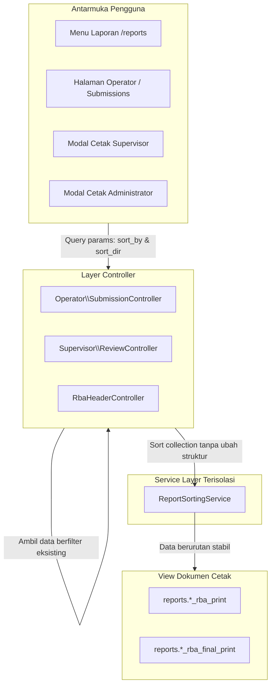

# Implementation Plan (Revisi): Opsi Pengurutan Berdasarkan Kolom pada Cetak Rincian Belanja & Pagu (RBA Final)

> **Prinsip Utama / Mandat Pengguna**:  
> **"Implementasi ini jangan sampai merusak fitur yang sudah ada" (Zero-Regression Guarantee)**.  
> Semua fitur eksisting (grouping terkelompok vs flat, lampiran latar belakang, filter operator & unit, kalkulasi total akumulasi, dan seluruh 34 unit/feature tests) wajib beroperasi 100% normal tanpa perubahan destruktif atau *breaking changes*.

---

## 🎯 Sasaran & Batasan Kritis

1. **Fleksibilitas Pengurutan Kolom yang Aman**:
   - **Default Standar**: Jika parameter tidak dikirimkan, sistem menggunakan default:
     - `sort_by = 'account_code'` (Nomor Rekening Belanja)
     - `sort_dir = 'asc'` (Menaik / Ascending)
     Hal ini memastikan URL lama, bookmark browser, dan automated test suite tetap berperilaku persis seperti sebelumnya.
   - Pilihan Kolom yang didukung:
     - 🔢 **Nomor Rekening Belanja** (*Default*, 5.1.xx / 5.2.xx)
     - 🔤 **Nama Rekening Belanja** (A - Z)
     - 📝 **Uraian & Spesifikasi Belanja** (A - Z)
     - 💰 **Total Usulan Belanja (Rp)** (Nominal terbesar ke terkecil / sebaliknya)
     - 🏷️ **Nominal Pagu Final (Rp)** (*khusus dokumen RBA Final*)
     - 💵 **Harga Satuan (Rp)**
     - 📦 **Volume Belanja**
     - 👤 **Operator Penyusun** (*pada level Supervisor & Administrator*)
     - 🏢 **Unit Kerja** (*pada level Administrator*)
   - Pilihan Arah Pengurutan: **Menaik (`asc`)** atau **Menurun (`desc`)**.

2. **Perlindungan Penuh Fitur Eksisting (Zero Regression)**:
   - **Grouping Rekening vs Flat**: Mode `grouping=account` (Terkelompok Rekening) dan `grouping=flat` (Per Baris Usulan) tetap bekerja utuh.
   - **Latar Belakang**: Opsi `include_background=1` dan `0` tetap bekerja normal.
   - **Filter Scope**: Filter `operator_ids` dan `unit_ids` dieksekusi di database query terlebih dahulu sebelum dilakukan pengurutan data di service.
   - **Integritas Nilai Uang (Kalkulasi Akumulasi)**: Grand total usulan, pagu awal, dan pagu final dihitung dari seluruh item, sehingga hasil perhitungan nominal uang Rp 100% identik.
   - **Dropdown Cepat Operator**: Quick link cetak di halaman Operator tetap dipertahankan agar pengguna yang ingin cetak instan satu klik tetap dapat melakukannya tanpa hambatan.

---

## 🏗️ Alur & Arsitektur Solusi



---

## 📋 Rincian Langkah Implementasi Non-Breaking

### 1. Backend Service: `App\Services\ReportSortingService.php`
Membuat class service murni yang terisolasi untuk menangani pengurutan:
- `sortDetails($details, $sortBy = 'account_code', $sortDir = 'asc', $pagus = null)`
  - Menerima collection `$details` yang sudah terfilter.
  - Mengembalikan collection baru yang terurut stabil (dengan fallback id `$a->id <=> $b->id`).
  - Tidak memodifikasi relasi database atau struktur field asli model `RbaDetail`.
- `sortGroupedDetails($groupedDetails, $sortBy = 'account_code', $sortDir = 'asc', $pagus = null)`
  - Mengurutkan grup akun serta baris usulan di dalam tiap grup.
- `sortAccountCodes($accountCodes, $detailsByAccount, $sortBy = 'account_code', $sortDir = 'asc', $pagus = null)`
  - Mengurutkan daftar `$reportAccountCodes` pada dokumen cetak Administrator RBA Final.
- `getSortLabel($sortBy, $sortDir)`
  - Menghasilkan label ramah pengguna (contoh: *"Nomor Rekening Belanja (Menaik)"*).

### 2. Controller Integration (Non-Destructive)
Memperbarui method `printPreview` dan `printPreviewFinal` pada:
- `App\Http\Controllers\Operator\SubmissionController`
- `App\Http\Controllers\Supervisor\ReviewController`
- `App\Http\Controllers\RbaHeaderController`

**Cara Kerja Aman:**
- Mengambil parameter request dengan fallback nilai bawaan:
  ```php
  $sortBy = $request->get('sort_by', 'account_code');
  $sortDir = strtolower($request->get('sort_dir', 'asc'));
  if (!in_array($sortDir, ['asc', 'desc'])) {
      $sortDir = 'asc';
  }
  ```
- Seluruh logika otorisasi, scope sub-unit, filter operator, dan kalkulasi pagu tetap tidak disentuh.
- Mengirimkan variabel `$sortBy`, `$sortDir`, dan `$sortLabel` ke view.

### 3. Frontend: Penambahan Opsi Pengurutan pada Formulir & Modal

#### A. [reports/index.blade.php](file:///c:/Users/PDETUF/Project/Rumah%20Sakit/rbakardinah/resources/views/reports/index.blade.php) (Menu Laporan)
- Menambahkan section: **Opsi Pengurutan Kolom (Sort By)** dengan default terpilih: **Nomor Rekening Belanja** dan arah **Menaik (Ascending)**.
- Nilai default dikirimkan secara transparan di form submission.

#### B. [supervisor/submissions/show.blade.php](file:///c:/Users/PDETUF/Project/Rumah%20Sakit/rbakardinah/resources/views/supervisor/submissions/show.blade.php) (Modal Cetak Supervisor)
- Menambahkan opsi pilihan `sort_by` dan `sort_dir` di dalam modal cetak supervisor dengan nilai default yang sama.

#### C. [admin/headers/show.blade.php](file:///c:/Users/PDETUF/Project/Rumah%20Sakit/rbakardinah/resources/views/admin/headers/show.blade.php) (Modal Cetak Admin)
- Menambahkan opsi pilihan `sort_by` dan `sort_dir` di dalam modal cetak administrator.

#### D. [operator/submissions/show.blade.php](file:///c:/Users/PDETUF/Project/Rumah%20Sakit/rbakardinah/resources/views/operator/submissions/show.blade.php) (Halaman Operator)
- Mempertahankan link dropdown cetak cepat yang sudah ada dengan menambahkan parameter default `sort_by=account_code&sort_dir=asc`.
- Menambahkan opsi tombol buka **Modal Konfigurasi Cetak Operator** agar operator memiliki keleluasaan penuh mengubah urutan cetak saat dibutuhkan.

### 4. Template Dokumen Cetak (Print Views)
Memperbarui 6 view cetak:
- Menampilkan teks indikator urutan dokumen cetak di header dokumen (`Urutan: [Nama Kolom] ([Menaik/Menurun])`).
- Penomoran urut tabel `1, 2, 3...` tetap berurutan rapi.
- Akumulasi total tidak berubah.

---

## 🧪 Rencana Verifikasi & Regression Testing

1. **Uji Regression Suite Eksisting**:
   - Jalankan `php artisan test --filter="ReviewTest|RbaDetailFeaturesTest|AdminDashboardTest|ReportMenuTest"`.
   - **Target**: Seluruh 34 tests wajib tetap **PASS** (100% Green).
2. **Uji Kasus Baru Pengurutan Kolom**:
   - Pengujian `sort_by=nominal_request&sort_dir=desc` (memastikan nominal terbesar muncul teratas).
   - Pengujian `sort_by=description&sort_dir=asc` (memastikan uraian alfabetis).
   - Pengujian `sort_by=pagu_final&sort_dir=desc` pada dokumen RBA Final.
   - Pengujian tanpa query params (memastikan default tetap nomor rekening ASC).
3. **Uji Rendering Blade**:
   - Memastikan tidak ada tampilan error atau markup rusak di seluruh halaman terkait.

---

## 📂 Arsip Dokumen
Dokumen revisi ini disimpan pada workspace di:
`documentation/20260926103600_revisi_implementation_plan_Opsi_Pengurutan_Cetak_Rincian_Belanja_Dan_Pagu_Final.md`.
