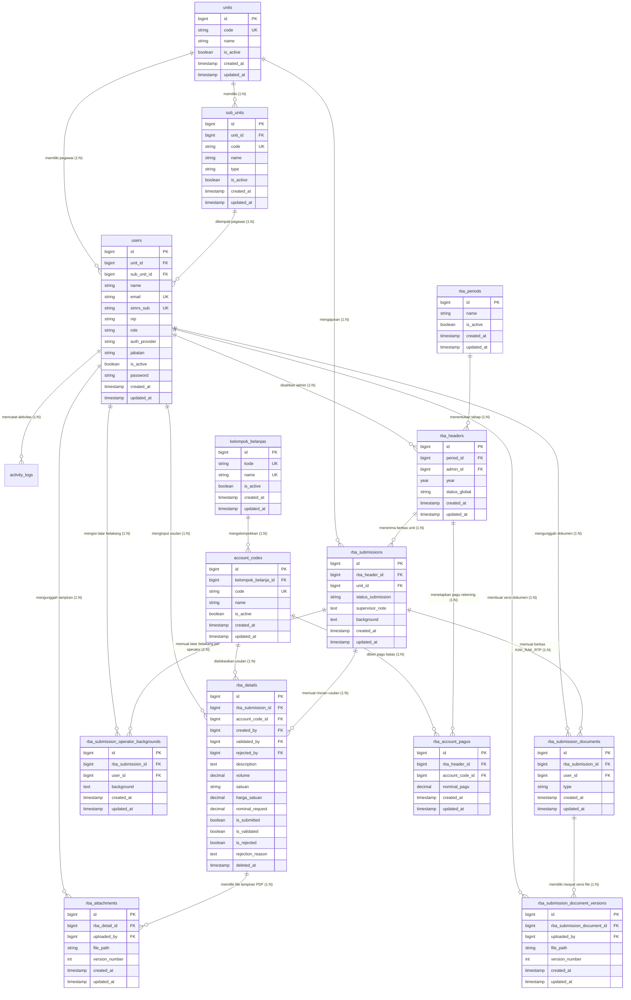
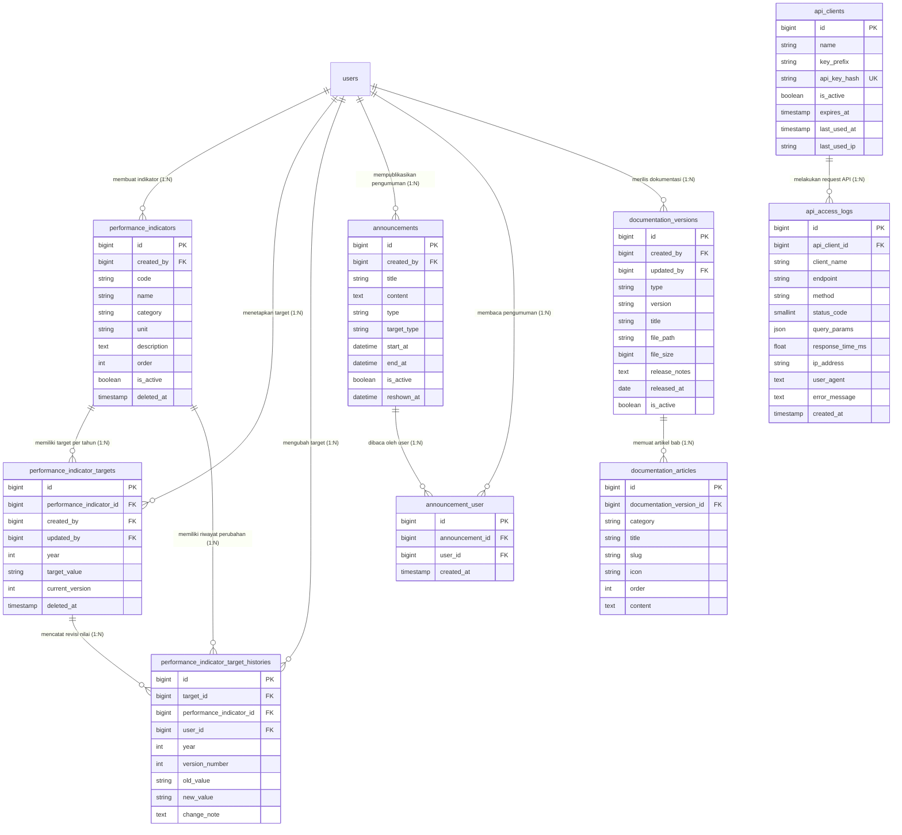
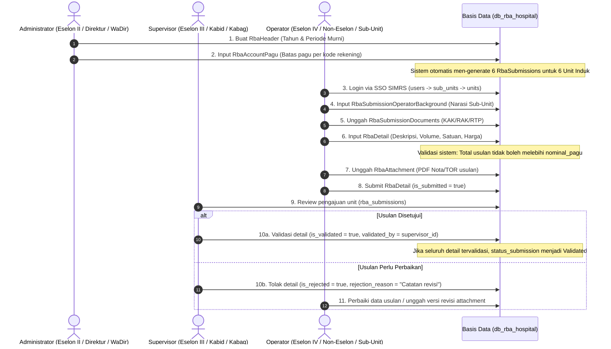

# Dokumen Spesifikasi ERD & Kamus Data: Basis Data SIPAKAR RSUD Kardinah

Dokumen ini merupakan referensi resmi arsitektur dan relasi data sistem **SIPAKAR (`db_rba_hospital`)** RSUD Kardinah Kota Tegal. Dokumen ini memuat diagram visual interaktif berbasis Mermaid, rincian kamus data (*data dictionary*) untuk **24 entitas tabel domain**, kardinalitas relasi, kunci primer & asing, serta aturan integritas data (*business rules*).

---

## 1. Ikhtisar Arsitektur Basis Data

Basis data **`db_rba_hospital`** dirancang dengan arsitektur relasional yang solid, terbagi menjadi **7 Kelompok Domain Utama**:
1. **Domain Organisasi & Pengguna**: Mengakomodasi struktur organisasi RSUD 4-level (*Two-Tier Hierarchy*), manajemen peran (Administrator, Supervisor, Operator), autentikasi ganda (Lokal & SSO SIMRS OIDC), serta log audit aktivitas sistem.
2. **Domain Master Bagan Akun Standar (BAS)**: Klasifikasi belanja daerah berbasis Permendagri / BLUD, mencakup Kelompok Belanja dan Kode Rekening Belanja.
3. **Domain Siklus Penganggaran RBA**: Inti sistem SIPAKAR yang mengelola Header Periode Anggaran, Pagu Belanja Rekening, Pengajuan Unit (Submissions), Rincian Belanja (Details dengan volume & satuan), Riwayat Lampiran PDF Berversi, Latar Belakang Operator, serta Dokumen KAK/RAK/RTP.
4. **Domain Indikator Kinerja & Renstra**: Pengelolaan Indikator Kinerja Program/Kegiatan, Target Tahunan per Unit, dan Riwayat Versi Perubahan Target (*Version History*).
5. **Domain Pengumuman & Notifikasi**: Siaran pengumuman internal sistem dan pencatatan riwayat baca pengguna (*Read Tracking*).
6. **Domain Integrasi Eksternal (REST API)**: Manajemen klien API eksternal (SIMRS / Pengembang), autentikasi API Key hash SHA-256, dan log audit akses transaksi API secara real-time.
7. **Domain Dokumentasi Sistem**: Manajemen artikel panduan pengguna (HTML) dan rilis Manual Book (PDF) berversi.

---

## 2. Diagram Visual ERD (Entity Relationship Diagram)

### 2.1 Diagram Inti: Organisasi, Pengguna, & Mesin Penganggaran RBA (Core Engine)

Diagram ini menggambarkan poros utama operasional SIPAKAR, mulai dari penempatan pegawai SSO pada unit/sub-unit, penetapan pagu rekening belanja, hingga penyusunan usulan RBA dan verifikasi supervisor.

---

### 2.2 Diagram Pendukung: Indikator Kinerja, API Integrasi, Pengumuman, & Dokumentasi

Diagram ini mencakup modul penunjang operasional, integrasi SIMRS, audit log, serta dokumentasi sistem.

---

## 3. Kamus Data Komprehensif (Data Dictionary)

Berikut adalah spesifikasi mendalam dari setiap entitas tabel di database `db_rba_hospital`.

### 3.1 Domain Organisasi & Pengguna

#### 1. Tabel `units` (Unit Induk Penganggaran / Eselon III)
- **Fungsi**: Merepresentasikan 6 Bagian dan Bidang Induk di RSUD Kardinah (Pelayanan, Keperawatan, Penunjang, Perencanaan, Umum, Keuangan) yang menjadi poros dokumen usulan anggaran `rba_submissions`.
- **Primary Key**: `id` (bigint unsigned, auto-increment)
- **Kolom**:
  | Nama Kolom | Tipe Data | Nullable | Default | Keterangan & Constraint |
  |---|---|---|---|---|
  | `id` | bigint unsigned | NO | Auto | Kunci utama unik |
  | `code` | varchar(255) | NO | - | Kode unik unit (misal: `UNIT-PEL`, `UNIT-KEP`) - `UNIQUE` |
  | `name` | varchar(255) | NO | - | Nama resmi unit induk (misal: Unit Perencanaan dan Pemasaran) |
  | `is_active` | tinyint(1) | NO | 1 | Status aktifasi unit kerja |
  | `created_at` / `updated_at` | timestamp | YES | NULL | Waktu pembuatan dan perubahan data |
- **Relasi**:
  - `units` (1) $\rightarrow$ (N) `sub_units` (via `sub_units.unit_id`)
  - `units` (1) $\rightarrow$ (N) `users` (via `users.unit_id`)
  - `units` (1) $\rightarrow$ (N) `rba_submissions` (via `rba_submissions.unit_id`)

#### 2. Tabel `sub_units` (Satuan Kerja Operasional / Eselon IV & Non-Eselon)
- **Fungsi**: Menyimpan satuan kerja operasional teknis rumah sakit (Sub-Bagian, Seksi, Instalasi, Komite, Tim Kerja) tempat pegawai SSO ditempatkan.
- **Primary Key**: `id` (bigint unsigned, auto-increment)
- **Kolom**:
  | Nama Kolom | Tipe Data | Nullable | Default | Keterangan & Constraint |
  |---|---|---|---|---|
  | `id` | bigint unsigned | NO | Auto | Kunci utama unik |
  | `unit_id` | bigint unsigned | NO | - | Foreign Key ke `units.id` (`ON DELETE CASCADE`) |
  | `code` | varchar(255) | YES | NULL | Kode unik sub-unit (misal: `SUB-REN-01`, `SUB-FAR-01`) - `UNIQUE` |
  | `name` | varchar(255) | NO | - | Nama sub-unit (misal: "Instalasi Farmasi", "Unit PDE") |
  | `type` | varchar(255) | YES | NULL | Klasifikasi: `Sub Bagian`, `Sub Bidang`, `Seksi`, `Instalasi`, `Komite`, `Tim Kerja` |
  | `is_active` | tinyint(1) | NO | 1 | Status aktifasi sub-unit |
  | `created_at` / `updated_at` | timestamp | YES | NULL | Jejak waktu |
- **Relasi**:
  - `sub_units` (N) $\leftarrow$ (1) `units` (via `unit_id`)
  - `sub_units` (1) $\rightarrow$ (N) `users` (via `users.sub_unit_id`)

#### 3. Tabel `users` (Pegawai, Pengguna Sistem & Kredensial SSO)
- **Fungsi**: Menyimpan akun pengguna, baik akun lokal maupun akun personal pegawai RSUD yang disinkronisasi melalui Single Sign-On (SSO) SIMRS berbasis OIDC/OAuth2.
- **Primary Key**: `id` (bigint unsigned, auto-increment)
- **Kolom**:
  | Nama Kolom | Tipe Data | Nullable | Default | Keterangan & Constraint |
  |---|---|---|---|---|
  | `id` | bigint unsigned | NO | Auto | Kunci utama unik |
  | `name` | varchar(255) | NO | - | Nama lengkap pegawai (beserta gelar) |
  | `email` | varchar(255) | NO | - | Alamat email unik pengguna - `UNIQUE` |
  | `simrs_sub` | varchar(255) | YES | NULL | Subject ID unik dari IdP SSO SIMRS - `UNIQUE` |
  | `nip` | varchar(255) | YES | NULL | Nomor Induk Pegawai (NIP) resmi pegawai |
  | `role` | varchar(255) | NO | - | Peran akses: `Administrator`, `Supervisor`, `Operator` |
  | `auth_provider` | enum('local','simrs_oidc') | NO | 'local' | Mekanisme autentikasi login |
  | `simrs_metadata` | json | YES | NULL | Payload klaim profil dari SSO (ruangan, profesi, dsb) |
  | `unit_id` | bigint unsigned | YES | NULL | Foreign Key ke `units.id` (`ON DELETE SET NULL`) |
  | `sub_unit_id` | bigint unsigned | YES | NULL | Foreign Key ke `sub_units.id` (`ON DELETE SET NULL`) |
  | `jabatan` | varchar(255) | YES | NULL | Jabatan fungsional/struktural pegawai |
  | `is_active` | tinyint(1) | NO | 1 | Status akun aktif/nonaktif |
  | `password` | varchar(255) | NO | - | Hash bcrypt kata sandi (untuk auth lokal) |
  | `remember_token` | varchar(100) | YES | NULL | Token sesi login "Ingat Saya" |
  | `email_verified_at` | timestamp | YES | NULL | Waktu verifikasi email |
- **Relasi**:
  - `users` (N) $\leftarrow$ (1) `units` (via `unit_id`)
  - `users` (N) $\leftarrow$ (1) `sub_units` (via `sub_unit_id`)
  - `users` (1) $\rightarrow$ (N) `rba_details` (via `created_by`, `validated_by`, `rejected_by`)
  - `users` (1) $\rightarrow$ (N) `activity_logs` (via `activity_logs.user_id`)

#### 4. Tabel `activity_logs` (Jejak Audit Aktivitas Pengguna)
- **Fungsi**: Mencatat riwayat aksi kritikal pada sistem (login, perubahan data anggaran, validasi/revisi usulan).
- **Kolom Utama**: `id`, `user_id` (FK ke `users.id`), `user_name`, `user_role`, `action` (create/update/delete/validate), `model_type`, `model_id`, `description`, `old_values` (JSON), `new_values` (JSON), `ip_address`, `user_agent`, `created_at`.

---

### 3.2 Domain Master Bagan Akun Standar (BAS) & Anggaran

#### 5. Tabel `kelompok_belanjas` (Klasifikasi Makro Belanja)
- **Fungsi**: Mengelompokkan belanja daerah RSUD Kardinah (misal: Belanja Operasi, Belanja Modal).
- **Kolom**: `id`, `kode` (varchar, UNIQUE), `name` (varchar, UNIQUE), `is_active` (boolean), timestamps.
- **Relasi**: `kelompok_belanjas` (1) $\rightarrow$ (N) `account_codes` (via `account_codes.kelompok_belanja_id`).

#### 6. Tabel `account_codes` (Kode Rekening Belanja 12-Digit / BAS)
- **Fungsi**: Daftar kode rekening belanja terperinci untuk penganggaran RBA (misal: 5.1.02.01.01.0024 - Belanja Alat/Bahan untuk Kegiatan Kantor).
- **Kolom**: `id`, `kelompok_belanja_id` (FK ke `kelompok_belanjas.id`), `code` (varchar, UNIQUE), `name` (varchar), `is_active` (boolean), timestamps.
- **Relasi**:
  - `account_codes` (1) $\rightarrow$ (N) `rba_account_pagus` (via `rba_account_pagus.account_code_id`)
  - `account_codes` (1) $\rightarrow$ (N) `rba_details` (via `rba_details.account_code_id`)

#### 7. Tabel `rba_periods` (Tahapan Periode Anggaran)
- **Fungsi**: Siklus tahapan perencanaan anggaran tahunan (misal: `Murni`, `Perubahan`, `Pergeseran`).
- **Kolom**: `id`, `name` (varchar), `is_active` (boolean), timestamps.
- **Relasi**: `rba_periods` (1) $\rightarrow$ (N) `rba_headers` (via `rba_headers.period_id`).

---

### 3.3 Domain Inti Penganggaran RBA

#### 8. Tabel `rba_headers` (Header Tahun & Siklus Anggaran Global)
- **Fungsi**: Induk penetapan anggaran per tahun anggaran dan tahapan periode.
- **Kolom**: `id`, `period_id` (FK ke `rba_periods.id`), `admin_id` (FK ke `users.id`), `year` (year, misal 2026), `status_global` (`Draft`, `Open`, `Locked`, `Final`), timestamps.
- **Relasi**:
  - `rba_headers` (1) $\rightarrow$ (N) `rba_account_pagus`
  - `rba_headers` (1) $\rightarrow$ (N) `rba_submissions`

#### 9. Tabel `rba_account_pagus` (Plafon Batas Pagu Rekening Belanja)
- **Fungsi**: Menentukan batas maksimal nominal anggaran per kode rekening pada suatu header RBA yang berlaku untuk seluruh pengajuan unit.
- **Kolom**: `id`, `rba_header_id` (FK ke `rba_headers.id`), `account_code_id` (FK ke `account_codes.id`), `nominal_pagu` (decimal(15,2)), timestamps.
- **Aturan Integritas**: Kombinasi `rba_header_id` + `account_code_id` unik.

#### 10. Tabel `rba_submissions` (Berkas Pengajuan RBA per Unit Induk)
- **Fungsi**: Berkas usulan anggaran tingkat unit induk (Eselon III) per siklus RBA.
- **Kolom**: `id`, `rba_header_id` (FK ke `rba_headers.id`), `unit_id` (FK ke `units.id`), `status_submission` (`Draft`, `Submitted`, `Reviewed`, `Validated`, `Rejected`), `supervisor_note` (text), `background` (text), timestamps.
- **Relasi**:
  - `rba_submissions` (1) $\rightarrow$ (N) `rba_details`
  - `rba_submissions` (1) $\rightarrow$ (N) `rba_submission_operator_backgrounds`
  - `rba_submissions` (1) $\rightarrow$ (N) `rba_submission_documents`

#### 11. Tabel `rba_details` (Rincian Usulan Item Belanja)
- **Fungsi**: Butir usulan rincian belanja yang diisi oleh operator, memuat uraian spesifikasi, volume, satuan, harga satuan, dan kalkulasi nominal total request.
- **Kolom**:
  | Nama Kolom | Tipe Data | Nullable | Keterangan & Constraint |
  |---|---|---|---|
  | `id` | bigint unsigned | NO | Primary Key |
  | `rba_submission_id` | bigint unsigned | NO | FK ke `rba_submissions.id` (`ON DELETE CASCADE`) |
  | `account_code_id` | bigint unsigned | NO | FK ke `account_codes.id` (`ON DELETE RESTRICT`) |
  | `description` | text | NO | Uraian lengkap rincian belanja usulan |
  | `volume` | decimal(12,2) | NO | Kuantitas volume usulan barang/jasa |
  | `satuan` | varchar(50) | YES | Satuan ukuran (misal: rim, botol, paket, orang/bulan) |
  | `harga_satuan` | decimal(15,2) | NO | Estimasi harga satuan standar |
  | `nominal_request` | decimal(15,2) | NO | Nilai total (`volume * harga_satuan`) |
  | `is_submitted` | tinyint(1) | NO | Flag diajukan ke Supervisor |
  | `is_validated` | tinyint(1) | NO | Flag disetujui / divalidasi oleh Supervisor |
  | `validated_at` | timestamp | YES | Waktu validasi disahkan |
  | `validated_by` | bigint unsigned | YES | FK ke `users.id` (pejabat supervisor) |
  | `is_rejected` | tinyint(1) | NO | Flag dikembalikan / ditolak untuk direvisi |
  | `rejected_at` | timestamp | YES | Waktu penolakan dicatat |
  | `rejected_by` | bigint unsigned | YES | FK ke `users.id` (pejabat supervisor) |
  | `rejection_reason` | text | YES | Catatan perbaikan dari Supervisor |
  | `created_by` | bigint unsigned | NO | FK ke `users.id` (operator pengusul) |
  | `deleted_at` | timestamp | YES | Dukungan *Soft Deletes* |
- **Relasi**:
  - `rba_details` (1) $\rightarrow$ (N) `rba_attachments` (lampiran nota/TOR/dokumen pendukung berversi)

#### 12. Tabel `rba_attachments` (Lampiran PDF Rincian Usulan Berversi)
- **Fungsi**: Berkas PDF pendukung rincian belanja (TOR/RAB teknis), mendukung revisi dokumen berversi (*version numbering*).
- **Kolom**: `id`, `rba_detail_id` (FK ke `rba_details.id`), `file_path`, `version_number` (int), `uploaded_by` (FK ke `users.id`), timestamps.

#### 13. Tabel `rba_submission_operator_backgrounds` (Latar Belakang per Operator)
- **Fungsi**: Menampung narasi latar belakang usulan belanja yang ditulis secara independen oleh masing-masing operator/sub-unit dalam satu unit induk yang sama.
- **Kolom**: `id`, `rba_submission_id` (FK ke `rba_submissions.id`), `user_id` (FK ke `users.id`), `background` (text), timestamps.

#### 14. Tabel `rba_submission_documents` & 15. `rba_submission_document_versions`
- **Fungsi**: Mengelola dokumen formal tingkat pengajuan: Kerangka Acuan Kerja (KAK), Rencana Anggaran Kas (RAK), dan Rencana Target Pendapatan (RTP), lengkap dengan riwayat versi file yang diunggah.
- **Kolom `rba_submission_documents`**: `id`, `rba_submission_id` (FK), `user_id` (FK), `type` (`KAK`, `RAK`, `RTP`), timestamps.
- **Kolom `rba_submission_document_versions`**: `id`, `rba_submission_document_id` (FK), `file_path`, `version_number` (int), `uploaded_by` (FK), timestamps.

---

### 3.4 Domain Indikator Kinerja & Renstra

#### 16. Tabel `performance_indicators` (Master Indikator Kinerja)
- **Fungsi**: Definisi tolok ukur indikator kinerja program atau pelayanan rumah sakit.
- **Kolom**: `id`, `code` (varchar), `name` (varchar), `category` (varchar), `unit` (satuan persen/orang/hari), `description` (text), `order` (int), `is_active` (boolean), `created_by` (FK ke `users.id`), timestamps, `deleted_at`.

#### 17. Tabel `performance_indicator_targets` (Target Tahunan Indikator)
- **Fungsi**: Nilai target kuantitatif untuk suatu indikator kinerja pada tahun anggaran tertentu.
- **Kolom**: `id`, `performance_indicator_id` (FK), `year` (int), `target_value` (varchar), `current_version` (int), `created_by` (FK), `updated_by` (FK), timestamps, `deleted_at`.

#### 18. Tabel `performance_indicator_target_histories` (Audit Trail Perubahan Target)
- **Fungsi**: Riwayat perubahan angka target indikator dari versi ke versi beserta catatan alasan perubahannya (*change note*).
- **Kolom**: `id`, `target_id` (FK ke `performance_indicator_targets.id`), `performance_indicator_id` (FK), `year`, `version_number`, `old_value`, `new_value`, `change_note`, `user_id` (FK ke `users.id`), timestamps.

---

### 3.5 Domain Pengumuman & Notifikasi

#### 19. Tabel `announcements` & 20. `announcement_user`
- **Fungsi**: Modul siaran pengumuman penting (banner dashboard & modal pop-up) bagi seluruh atau grup pengguna tertentu, serta pencatatan tanda terima baca pengguna.
- **Kolom `announcements`**: `id`, `title`, `content` (text), `type` (`info`, `warning`, `danger`), `target_type` (`all`, `operator`, `supervisor`, `admin`), `start_at` (datetime), `end_at` (datetime), `is_active` (boolean), `reshown_at` (datetime), `created_by` (FK ke `users.id`), timestamps.
- **Kolom `announcement_user` (Pivot Read Tracking)**: `id`, `announcement_id` (FK), `user_id` (FK), timestamps.

---

### 3.6 Domain Integrasi Eksternal (REST API)

#### 21. Tabel `api_clients` (Klien Rekanan & SIMRS)
- **Fungsi**: Data kredensial aplikasi klien eksternal yang diizinkan mengakses REST API SIPAKAR.
- **Kolom**: `id`, `name` (varchar), `key_prefix` (varchar), `api_key_hash` (varchar(64) SHA-256 hash), `is_active` (boolean), `expires_at` (timestamp), `last_used_at` (timestamp), `last_used_ip` (varchar(45)), timestamps.

#### 22. Tabel `api_access_logs` (Audit Log Akses API Real-Time)
- **Fungsi**: Mencatat setiap request HTTP yang masuk ke endpoint REST API SIPAKAR (`/api/v1/pagu`, `/api/v1/ping`) untuk keperluan pemantauan keamanan, rate-limiting, audit keandalan, dan troubleshooting.
- **Kolom**: `id`, `api_client_id` (FK nullable), `client_name`, `endpoint`, `method` (GET/POST), `status_code` (200, 401, 403, 429, 500), `query_params` (json), `response_time_ms` (float), `ip_address`, `user_agent`, `error_message`, `created_at`.

---

### 3.7 Domain Dokumentasi Sistem

#### 23. Tabel `documentation_versions` & 24. `documentation_articles`
- **Fungsi**: Pusat manajemen panduan pengguna aplikasi, artikel tutorial interaktif berbasis Markdown/HTML, serta rilis file buku manual resmi (PDF) per versi rilis sistem.
- **Kolom `documentation_versions`**: `id`, `type` (`html`, `pdf`), `version` (varchar), `title` (varchar), `file_path`, `file_size`, `release_notes`, `released_at`, `is_active`, `created_by`, `updated_by`, timestamps.
- **Kolom `documentation_articles`**: `id`, `documentation_version_id` (FK), `category`, `title`, `slug`, `icon`, `order`, `content` (longtext), timestamps.

---

## 4. Alur Bisnis & Aturan Integritas Relasi (Business Integrity Rules)

### Aturan Integritas Kunci:
1. **Pencegahan Usulan Melebihi Batas Pagu (*Pagu Ceiling Enforcement*)**:
   - Total akumulasi `nominal_request` pada `rba_details` untuk satu kode rekening pada header RBA tertentu tidak boleh melebihi nilai `nominal_pagu` di `rba_account_pagus`.
2. **Sinkronisasi Otomatis Organisasi (*Auto-Sync User Placement*)**:
   - Jika `users.sub_unit_id` ditetapkan, maka `users.unit_id` wajib bernilai sama dengan `sub_units.unit_id` dari sub-unit tersebut guna memastikan tidak ada inkonsistensi data hierarki.
3. **Pemberian Hak Akses Berjenjang (*Multi-Tier Access Control*)**:
   - Operator hanya dapat mengedit dan mengunggah usulan milik sub-unit atau unit induknya sendiri.
   - Supervisor hanya berwenang memvalidasi usulan yang terafiliasi dengan `unit_id` miliknya.
   - Administrator memiliki hak kontrol penuh secara global atas penetapan pagu, pembukaan/penguncian periode anggaran, dan manajemen master data.
4. **Audit Trail & Keamanan Eksternal**:
   - Setiap modifikasi data bernilai strategis tercatat otomatis di `activity_logs`.
   - Autentikasi API divalidasi dengan hash kriptografis SHA-256 (`api_clients.api_key_hash`), dan setiap aktivitas panggilan dicatat di `api_access_logs`.
