# MANUAL BOOK & PANDUAN PENGGUNAAN SISTEM SIPAKAR
**RSUD KARDINAH**

---

| Informasi Dokumen | Detail |
| :--- | :--- |
| **Nama Aplikasi** | SIPAKAR |
| **Instansi** | RSUD Kardinah Kota Tegal |
| **Versi Dokumen** | 2.0 (Edisi Pengelompokan Dokumen Per Operator) |
| **Tanggal Terbit** | 30 Juli 2026 |
| **Target Pengguna** | Administrator, Supervisor (Kabid/Kabag), Operator (Unit/Sub-Unit) |

---

## DAFTAR ISI

1. [PENDAHULUAN](#1-pendahuluan)
   - 1.1 Latar Belakang
   - 1.2 Alur Penyusunan SIPAKAR
   - 1.3 Hak Akses & Matriks Peran Pengguna
2. [PANDUAN HAK AKSES ADMINISTRATOR](#2-panduan-hak-akses-administrator)
   - 2.1 Login & Navigasi Utama
   - 2.2 Manajemen Pengguna & Unit Kerja
   - 2.3 Manajemen Kode Rekening & Kelompok Belanja
   - 2.4 Inisialisasi Periode & Header RBA
   - 2.5 Setting Pagu Indikatif (Pagu Global per Rekening)
   - 2.6 Penguncian RBA (Lock / Unlock Status Global)
3. [PANDUAN HAK AKSES OPERATOR (UNIT BAWAHAN)](#3-panduan-hak-akses-operator-unit-bawahan)
   - 3.1 Dashboard & Workboard Operator
   - 3.2 Pengisian Latar Belakang RBA
   - 3.3 Penambahan & Edit Rincian Belanja (Volume, Satuan, Harga Satuan)
   - 3.4 Pengunggahan Lampiran PDF Rincian Belanja
   - 3.5 Pengajuan Usulan (*Submit*) ke Supervisor
   - 3.6 Pengunggahan Dokumen KAK, RAK, dan RTP per Operator (Setelah RBA Locked)
4. [PANDUAN HAK AKSES SUPERVISOR (KABID / KABAG)](#4-panduan-hak-akses-supervisor-kabid--kabag)
   - 4.1 Dashboard Supervisor
   - 4.2 Review Usulan RBA Unit Bawahan
   - 4.3 Validasi & Penolakan Rincian Belanja (Handling Exceeding Pagu)
   - 4.4 Pengelompokan & Peninjauan Dokumen KAK, RAK, dan RTP Per Operator (Fitur Terbaru)
5. [TROUBLESHOOTING & PERTANYAAN SERING DIAJUKAN (FAQ)](#5-troubleshooting--pertanyaan-sering-diajukan-faq)

---

## 1. PENDAHULUAN

### 1.1 Latar Belakang
Sistem Informasi **SIPAKAR** dikembangkan untuk mengdigitalisasi seluruh alur perencanaan anggaran, penyusunan Rencana Bisnis dan Anggaran (RBA), serta pengawasan usulan belanja dan pendapatan di lingkungan RSUD Kardinah. Sistem ini memastikan transparansi, kepatuhan batas pagu indikatif, serta memfasilitasi pelaporan berkas pendukung seperti Kerangka Acuan Kerja (KAK), Rencana Anggaran Kerja (RAK), dan Rencana Tindak Pengendalian (RTP).

### 1.2 Alur Penyusunan SIPAKAR

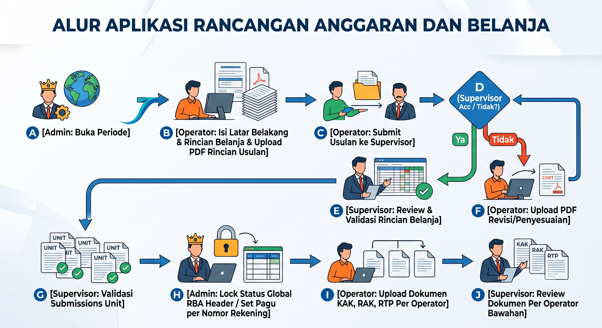

### 1.3 Hak Akses & Matriks Peran Pengguna

| Peran Pengguna | Deskripsi Peran | Hak Akses Utama |
| :--- | :--- | :--- |
| **Administrator** | Direktur / Wadir & Pengelola Sistem Utama | Manajemen user/unit, penetapan pagu indikatif, penguncian status global RBA. |
| **Supervisor** | Kepala Bidang / Kepala Bagian | Review usulan belanja unit, validasi/tolak rincian, peninjauan berkas KAK/RAK/RTP terpisah per Operator bawahan. |
| **Operator** | Pelaksana Unit Kerja / Sub-Unit Bawahan | Pengisian rincian belanja (volume x harga), upload PDF pendukung, upload berkas KAK/RAK/RTP. |

---

## 2. PANDUAN HAK AKSES ADMINISTRATOR

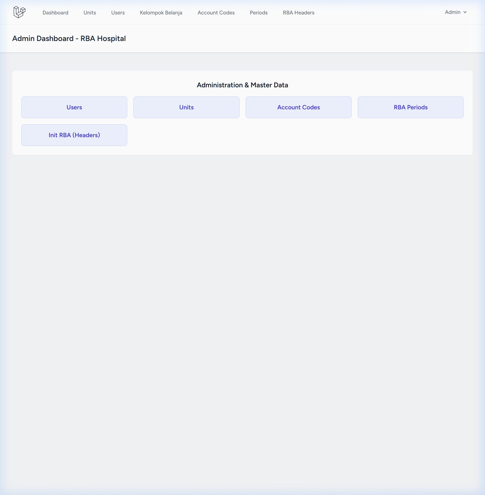

### 2.1 Login & Navigasi Utama
1. Buka peramban (*browser*) dan akses URL portal SIPAKAR.
2. Masukkan email Administrator (contoh: `admin@hospital.com`) dan kata sandi.
3. Setelah berhasil masuk, Anda akan diarahkan ke **Dashboard Administrator** yang menampilkan statistik umum unit, periode RBA aktif, dan ringkasan usulan.

### 2.2 Manajemen Pengguna & Unit Kerja
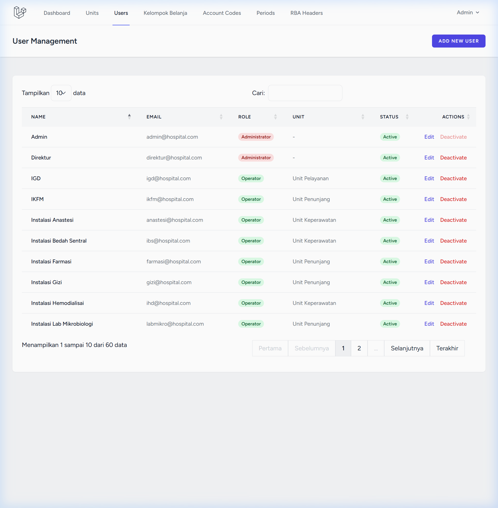

1. Pilih menu **Users** pada bilah navigasi atas.
2. Klik tombol **Tambah User Baru** untuk menonaktifkan atau menambahkan akun baru.
3. Tentukan nama pengguna, email, peran (*Administrator*, *Supervisor*, atau *Operator*), serta Unit Kerja terkait (wajib diisi untuk Supervisor dan Operator).

### 2.3 Manajemen Kode Rekening & Kelompok Belanja

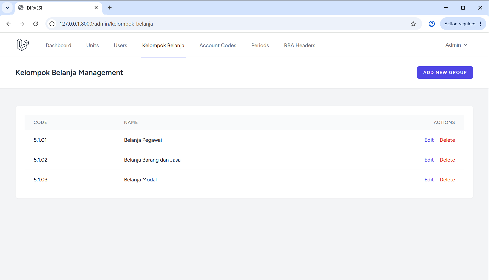

1. Pilih menu **Kelompok Belanja** untuk mengatur klasifikasi utama anggaran (Belanja Pegawai, Belanja Barang & Jasa, Belanja Modal).

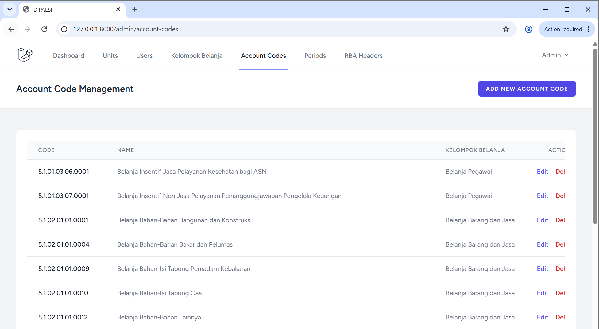

2. Pilih menu **Account Codes** untuk mengelola master kode rekening 6 digit beserta deskripsi standar rumah sakit.

### 2.4 Inisialisasi Periode & Header RBA
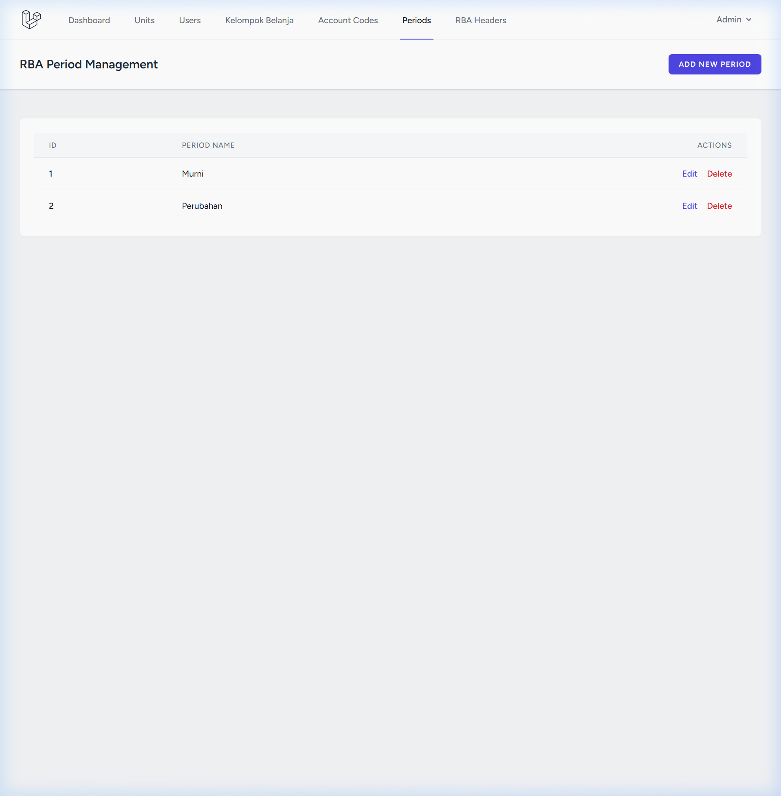

1. Pilih menu **Periods** untuk membuat atau mengedit periode tahun anggaran berjalan (misal: Murni / Perubahan).

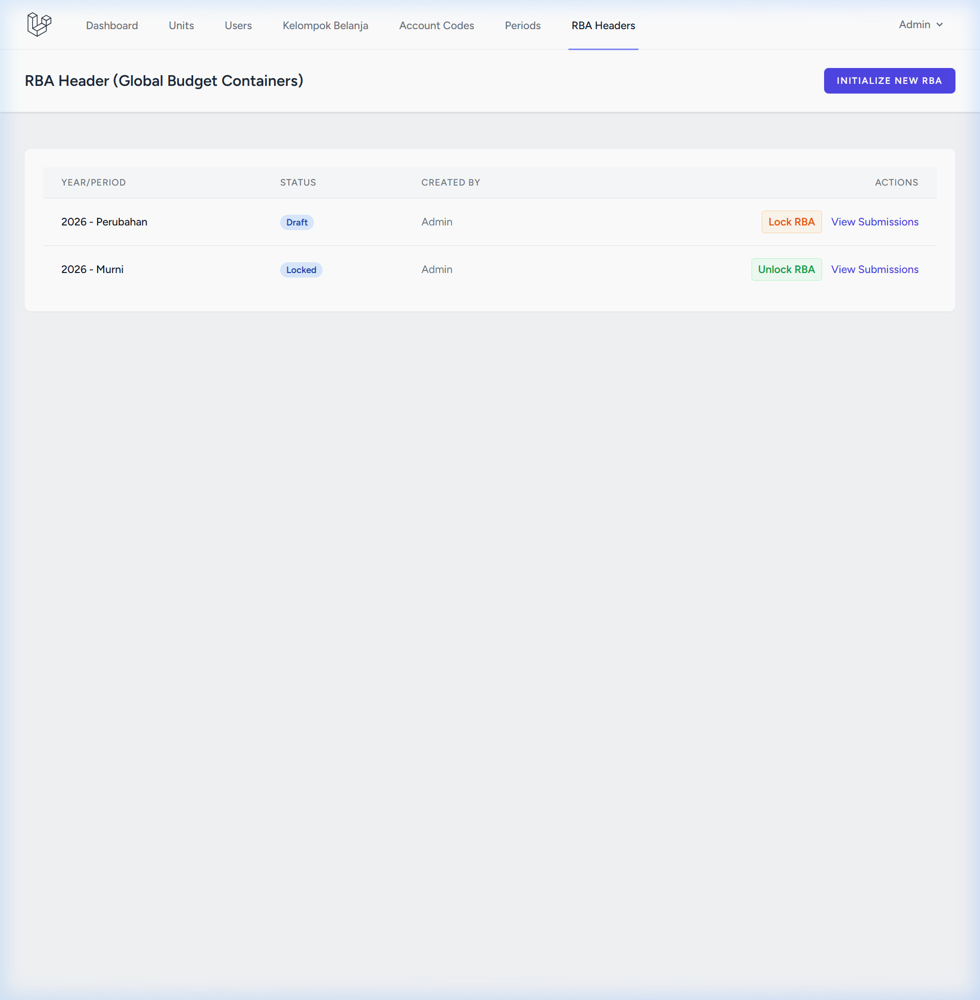

2. Pilih menu **RBA Headers** untuk membuat header anggaran induk bagi seluruh unit kerja.

### 2.5 Setting Pagu Indikatif (Pagu Global per Rekening)
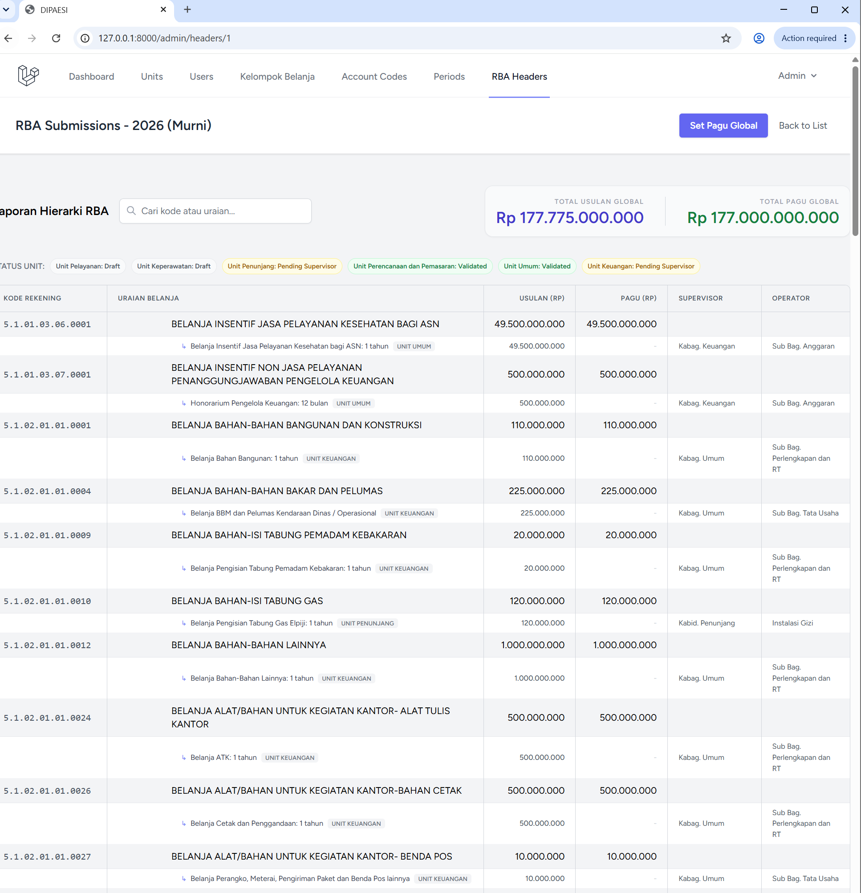

1. Pada halaman **RBA Headers**, klik tombol **Set Pagu Global** pada baris header RBA yang bersangkutan.
2. Isikan batas nominal maksimal (*Pagu Global*) untuk masing-masing kode rekening belanja.
3. Simpan perubahan. Pagu ini akan mengunci pengajuan usulan atau edit oleh operator per nomor rekeningnya, serta memberikan peringatan jika usulan melebihi pagu yang ditentukan.

### 2.6 Penguncian RBA (Lock / Unlock Status Global)
1. Setelah seluruh proses perencanaan dan pengesahan usulan selesai, Administrator dapat mengubah status RBA Header dari **Unlocked** menjadi **Locked** dengan menekan tombol **Kunci RBA Header**.
2. **Dampak Penguncian (Locked)**:
   * Operator dan Supervisor tidak dapat lagi menambah atau mengubah rincian angka usulan.
   * Modul pengunggahan dokumen KAK, RAK, dan RTP pada tampilan Operator dan Supervisor secara otomatis menjadi **AKTIF**.

---

## 3. PANDUAN HAK AKSES OPERATOR (UNIT BAWAHAN)

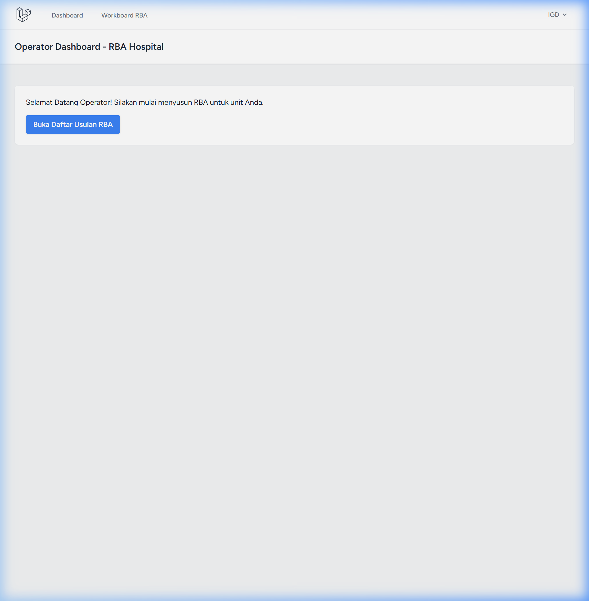

### 3.1 Dashboard & Workboard Operator
1. Login menggunakan akun Operator unit Anda (contoh: `pde@hospital.com`).
2. Masuk ke menu **Submissions** untuk melihat daftar pengajuan RBA unit.
3. Klik tombol **Buka Workboard** pada RBA berjalan.

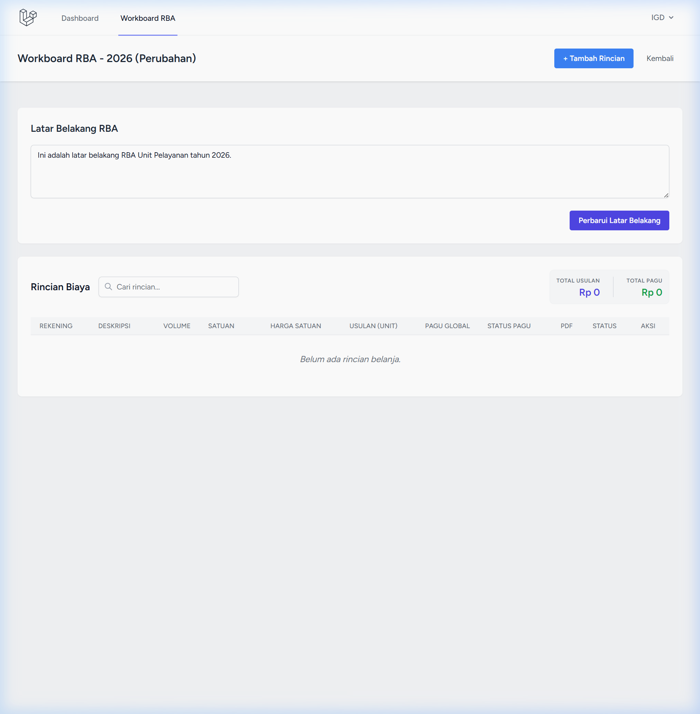

### 3.2 Pengisian Latar Belakang RBA
1. Pada bagian atas Workboard, periksa kolom **Latar Belakang RBA**.
2. Klik **Edit / Simpan Latar Belakang** untuk mengisi penjelasan rasionalitas usulan anggaran unit kerja Anda.

### 3.3 Penambahan & Edit Rincian Belanja

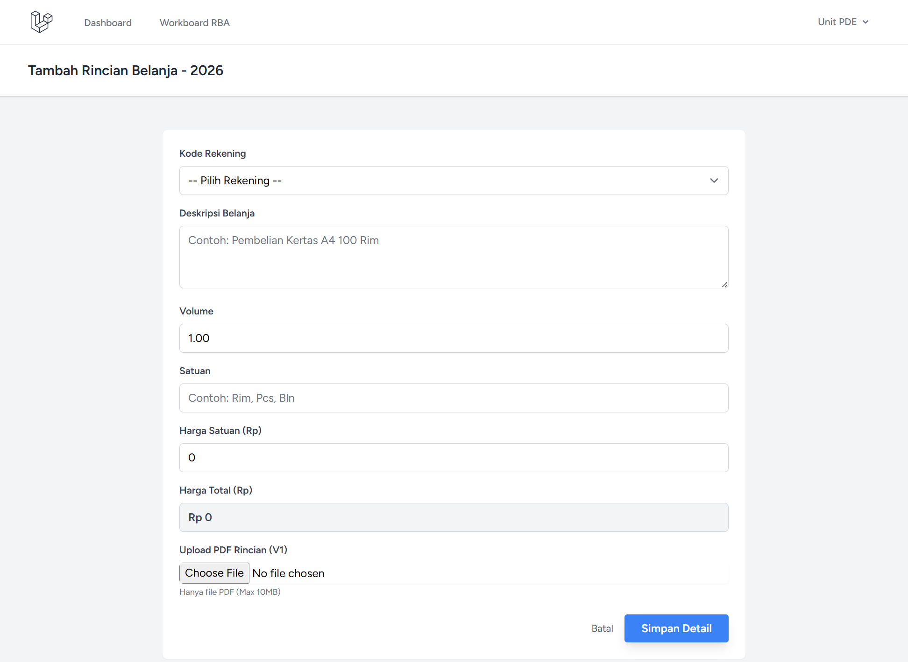

1. Tekan tombol **+ Tambah Rincian Belanja**.
2. Pilih **Kode Rekening Belanja**.
3. Masukkan **Deskripsi Rincian**, **Volume**, **Satuan** (contoh: *Pcs, Bulan, Paket*), dan **Harga Satuan (Rp)**.
4. Sistem secara otomatis menghitung `Total Usulan = Volume x Harga Satuan`.

### 3.4 Pengunggahan Lampiran PDF Rincian Belanja
1. Apabila total usulan pada kode rekening tertentu melebihi pagu global (*Status: OVER*), sistem memerlukan dokumen penjelas PDF.
2. Klik icon **Upload PDF** pada baris rincian yang bersangkutan untuk mengunggah dokumen JUSTIFIKASI/REVISI versi terbaru.

### 3.5 Pengajuan Usulan (*Submit*) ke Supervisor

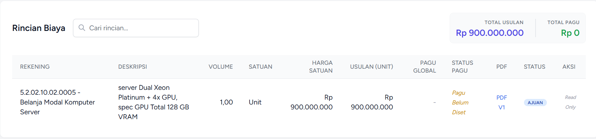

1. Setelah seluruh rincian selesai diisi dan diverifikasi mandiri, tekan tombol **Ajukan**.
2. Status submission akan berubah menjadi `Ajuan`.

### 3.6 Pengunggahan Dokumen KAK, RAK, dan RTP (Locked RBA)

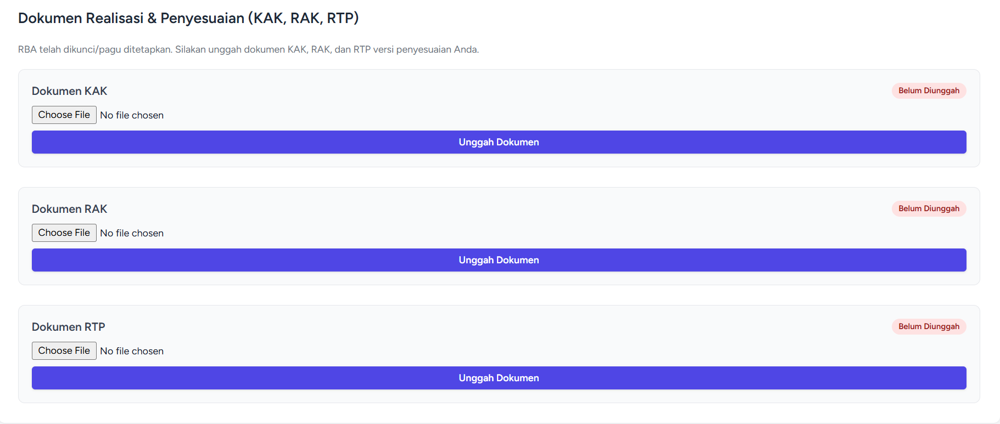

1. Apabila RBA Header telah dikunci (*Locked*) oleh Administrator, bagian **Dokumen Realisasi & Penyesuaian** di bawah halaman Workboard akan terbuka.
2. Pilih jenis dokumen:
   * **KAK**: Kerangka Acuan Kerja
   * **RAK**: Rencana Anggaran Kerja
   * **RTP**: Rencana Tindak Pengendalian
3. Unggah file bertipe **PDF** (Maksimal 10MB).
4. Setiap pengunggahan ulang akan mencatat versi secara otomatis (V1, V2, dst.) di mana dokumen dikaitkan secara eksplisit dengan akun Operator Anda.

---

## 4. PANDUAN HAK AKSES SUPERVISOR (KABID / KABAG)

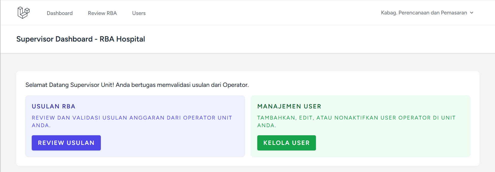

### 4.1 Dashboard Supervisor
1. Login menggunakan akun Supervisor (contoh: `rensar@hospital.com`).
2. Dashboard menampilkan daftar unit bawahan yang berada di bawah naungan struktur organisasi Anda.

### 4.2 Review Usulan RBA Unit Bawahan
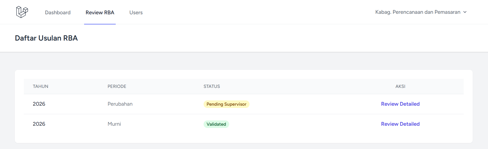

1. Pilih menu **Review RBA**.
2. Klik tombol **Review Detail** pada pengajuan RBA unit bawahan.

### 4.3 Validasi & Penolakan Rincian Belanja
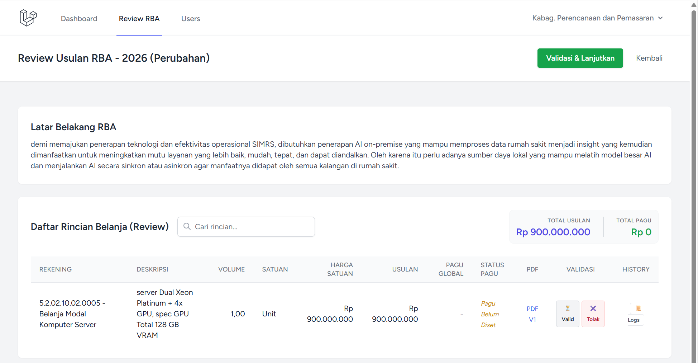

1. Pada tabel Rincian Belanja:
   * **Indikator Pagu**: Membandingkan total usulan unit terhadap Pagu Global.
   * **Tombol Validasi (✅ Valid)**: Klik untuk memvalidasi item rincian.
   * **Tombol Tolak (✖ Tolak)**: Klik untuk menolak item rincian dengan mengisi alasan penolakan pada pop-up dialog.
2. **Aturan Penanganan Over Pagu**:
   * Jika rincian berstatus `OVER` dan Operator **belum** mengunggah PDF revisi, tombol validasi akan terkunci dengan pesan *⏳ Valid (Butuh PDF Baru)*.

### 4.4 Pengelompokan Dokumen KAK, RAK, RTP Per Operator
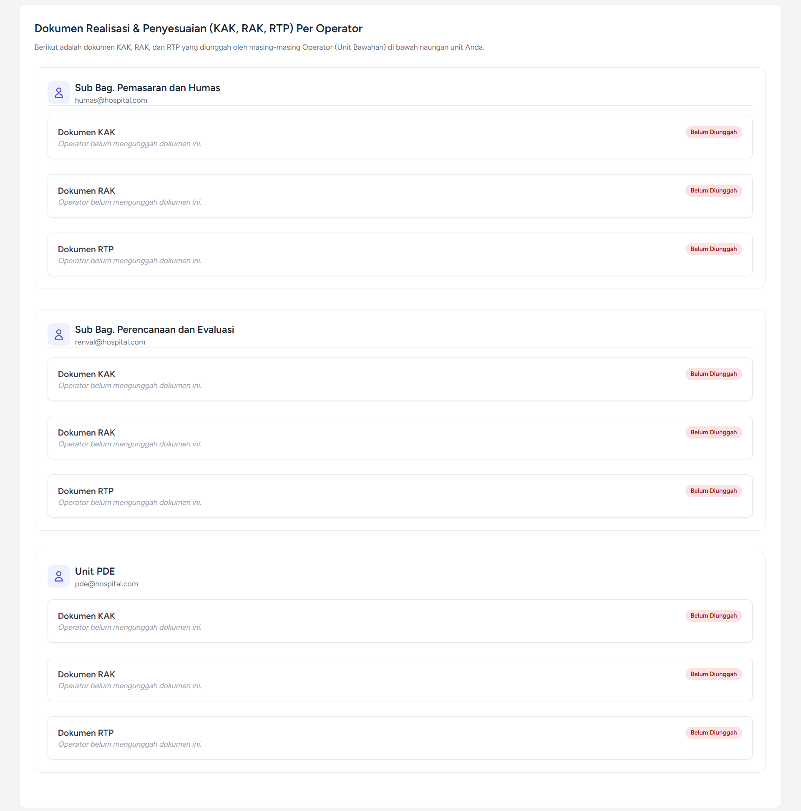

1. Gulir ke bagian paling bawah halaman Review RBA pada seksi **Dokumen Realisasi & Penyesuaian (KAK, RAK, RTP) Per Operator**.
2. Berkas KAK, RAK, dan RTP dikelompokkan secara terpisah di bawah nama dan email masing-masing Operator (Unit Bawahan).
3. **Fungsi Utama**:
   * Supervisor dapat mengunduh dokumen versi terbaru per Operator.
   * Supervisor dapat meninjau **Riwayat Versi** per Operator tanpa khawatir berkas antar Operator di unit yang sama saling menindih (*overwrite*).

---

## 5. TROUBLESHOOTING & PERTANYAAN SERING DIAJUKAN (FAQ)

### Q1: Mengapa tombol upload KAK/RAK/RTP tidak muncul di halaman Operator?
**Jawab**: Pengunggahan dokumen KAK, RAK, dan RTP hanya dapat dilakukan setelah status RBA Header diubah menjadi **Locked** oleh Administrator.

### Q2: Mengapa Supervisor tidak bisa menekan tombol Validasi pada rincian belanja tertentu?
**Jawab**: Rincian belanja tersebut melebihi batas Pagu Indikatif (*Over Pagu*). Operator wajib mengunggah file PDF penyesuaian/revisi terlebih dahulu sebelum Supervisor dapat memvalidasi.

### Q3: Apakah dokumen KAK yang diunggah Operator A akan menindih dokumen milik Operator B di bawah unit yang sama?
**Jawab**: Tidak. Setiap dokumen KAK, RAK, dan RTP disimpan secara independen dengan mengacu pada id user masing-masing Operator pengunggah.

---

*Dokumen ini diterbitkan secara resmi oleh Tim Pengembang Sistem Informasi RSUD Kardinah.*
